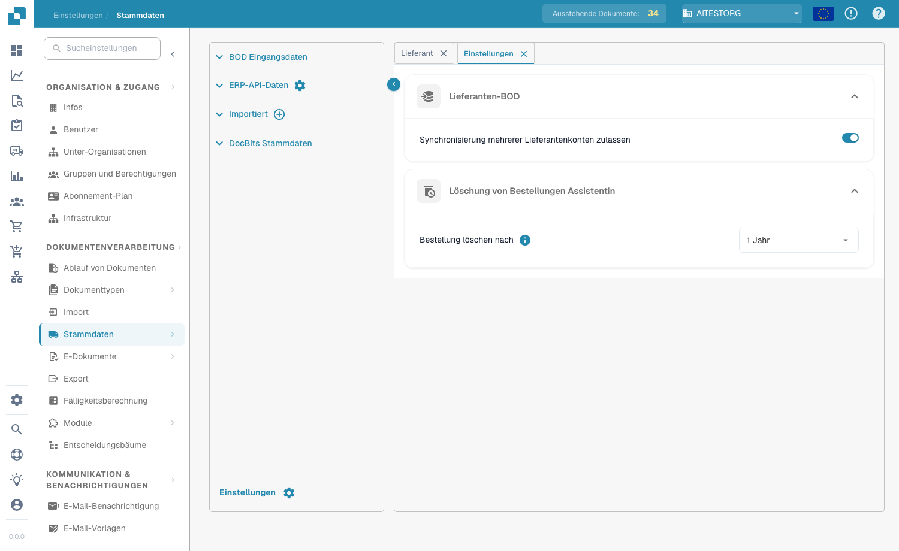

# Stammdaten-Lookup




Mit **Stammdaten-Lookup** (Seitenleiste: **Stammdaten**) können Sie die Stammdaten anzeigen und verwalten, die DocBits zur Validierung der aus Dokumenten extrahierten Daten gegen Ihr ERP-System verwendet. Dies ist entscheidend für präzises PO-Matching, Lieferantenvalidierung und die automatische Feldvervollständigung. Öffnen Sie die Seite über **Einstellungen → Dokumentenverarbeitung → Stammdaten**.

<figure><figcaption>
Seite Stammdaten-Lookup – Datenquellen und die Datentabelle
</figcaption></figure>

## Datenquellen

Das linke Panel listet vier Datenquellen-Kategorien auf:

| Quelle | Beschreibung |
|--------|--------------|
| **BOD Eingangsdaten** | Daten, die über Infor-BOD-Nachrichten (Business Object Document) empfangen werden. |
| **ERP-API-Daten** | Daten, die direkt über eine API aus Ihrem ERP-System abgerufen werden. Klicken Sie auf das Zahnrad-Symbol, um die API-Verbindung zu konfigurieren. |
| **Importiert** | Manuell importierte Daten (z. B. per CSV-Upload). Klicken Sie auf das **+**-Symbol, um neue Daten hinzuzufügen. |
| **DocBits Stammdaten** | Interne Stammdaten, die innerhalb von DocBits verwaltet werden. |

## Datentabelle

Bei Auswahl einer Datenquelle werden deren Daten rechts in einer durchsuchbaren, sortierbaren Tabelle angezeigt:

* **Registerkarten** – jede Registerkarte ist ein Stammdaten-Typ (z. B. Lieferant, Bestellung, Artikel).
* **Suche** – filtern Sie nach Spalte (**Suche nach Spalten**) oder suchen Sie nach Text (**Suche Zeichenfolge**).
* **Aktionen** – Spaltenbeschriftungen aktualisieren, leere Spalten ausblenden, Aliase aktualisieren oder die Daten als CSV herunterladen.
* **Seitennavigation** – navigieren Sie mit den Seitensteuerelementen durch große Datenmengen.

Die Lieferanten- und Bestelltabellen enthalten Spalten wie Lieferanten-ID, Lieferantenname, Adresse, Bankleitzahl, Bestellnummer, Artikel-ID, Beschreibung, Menge, Stückpreis, Gesamtbetrag, Währung und Status sowie etwaige benutzerdefinierte Felder.

## Einstellungen

Klicken Sie unten links im Datenquellen-Panel auf **Einstellungen** (Zahnrad-Symbol), um die Stammdaten-Einstellungen zu öffnen.

<figure><figcaption>
Einstellungen für Supplier BOD und das Löschen von Bestellungen
</figcaption></figure>

### Supplier BOD

**Allow Multiple Supplier Accounts Sync**

* **Aktiviert**: Ein einzelner Lieferant kann mehrere `<FinancialParty>`-Elemente im BOD haben (häufig aufgrund mehrerer IBANs oder Finanzkonten). Alle `<FinancialParty>`-Einträge werden extrahiert und in der Lieferantentabelle gespeichert, sodass mehrere Finanzattribute hinterlegt werden können.
* **Deaktiviert**: Nur das letzte für den Lieferanten gefundene `<FinancialParty>`-Element wird extrahiert. Frühere Finanzattribute (z. B. zusätzliche IBANs) werden ignoriert; gespeichert werden nur die Daten des letzten Vorkommens.

### Purchase Order Deletion Assistant

**Delete Purchase Order After** – legen Sie fest, wann abgeschlossene Bestellungen entfernt werden sollen. Nach dem gewählten Zeitraum werden die Datensätze automatisch gelöscht.


Wie Sie Stammdaten in DocBits laden, erfahren Sie unter [Stammdaten importieren](../../../infor-integration-and-configuration/importing-customer-master-data/).

