# Tableau de bord analytique

## Vue d'ensemble

Le **Tableau de bord analytique** offre une visibilité complète sur les performances du traitement de vos documents. Il suit le temps passé par les documents à chaque étape de leur parcours — de l'importation à l'exportation — et vous aide à identifier les goulots d'étranglement, à comparer les performances entre organisations, types de documents et fournisseurs, et à comparer vos résultats à la **Moyenne mondiale DocBits**.

Chaque document passe par différentes étapes :

**Nouveau** (importé) → **En cours** (traitement) → **Prêt pour la validation** (en attente de révision utilisateur) → **En attente de validation** (en attente d'approbation) → **Exporter** (terminé et exporté)

Du temps s'écoule à chaque étape — le Tableau de bord analytique vous indique exactement **combien**, et **où** concentrer vos améliorations.

### Deux types de goulots d'étranglement

Le tableau de bord vous aide à distinguer entre :

* **Goulots d'étranglement système** — Le temps pendant lequel DocBits est occupé par le traitement automatique (OCR et extraction de texte, classification de documents, extraction de champs, validation automatique). Optimisable via la configuration et les ressources système.
* **Goulots d'étranglement utilisateur** — Le temps passé à attendre la validation et l'approbation manuelles (temps d'attente en file, correction manuelle des données, révision et validation, flux d'approbation). Optimisable via le flux de travail et l'allocation des ressources.

## Comment l'activer

Le Tableau de bord analytique est contrôlé par un paramètre de module. Une fois activé, une entrée **Tableau de bord analytique** apparaît dans la barre latérale gauche.

1. Accédez à **Paramètres → Traitement des documents → Module → Tableau de bord et analytique**.
2. Activez l'option **Tableau de bord analytique**.

<mark style="color:red;">**Remarque**</mark> : Le Tableau de bord analytique nécessite un **Abonnement Tableau de bord IA**.

<mark style="color:red;">**Remarque**</mark> : L'accès au Tableau de bord analytique est limité aux utilisateurs disposant des droits **administrateur**.

## Types de flux

Choisissez la bonne perspective pour votre analyse. Chaque type de flux vous offre une perspective différente sur les mêmes données.

| Type de flux | Objectif | Question clé |
| --- | --- | --- |
| **Statut** | Suivre le cycle de vie du document de l'importation à l'exportation | *« Quel est le temps total de mes documents de l'importation à l'exportation ? »* |
| **Traitement** | Analyse technique des performances des modules | *« Quelles étapes de traitement sont des goulots d'étranglement ? »* |
| **Interaction de l'utilisateur** | Points de contact humains et temps d'attente | *« Combien de temps les documents attendent-ils les utilisateurs ? »* |

Utilisez le sélecteur **Type de flux** en haut du tableau de bord pour basculer entre les perspectives.

<figure><figcaption></figcaption></figure>

### Flux de statut

Suit le parcours du document de **Nouveau** à **Exporté** — utile pour l'analyse du cycle de vie de bout en bout.

<figure>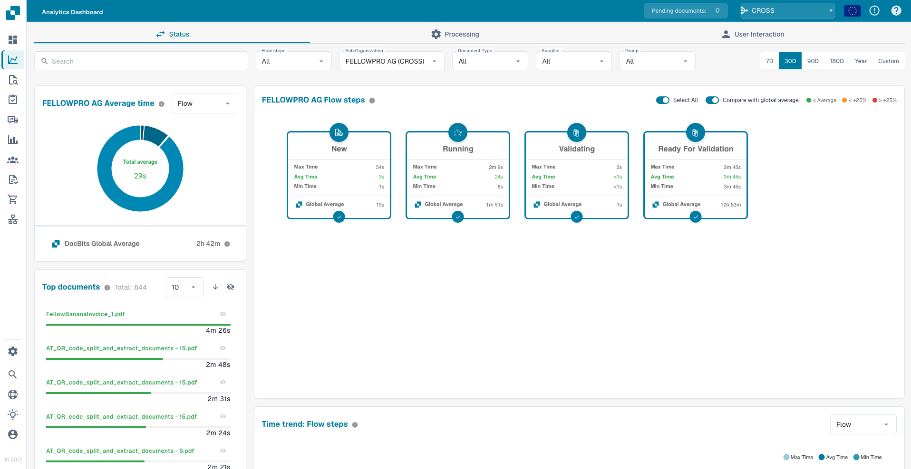<figcaption></figcaption></figure>

### Flux de traitement

Analyse les performances de tous les **modules de traitement technique** (OCR, classification, extraction, validation) — utile pour identifier les goulots d'étranglement côté système.

<figure>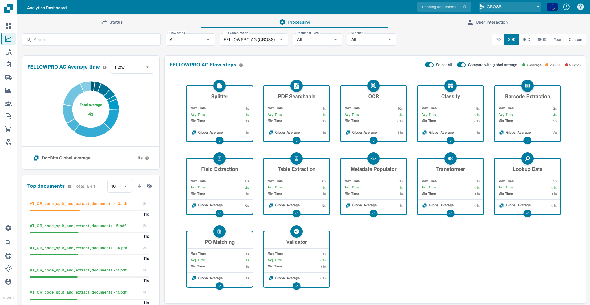<figcaption></figcaption></figure>

### Flux d'interaction utilisateur

Se concentre sur les **points de contact humains** — temps d'attente en file, validation manuelle, révision et approbation — utile pour identifier les goulots d'étranglement de flux de travail et de personnel.

<figure>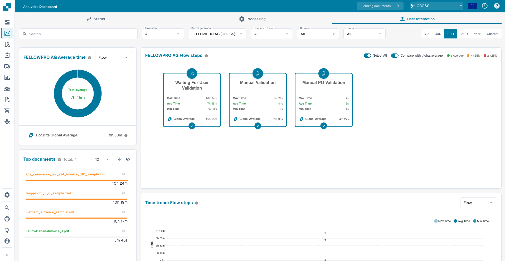<figcaption></figcaption></figure>

## Options de filtrage

Le tableau de bord prend en charge un filtrage multidimensionnel puissant. Tous les graphiques, cartes et tableaux se mettent à jour en temps réel en fonction des filtres actifs.

### Recherche

Localisez instantanément n'importe quel document par **nom** ou **identifiant unique**.

<figure>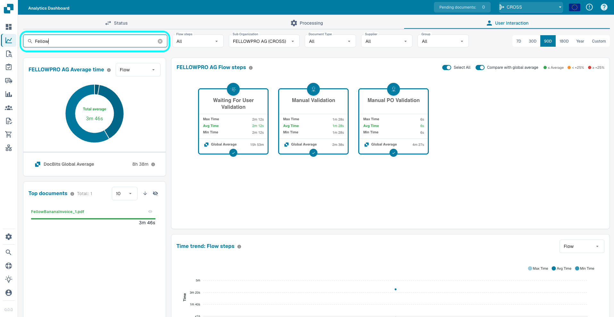<figcaption></figcaption></figure>

### Étapes du flux

Sélectionnez des étapes spécifiques pour cibler votre analyse. L'activation/désactivation des étapes recalcule également les métriques de temps dans les autres composants du tableau de bord.

<figure>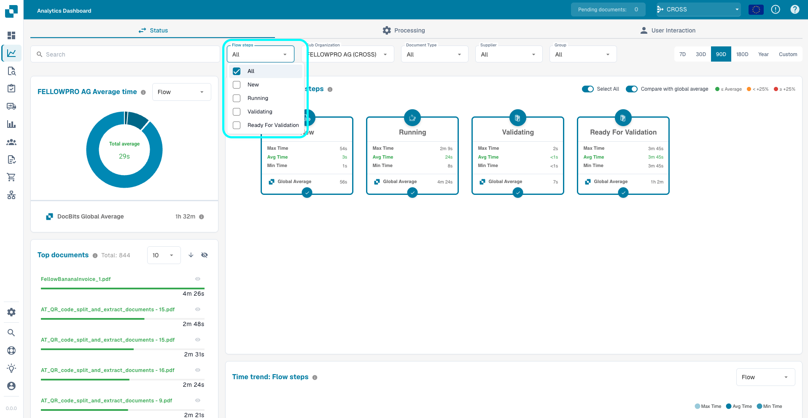<figcaption></figcaption></figure>

### Sous-organisation, Type de document, Fournisseur, Groupe

Comparez les performances entre :

* **Sous-organisations** — différentes unités commerciales ou locataires
* **Types de document** — factures, bons de commande, bons de livraison, etc.
* **Fournisseurs** — pour identifier les fournisseurs qui causent les temps de traitement les plus longs
* **Groupes** — pour comparer les performances entre les groupes d'utilisateurs assignés (disponible pour les types de flux **Statut** et **Interaction de l'utilisateur**)

<figure>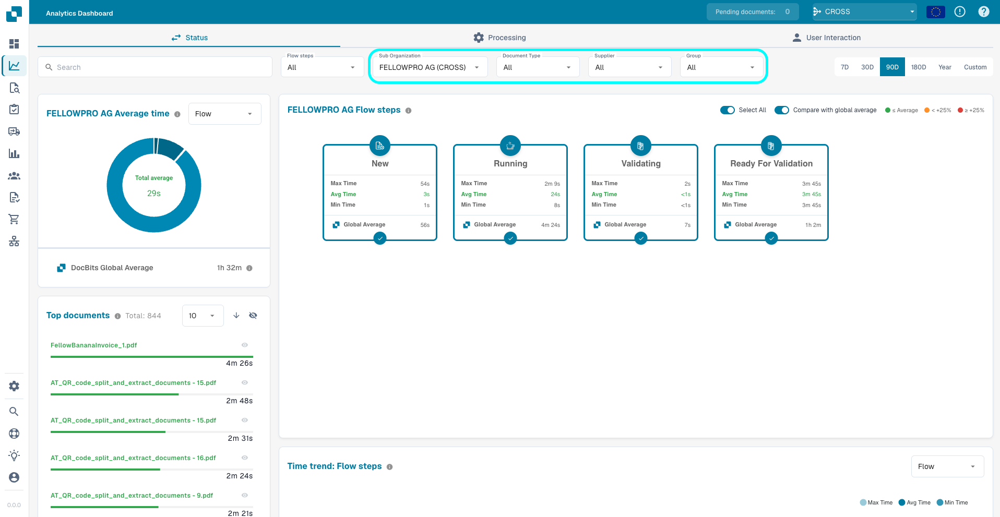<figcaption></figcaption></figure>

<mark style="color:red;">**Remarque**</mark> : Le filtre **Groupe** ne s'applique qu'aux documents qui sont **directement assignés à un groupe**. Les documents assignés à un utilisateur individuel — même si cet utilisateur est membre d'un groupe — ne sont **pas** inclus dans les résultats du filtre de groupe.

### Période

Analysez n'importe quelle période, de **7 jours** jusqu'à une **année complète**, ou définissez une **plage personnalisée** à l'aide du sélecteur de dates.

<figure>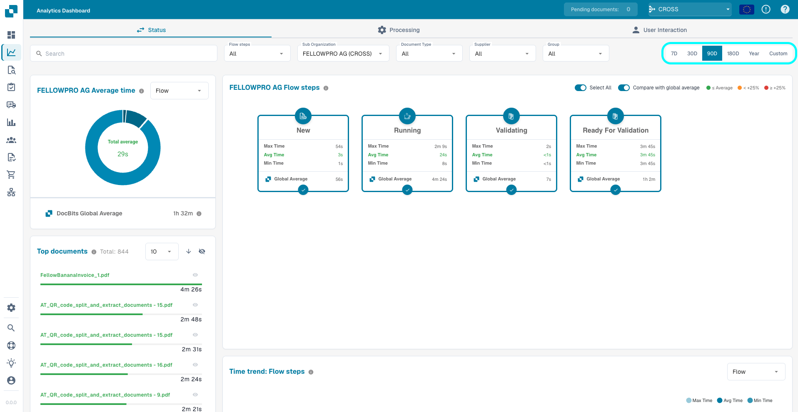<figcaption></figcaption></figure>

## Cartes des étapes du flux

Chaque carte représente une étape de flux selon le **Type de flux** sélectionné. Les cartes s'adaptent à votre sélection — affichant les étapes du cycle de vie pour *Statut*, les modules de traitement pour *Traitement*, ou les points de contact utilisateur pour *Interaction de l'utilisateur*.

Chaque carte affiche :

* Les temps **Min, Moyenne, Max** pour l'étape
* Une comparaison entre **votre Temps moyen** et la **Moyenne mondiale DocBits** (lorsque le commutateur de comparaison est activé)
* Un cercle de sélection pour **inclure ou exclure** l'étape des calculs de temps agrégés utilisés par le Graphique du temps moyen, le Graphique de tendance temporelle et le Tableau de données

Un commutateur **Tout sélectionner** dans l'en-tête vous permet d'inclure ou d'exclure toutes les étapes à la fois.

<figure>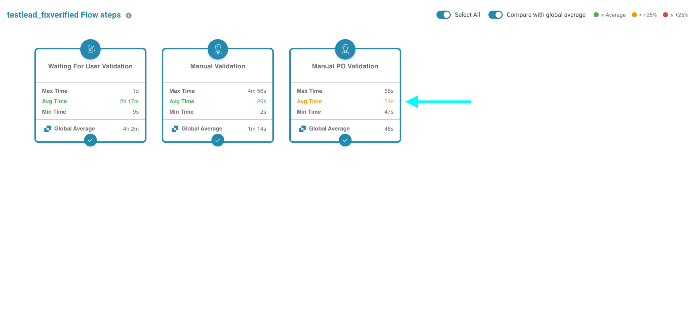<figcaption></figcaption></figure>

<figure>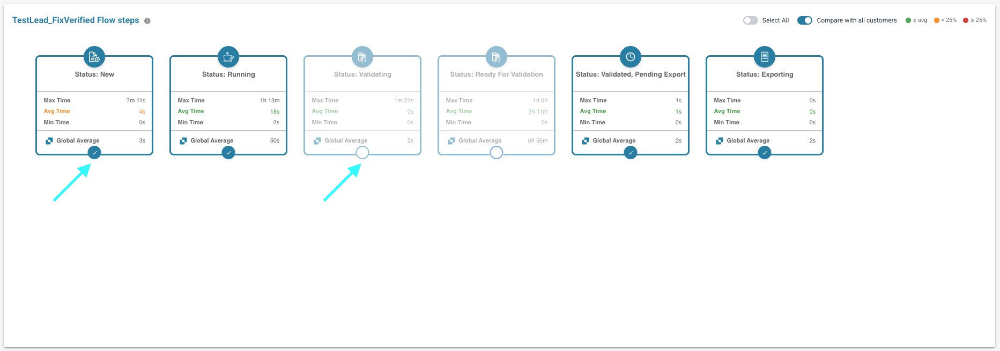<figcaption></figcaption></figure>

### Comparer avec la Moyenne mondiale

Le commutateur **Comparer avec la Moyenne mondiale** contrôle si la Moyenne mondiale DocBits est affichée sur les cartes et dans le graphique. Lorsqu'il est activé, le temps moyen sur chaque carte est codé par couleur :

* **Vert** — votre Temps moyen est égal ou inférieur à la Moyenne mondiale
* **Orange** — votre Temps moyen est jusqu'à **+25 %** au-dessus de la Moyenne mondiale
* **Rouge** — votre Temps moyen est à **+25 %** ou plus au-dessus de la Moyenne mondiale

<figure>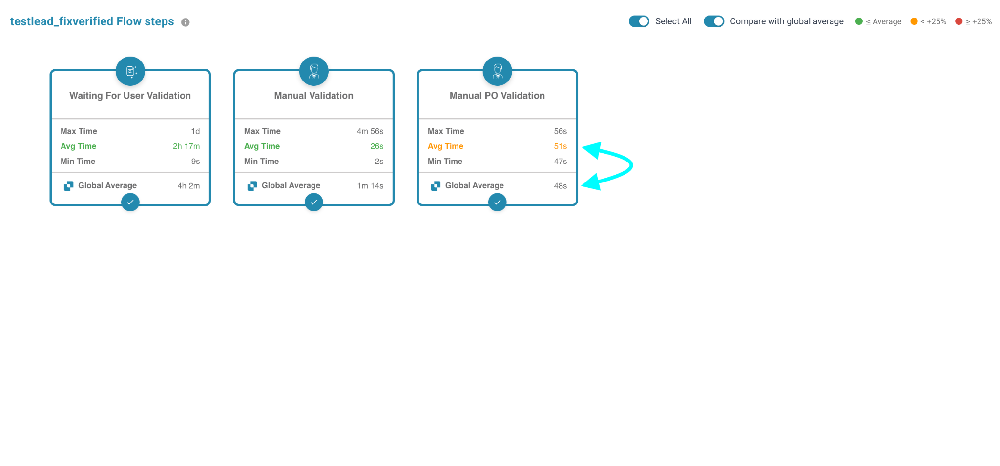<figcaption></figcaption></figure>

## Graphique du temps moyen

Le Graphique du temps moyen visualise la distribution du temps de traitement pour les étapes de flux sélectionnées. Utilisez le sélecteur **Grouper par** pour comparer entre différentes dimensions :

* **Étapes du flux** — voir quelles étapes consomment le plus de temps
* **Sous-organisation** — identifier les variations entre les unités commerciales
* **Type de document** — comparer les temps de traitement entre les types de documents
* **Fournisseur** — découvrir quels fournisseurs ont les temps de traitement les plus longs
* **Groupe** — comparer entre les groupes d'utilisateurs assignés (types de flux Statut et Interaction de l'utilisateur uniquement)

Lorsque **Comparer avec la Moyenne mondiale** est activé, le graphique affiche également la Moyenne mondiale DocBits pour le benchmarking.

<figure>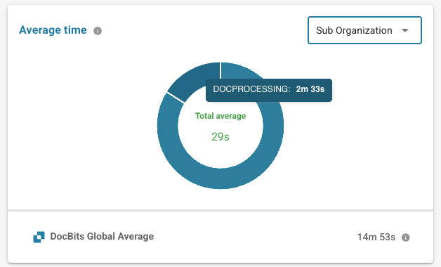<figcaption></figcaption></figure>

## Documents principaux

La carte **Documents principaux** liste les documents individuels correspondant à l'ensemble de filtres actifs, classés par temps total passé.

* Commutateur d'**ordre de tri** — basculer entre **décroissant** (le plus lent en premier) et **croissant** (le plus rapide en premier).
* Liste déroulante **Taille de page** et pagination — parcourir le jeu de résultats.
* **Masquer / afficher** un document via l'icône en forme d'œil à côté — les documents masqués sont exclus de tous les calculs de temps sur le tableau de bord.
* **Masquer / afficher tous** les documents du filtre via l'icône en forme d'œil dans l'en-tête.
* **Cliquez sur un document** (nom de fichier ou barre de progression) pour copier son ID de document dans le presse-papiers.

<figure>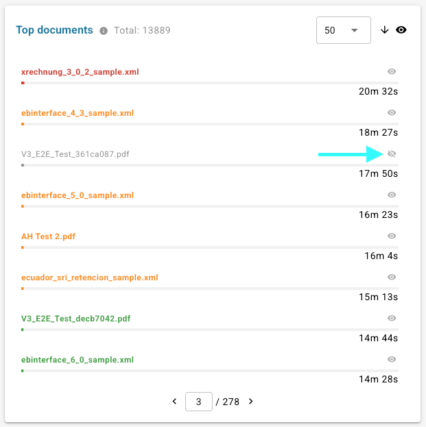<figcaption></figcaption></figure>

## Graphique de tendance temporelle

Suivez les tendances de performance dans le temps et détectez les anomalies. Le Graphique de tendance temporelle affiche le **Temps moyen** des étapes de flux actuellement sélectionnées et peut être groupé par :

* **Étapes du flux** — une ligne par étape sélectionnée
* **Sous-organisation**
* **Type de document**
* **Fournisseur**
* **Groupe** (disponible pour les types de flux **Statut** et **Interaction de l'utilisateur**)

Cela facilite la détection d'un pic soudain pour un fournisseur spécifique, ou d'une augmentation progressive pour un type de document spécifique, avant qu'il ne devienne un problème critique.

<figure>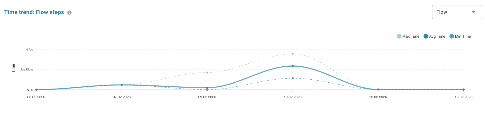<figcaption></figcaption></figure>

<figure>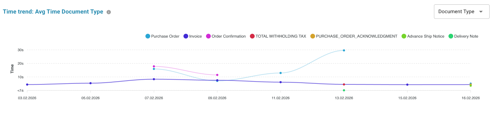<figcaption></figcaption></figure>

## Tableau de données

Le Tableau de données donne un accès complet à toutes les données de ligne sous-jacentes pour l'ensemble de filtres actifs.

* **Glissez les colonnes dans le panneau Colonnes cachées** (à gauche du tableau) pour les retirer de la vue. Les colonnes cachées sont utilisées pour l'agrégation — les temps **Min / Max / Moyenne** sont recalculés dynamiquement en fonction des colonnes visibles. Glissez une étiquette vers le tableau (ou cliquez sur l'icône **+**) pour restaurer la colonne.
* **Triez** en cliquant sur les en-têtes de colonne et **réorganisez** les colonnes par glisser-déposer.
* **Téléchargez le CSV** via le bouton dans l'en-tête de la carte — seules les colonnes actuellement visibles sont exportées.

<figure>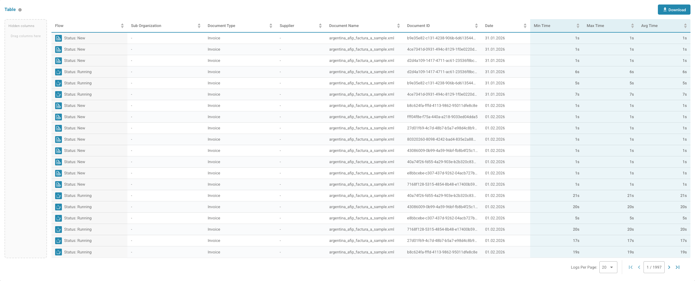<figcaption></figcaption></figure>

<figure><figcaption></figcaption></figure>

<figure>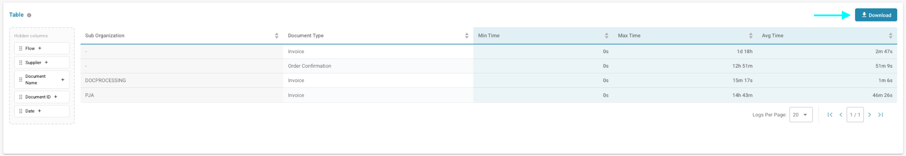<figcaption></figcaption></figure>
