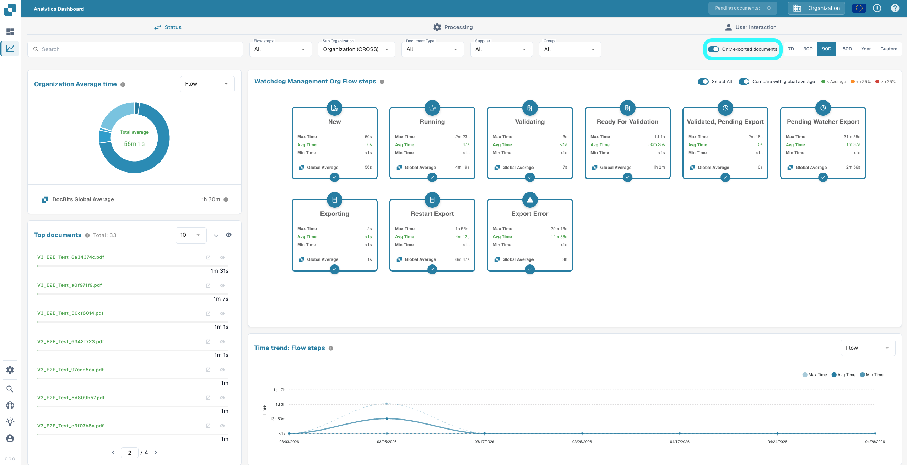

# Analytics Dashboard

## Overview

The **Analytics Dashboard** provides complete visibility into your document processing performance. It tracks how long documents spend at each stage of their journey — from import to export — and helps you identify bottlenecks, compare performance across organizations, document types, and suppliers, and benchmark your results against the **DocBits Global Average**.

Every document travels through distinct stages:

**New** (imported) → **Running** (processing) → **Ready for Validation** (awaiting user review) → **Pending Approval** (awaiting approval) → **Export** (completed & exported)

Time passes at each stage — the Analytics Dashboard tells you exactly **how much**, and **where** to focus your improvements.

### Two Types of Bottlenecks

The dashboard helps you distinguish between:

* **System Bottlenecks** — How long DocBits is busy with automatic processing (OCR & text extraction, document classification, field extraction, automatic validation). Optimizable through configuration and system resources.
* **User Bottlenecks** — Time spent waiting for manual validation and approval (queue wait time, manual data correction, review & validation, approval workflows). Optimizable through workflow and resource allocation.

## How to Activate

The Analytics Dashboard is controlled by a module setting. Once enabled, an **Analytics Dashboard** entry appears in the left sidebar.

1. Navigate to **Settings → Document Processing → Module → Dashboard and Analytics**.
2. Enable the **Analytics Dashboard** option.

<mark style="color:red;">**Note**</mark>: The Analytics Dashboard requires an **AI Dashboard Subscription**.

<mark style="color:red;">**Note**</mark>: Access to the Analytics Dashboard is limited to users with **administrator** rights.

## Flow Types

Choose the right lens for your analysis. Each flow type gives you a different perspective on the same data.

| Flow Type | Purpose | Key Question |
| --- | --- | --- |
| **Status** | Track document lifecycle from import to export | *"What is the overall time of my documents from import to export?"* |
| **Processing** | Technical module performance analysis | *"Which processing steps are bottlenecks?"* |
| **User Interaction** | Human touchpoints and wait times | *"How long do documents wait for users?"* |

Use the **Flow Type** switch at the top of the dashboard to toggle between perspectives.

<figure><figcaption></figcaption></figure>

### Status Flow

Tracks the document journey from **New** to **Exported** — useful for end-to-end lifecycle analysis.

<figure><figcaption></figcaption></figure>

### Processing Flow

Analyzes performance across all **technical processing modules** (OCR, classification, extraction, validation) — useful for identifying system-side bottlenecks.

<figure><figcaption></figcaption></figure>

### User Interaction Flow

Focuses on **human touchpoints** — queue wait time, manual validation, review and approval — useful for identifying workflow and staffing bottlenecks.

<figure><figcaption></figcaption></figure>

## Filter Options

The dashboard supports powerful multi-dimensional filtering. All charts, cards, and tables update in real time based on the active filters.

### Search

Instantly locate any document by **name** or **unique ID**.

<figure><figcaption></figcaption></figure>

### Flow Steps

Select specific steps to focus your analysis. Toggling steps on/off also recalculates timing metrics on the other components of the dashboard.

<figure><figcaption></figcaption></figure>

### Sub-Organization, Document Type, Supplier, Group

Compare performance across:

* **Sub-Organizations** — different business units or tenants
* **Document Types** — invoices, purchase orders, delivery notes, etc.
* **Suppliers** — to identify which suppliers cause the longest processing times
* **Groups** — to compare performance across assigned user groups (available for the **Status** and **User Interaction** flow types)

<figure><figcaption></figcaption></figure>

<mark style="color:red;">**Note**</mark>: The **Group** filter only applies to documents that are **assigned directly to a group**. Documents assigned to an individual user — even if that user is a member of a group — are **not** included in the group filter results.

### Only Exported Documents

On by default — only documents that have completed export are considered in the dashboard metrics.

<mark style="color:red;">**Note**</mark>: Disabling this can result in inaccurate average values, since documents that have not yet completed are also included in the calculations.

<figure><figcaption></figcaption></figure>

### Time Range

Analyze any period from **7 days** up to a **full year**, or set a **custom range** using the date picker.

<figure><figcaption></figcaption></figure>

## Flow Steps Cards

Each card represents a flow step based on the selected **Flow Type**. The cards adapt to your selection — showing lifecycle stages for *Status*, processing modules for *Processing*, or user touchpoints for *User Interaction*.

Each card displays:

* **Min, Avg, Max** times for the step
* A comparison between **your Avg Time** and the **DocBits Global Average** (when the comparison toggle is on)
* A selection circle to **include or exclude** the step from the aggregate timing calculations used by the Average Time Chart, Time Trend Chart, and Data Table

A **Select All** toggle in the header lets you include or exclude every step at once.

<figure><figcaption></figcaption></figure>

<figure><figcaption></figcaption></figure>

### Compare with Global Average

The **Compare with Global Average** toggle controls whether the DocBits Global Average is shown on the cards and in the chart. When enabled, the average time on each card is color-coded:

* **Green** — your Avg Time is at or below the Global Average
* **Orange** — your Avg Time is up to **+25%** above the Global Average
* **Red** — your Avg Time is **+25%** or more above the Global Average

<figure><figcaption></figcaption></figure>

## Average Time Chart

The Average Time Chart visualizes how processing time is distributed for the selected flow steps. Use the **Group By** selector to compare across different dimensions:

* **Flow Steps** — see which steps consume the most time
* **Sub-Organization** — identify variations between business units
* **Document Type** — compare processing times across document types
* **Supplier** — discover which suppliers have the longest processing times
* **Group** — compare across assigned user groups (Status and User Interaction flow types only)

When **Compare with Global Average** is enabled, the chart also displays the DocBits Global Average for benchmarking.

<figure><figcaption></figcaption></figure>

## Top Documents

The **Top Documents** card lists individual documents matching the active filter set, ranked by total time spent.

* **Sort order** toggle — switch between **descending** (slowest first) and **ascending** (fastest first).
* **Page size** dropdown and pagination — page through the result set.
* **Hide / show** a document via the eye icon next to it — hidden documents are excluded from all timing calculations on the dashboard.
* **Hide / show all** documents in the filter via the eye icon in the header.
* **Click a document** (filename or progress bar) to copy its Document ID to the clipboard.

<figure><figcaption></figcaption></figure>

## Time Trend Chart

Track performance trends over time and spot anomalies. The Time Trend Chart shows the **Avg Time** of the currently selected flow steps and can be grouped by:

* **Flow Steps** — one line per selected step
* **Sub-Organization**
* **Document Type**
* **Supplier**
* **Group** (available for the **Status** and **User Interaction** flow types)

This makes it easy to detect a sudden spike for a specific supplier, or a gradual increase for a specific document type, before it becomes a critical problem.

<figure><figcaption></figcaption></figure>

<figure><figcaption></figcaption></figure>

## Data Table

The Data Table provides full access to all underlying row data for the active filter set.

* **Drag columns into the Hidden Columns panel** (left of the table) to remove them from the view. Hidden columns are used for aggregation — **Min / Max / Avg** timings are recalculated dynamically based on the visible columns. Drag a chip back to the table (or click the **+** icon) to restore the column.
* **Sort** by clicking column headers and **reorder** columns by drag-and-drop.
* **Download CSV** via the button in the card header — only the currently visible columns are exported.

<figure><figcaption></figcaption></figure>

<figure><figcaption></figcaption></figure>

<figure><figcaption></figcaption></figure>
