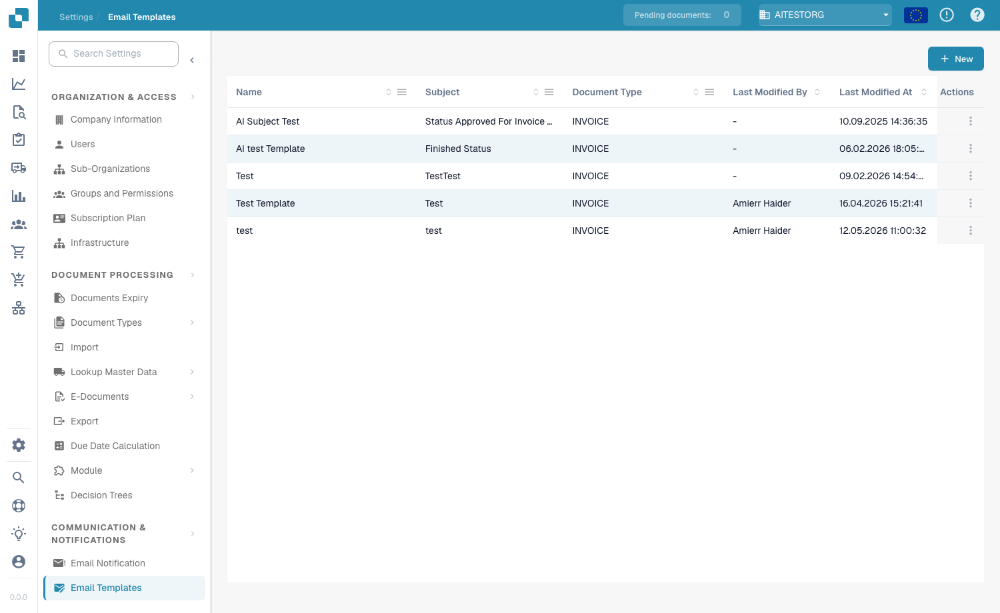
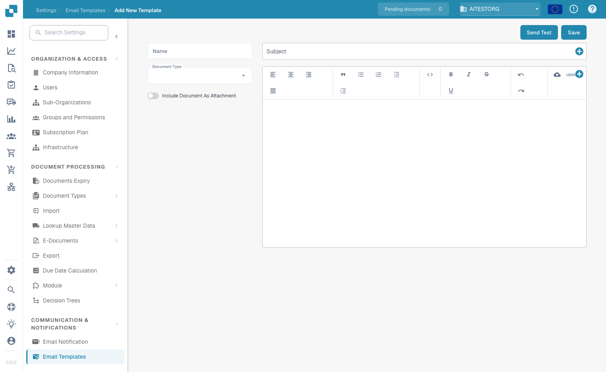

# Email Templates

<figure><figcaption>
Email Templates list
</figcaption></figure>

Email Templates let you design reusable email layouts used by Email Notifications. Each template defines a subject line and body content, including dynamic placeholders that are filled in with document data when the email is sent. Open the page from **Settings → Communication & Notifications → Email Templates**.

## Template List

| Column | Description |
|--------|-------------|
| **Name** | A descriptive name for the template. |
| **Subject** | The email subject line. Supports placeholders such as `{{invoice_id}}`. |
| **Document Type** | The document type this template applies to (e.g. `INVOICE`). |
| **Last Modified By** | The user who last edited the template. |
| **Last Modified At** | Timestamp of the last change. |
| **Actions** | Three-dot menu to edit or delete the template. |

## Creating a Template

1. Click **+ New** in the top-right corner.
2. Enter a **Name** and choose the **Document Type** the template applies to.
3. (Optional) Enable **Include Document As Attachment** to attach the source document to the email.
4. Enter the **Subject**. Click the **+** button next to the field to insert a dynamic placeholder.
5. Design the email body in the rich-text editor — format text (bold, italic, lists, alignment), insert images with **Upload**, and use the **+** button to insert placeholders.
6. Click **Send Test** to email yourself a preview, then click **Save**.

<figure><figcaption>
The template editor — name, document type, subject and rich-text body
</figcaption></figure>

## Dynamic Placeholders

Placeholders insert document field values into the subject or body. Add them with the **+** button, or type them directly using double curly braces:

* `{{invoice_id}}` — the invoice number
* `{{supplier_name}}` — the supplier name
* `{{total_amount}}` — the total amount
* `{{status}}` — the current document status

## Sending a Test

Click **Send Test** in the editor to send a preview of the template to your own email address. This lets you check the layout and verify that the placeholders resolve correctly before saving the template.
