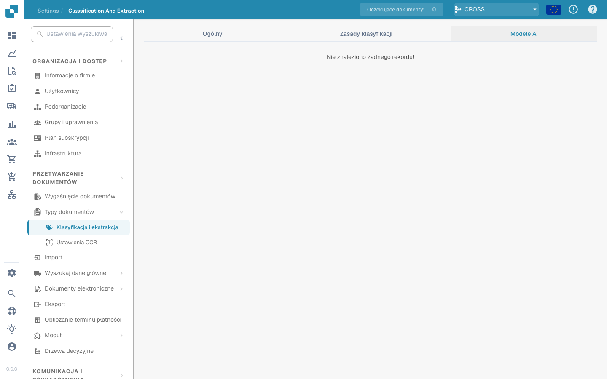

# Classification and Extraction

<figure><figcaption>
Classification and Extraction Page
</figcaption></figure>

## Overview

In the **Classification and Extraction** settings, you can:

* Enable **Document Splitting** based on QR codes
* Configure **amount formatting**
* Set up **table extraction**
* Toggle processing of unsupported **ZUGFeRD** files
* Define special classification rules
* Monitor Custom-Trained **AI Models** used in the classification process

This page provides a detailed explanation of all available settings.

## **Accessing Classification and Extraction Settings**

To access the **Classification and Extraction** settings, go to:\
**Settings → Document Processing → Classification and Extraction**

<figure><figcaption></figcaption></figure>

## Document Splitting

In the **Document Splitting** section, you can configure whether an uploaded document should be split into multiple documents whenever a **barcode** appears on one of its pages.

To activate this feature:

1. Go to the **Document Splitting** section.
2.  Open the dropdown menu.

    <figure><figcaption></figcaption></figure>
3.  Select **Split by Barcode/QR Code**.

    <figure><figcaption></figcaption></figure>

You will then have the option to:

* Select one or more barcode types to be detected.
*   Specify a regex pattern that the barcode must match in order to trigger document splitting.

    <figure><figcaption></figcaption></figure>

## Amount Formatting

In the **Amount Formatting** section, you have two options:

* **Allow Rounding During Amount Comparison:**\
  If enabled, a tolerance of ±0.5 is allowed during amount comparison.\
  If disabled, a default tolerance of ±0.05 applies.
* **Require Exact Match for Amount Comparison:**\
  If enabled, amounts must match exactly with zero tolerance.\
  If disabled, a tolerance of ±0.05 is allowed.

<mark style="color:red;">**Note**</mark>: Only one of these settings can be active at a time.

## Table Extraction


**Prerequisites for a working table extraction**

* The document type has **table columns** (Settings → Global Settings → Document Types → [Table Columns](../../global-settings/document-types/table-columns/README.md)). Without columns there is nothing to extract into.
* **Table Extraction** or **AI Table Extraction** is switched on below, for the whole organization.
* The document has readable text: OCR ran, or E-Text is used for born-digital PDFs ([OCR Settings](../ocr-settings.md)).
* Training and AI models are **per supplier**. A trained table applies only to documents of the supplier it was trained on.


You can extract tables from documents by enabling either **Table Extraction** or **AI Table Extraction**. A trained table (whether AI-based or manual) is always linked to a specific supplier.

**Table Extraction:** Activates rule-based table extraction. Tables are trained per supplier on the validation screen (*Go to table extraction view*).\
Learn more about training [here](../../../setup/document-training/training-line-fields-table-training/defining-tables-and-columns.md).

**AI Table Extraction:** Uses AI to extract the table of any supplier without training. If the results for one supplier are not accurate enough, train that supplier's table; the saved rules then take precedence over the AI for that supplier.

**Use Table Extraction Vision (AI):** The AI reads the page image instead of the text layer. Helps with scanned documents and tables without clear text structure; slower.

**Use Structured Extraction (AI):** The AI returns the table in a fixed structure that maps directly onto the configured table columns. Recommended when column headers on the documents vary a lot.

**Table Extraction for Costing Element:** When enabled, DocBits can extract costing elements from tables at the line level and classify them accordingly.\
Detailed explanation available [here](table-extraction-for-costing-element.md).

**Auto Extract Tax Code:** When enabled, the system automatically fills the **Tax Code** field on the Validation Screen, provided that a tax code field is configured.\
More information on this setting [here](auto-extract-tax-code.md).

**Save extraction rules (Admin only):** Only administrators can click *Save Rules* in table training. Switch it on when users keep saving rules that break a supplier's extraction.

**AI Model:** Selects the AI tier used for table extraction: **Fast** (default), **Full** (highest accuracy, slower) or **Nexus** (opt-in third tier). The table below the selector shows:

* Which **suppliers** use which AI model
* Whether they use E-Text
* Options to delete an entry or reset the training data

This setting is explained in detail [here](ai-model.md).

### Why does the table look different per supplier?

Everything that DocBits learns about a table is stored **per supplier**:

* **Saved rules** (table training): position of the table and mapping of its columns on that supplier's layout.
* **AI table tags and formatting rules**: hints the user saved for that supplier's AI table.
* **Supplier-specific AI model**: the tier chosen for that supplier under *More settings* on the validation screen.

So supplier A with saved rules shows a deterministic table in the *Extracted table* tab of the validation screen, while supplier B without rules gets the *AI Extracted table*. To make supplier B behave like A, train B's table once. To reset a supplier, delete its rules on the validation screen or reset its training data in the AI Model table.

### Preference keys

Every toggle in this section is stored as an organization preference. Use the key when you set the value through the API (`/preferences/set_preference`), a script, or the DocBits MCP (`get_preference` / `set_preference`).

| Setting (UI label) | Preference key | Values |
|---|---|---|
| Table Extraction | `TABLE_EXTRACTION_SETTING` | `true` / `false` |
| AI Table extraction | `USE_AI_TABLE_EXTRACTION` | `true` / `false` |
| Use Table Extraction Vision (AI) | `TABLE_EXTRACTION_USE_VISION` | `true` / `false` |
| Use Structured Extraction (AI) | `USE_STRUCTURED_EXTRACTION` | `true` / `false` |
| Table extraction for costing element | `CHARGES_TABLE_EXTRACTION` | `true` / `false` |
| Auto extract tax code | `AUTO_EXTRACT_TAX_CODE` | `true` / `false` |
| Save extraction rules (Admin only) | `ONLY_ADMIN_CAN_SAVE_RULES` | `true` / `false` |
| AI Model | `AI_MODEL` | `gpt-5.4-mini` (Fast), `gpt-5.5` (Full), `qwen3.8-max` (Nexus) |
| Table extraction version (confirmation dialog) | `TBL_EXT_VERSION` | version string |
| OCR Settings → Use AI data for tables if available | `USE_AI_DATA_FOR_TABLE` | `true` / `false` |
| OCR Settings → Use E-Text if available | `USE_ETEXT_IF_AVAILABLE` | `true` / `false` |

Notes:

* Boolean preferences are stored as the strings `true` / `false`; a key that was never set counts as `false`. If you send `1` or `0`, DocBits stores `true` / `false`.
* `AI_MODEL` unset means **Fast**.
* Changing a key takes effect for documents processed afterwards. Restart a document to re-extract it with the new setting.
* Per-supplier choices (E-Text, AI model, saved rules) are not organization preferences; they are set on the validation screen under *More settings* for a document of that supplier.

## Electronic Document

**Process Unsupported ZUGFeRD PDF:** If enabled, unsupported **ZUGFeRD** versions will be processed as standard PDFs, and the embedded XML will be ignored.

The list of supported **ZUGFeRD** versions can be found [here](../../global-settings/document-types/edi/zugferd/README.md).

## **Classification Rules**

In the **Classification Rules** section, you can define specific **regex** patterns and criteria to help the system automatically classify documents during processing.

To access this section, click the **Classification Rules** tab at the top of the page.

<figure><figcaption></figcaption></figure>

### **Add a New Classification Rule**

To create a new rule:

1.  Click **Add** in the top-right corner.

    <figure><figcaption></figcaption></figure>
2. Fill in the following fields:
   * **Pattern**: The regex pattern the system should search for to trigger classification.
   * **Type**: Where the pattern should be searched (e.g., **Barcode**).
   * **Sub Organization** _(optional)_: Specify which sub organization the rule applies to.
   * **Document Type**: Define the document type to assign when the pattern is matched.
   *   **Sub Document Type** _(optional)_: Specify a sub type for more detailed classification.

       <figure><figcaption></figcaption></figure>
3.  Click **Save** to save your classification rule.

    <figure><figcaption></figcaption></figure>

### **Edit a Classification Rule**

To edit an existing rule:

1.  Click the three dots in the **Actions** column.

    <figure><figcaption></figcaption></figure>
2.  Select **Edit**.

    <figure><figcaption></figcaption></figure>
3. Make your desired changes.
4.  Click **Save** to apply the updates.

    <figure><figcaption></figcaption></figure>

### **Delete a Classification Rule**

To delete a rule:

1.  Click the three dots in the **Actions** column.

    <figure><figcaption></figcaption></figure>
2.  Select **Delete**.

    <figure><figcaption></figcaption></figure>

## AI Models

The **AI Models** section displays all custom-trained models that have been specifically fine-tuned for your needs.

### Accessing the AI Models Section

To open this section, click the **AI Models** tab located at the top of the page.

<figure><figcaption></figcaption></figure>

### Model Categories

Models are organized into categories. Below each category name, the number of models it contains is shown.\
Click on a category to view its details.

<figure><figcaption></figcaption></figure>

At the top of the selected category page, you’ll see key information about each model:

* **Type**: The type of model.
* **First Page Only**: Indicates whether the model processes only the first page of a document.
* **Version**: The version number of the model.

### Model Table

All models within a category are listed in a table, which includes the following information:

* **Name**: The name of the model.
* **Next Model**: The model that will further process the output of the current model.
* **Document Type**: The primary document type assigned by the model during classification.
* **Document Sub Types**: The sub types into which the document is further classified.
* **Priority**: The priority level that determines the model’s position in the classification queue.

<figure><figcaption></figcaption></figure>

### Editing a Model

To edit a model:

1.  Click the pen icon in the **Actions** column next to the model you want to edit.

    <figure><figcaption></figcaption></figure>
2. Update the available fields:
   * **Next Model**: Select the model that should process the output from the current model.
   * **Document Type**: Choose the document type the model should classify the input as.
3.  Click **Save** to apply your changes.

    <figure><figcaption></figcaption></figure>
