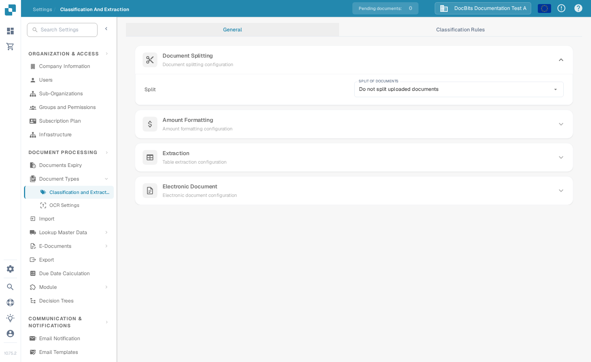
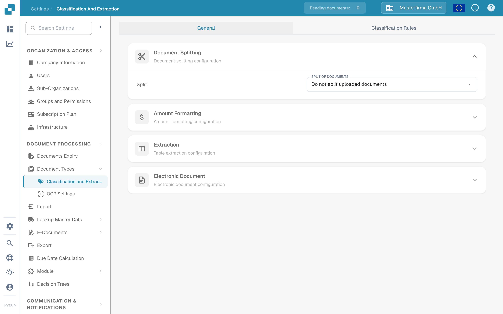
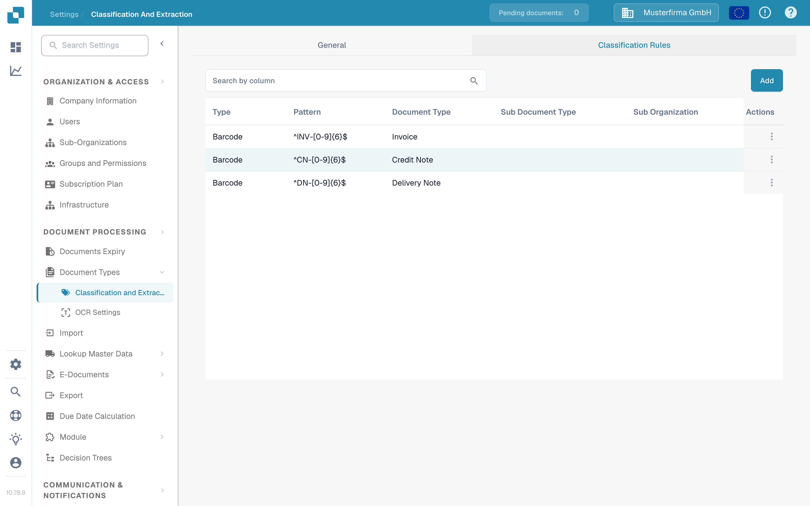
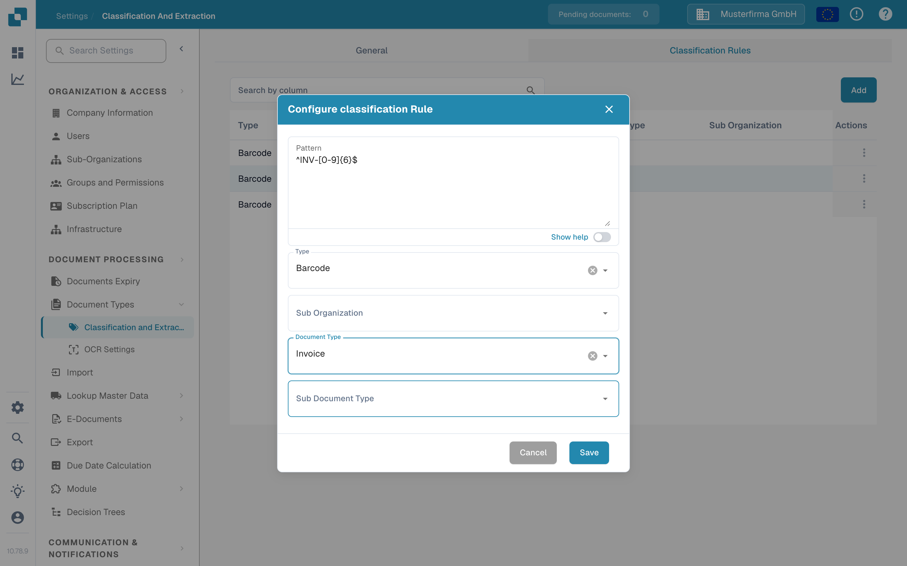

# Classification and Extraction

Use these settings to control how DocBits splits uploaded files, compares amounts, extracts tables, handles certain electronic documents, and classifies documents. You need permission to change organization settings.

Open **Settings → Document Types → Classification and Extraction**. The current page has two tabs: **General** and **Classification Rules**. The AI model controls are in **General → Extraction**; there is no separate **AI Models** tab on this screen.

<figure><figcaption>
Choose General for processing settings or Classification Rules for document classification patterns.
</figcaption></figure>

## General

Open a section to see its settings. Changing an organization setting can affect documents processed later; check the intended document type and test the result before changing a production workflow.

### Document Splitting

**Split** is set to **Do not split uploaded documents** in this test organization. Choose a barcode or QR-code splitting option only when your incoming file format requires it. When that option is selected, configure the supported barcode types and a pattern if needed. A file is split only when the configured conditions are met.

### Amount Formatting

**Allow Rounding During Amount Comparison** controls whether small rounding differences are accepted. **Require Exact Match for Amount Comparison** requires an exact comparison. Check which policy your organization needs before enabling either option; the two settings have different effects on validation.

### Extraction

**Table Extraction** enables extraction based on trained rules. **AI Table extraction** enables AI-based table extraction. The controls for **Use Table Extraction Vision (AI)** and **Use Structured Extraction (AI)** choose how the AI reads and structures a table. A document type also needs configured table columns for useful results; see [Table Columns](../../global-settings/document-types/table-columns/README.md).

The current screen also includes **Table extraction for costing element**, **Auto extract tax code**, **Save extraction rules (Admin only)**, and **AI Model**. The model selector and supplier table live here, within **Extraction**. See [Table Extraction for Costing Element](table-extraction-for-costing-element.md), [Auto Extract Tax Code](auto-extract-tax-code.md), and [AI Model](ai-model.md) for those topics.

**What the AI requests** shows the header fields and table columns requested for the selected document type. Use **Edit fields** or **Edit columns** only after checking the selected type; the list distinguishes requested columns from configured columns that are not requested. Supplier training or AI hints can change the requested fields for a supplier.

<figure><figcaption>
The Extraction section shows both the processing controls and requested fields for the selected type.
</figcaption></figure>

### Electronic Document

**Process Unsupported ZUGFeRD PDF** controls whether unsupported ZUGFeRD PDFs are processed as ordinary PDFs instead of using their embedded XML. For supported versions, see [ZUGFeRD](../../global-settings/document-types/edi/zugferd/README.md).

## Classification Rules

The **Classification Rules** tab lists patterns used to assign a document type or subtype. Search the list with **Search by column**. Existing rows offer **Edit** and **Delete** actions; check which documents rely on a rule before changing it. In the captured test organization the list is empty, so no existing rule was edited or deleted.

<figure><figcaption>
Find existing rules here or choose Add to prepare a new one.
</figcaption></figure>

To prepare a rule, choose **Add**. The dialog asks for **Pattern**, **Type**, **Sub Organization**, **Document Type**, and **Sub Document Type**. Select the type and destination carefully; the pattern determines which documents the rule can match. **Cancel** leaves the organization unchanged. **Save** creates the rule, so review it before saving.

<figure><figcaption>
Review the pattern and target document type before saving a classification rule.
</figcaption></figure>


These screenshots show English UI in the synthetic DocBits Documentation Test A organization. No organization setting or classification rule was saved while capturing them.

