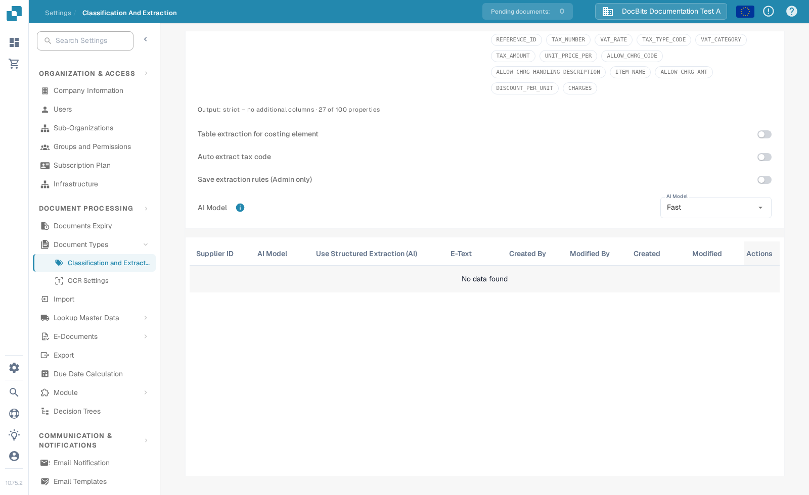
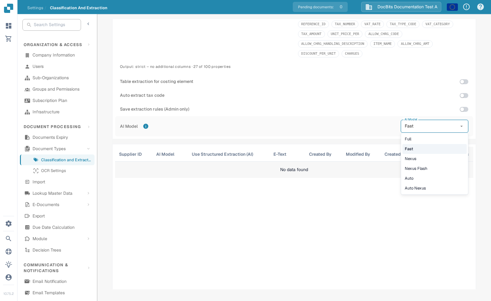

# AI Model

Choose the default AI model for extraction in **Settings → Document Processing → Classification and Extraction → General → Extraction**. Scroll to **AI Model** below the extraction options. The selector displays the current choice; in the synthetic **DocBits Documentation Test A** organization it is **Fast**.

<figure><figcaption>
The AI Model selector sits below the Extraction settings. The supplier table is empty in this test organization.
</figcaption></figure>

## Choose an option

1. Open the **AI Model** selector. The current Sandbox menu offers **Full**, **Fast**, **Nexus**, **Nexus Flash**, **Auto**, and **Auto Nexus**. Available options may vary with your organization's deployment.
2. Check the **info** icon beside the setting for the token cost of the selected option. In the captured Test A state, the tooltip for **Fast** reads **Costs 1 token per document**. Confirm current costs in your own organization before changing a setting.
3. If you are responsible for organization-wide extraction settings, choose the option approved for your documents. Changing the selection saves an organization setting; this guide's screenshots opened the menu without changing or saving a value.

<figure><figcaption>
The live menu contains six choices; none was selected during this documentation check.
</figcaption></figure>

The model choice is only one part of extraction. The nearby **Table Extraction**, **AI Table extraction**, **Use Table Extraction Vision (AI)**, and **Use Structured Extraction (AI)** controls have separate effects. See [Classification and Extraction](README.md) before changing them. For document-level behavior, compare a representative document before and after any setting change.

## Supplier-specific settings

The table below the selector lists supplier overrides, if any. Its columns show **Supplier ID**, **AI Model**, **Use Structured Extraction (AI)**, **E-Text**, who created and modified the entry, the dates, and **Actions**. **No data found** means this organization has no supplier-specific entries to inspect in this view.

Where an entry exists and your role allows it, its **Actions** menu can remove the override after a confirmation. This was not exercised in the synthetic test organization because the table is empty. A supplier without an override uses the applicable default. See [Supplier-specific AI model for field and table extraction](../../../../end-user-and-partner-section/end-user-section/validation-screen/supplier-specific-ai-model-for-field-and-table-extraction.md) to configure a supplier from the validation screen.
