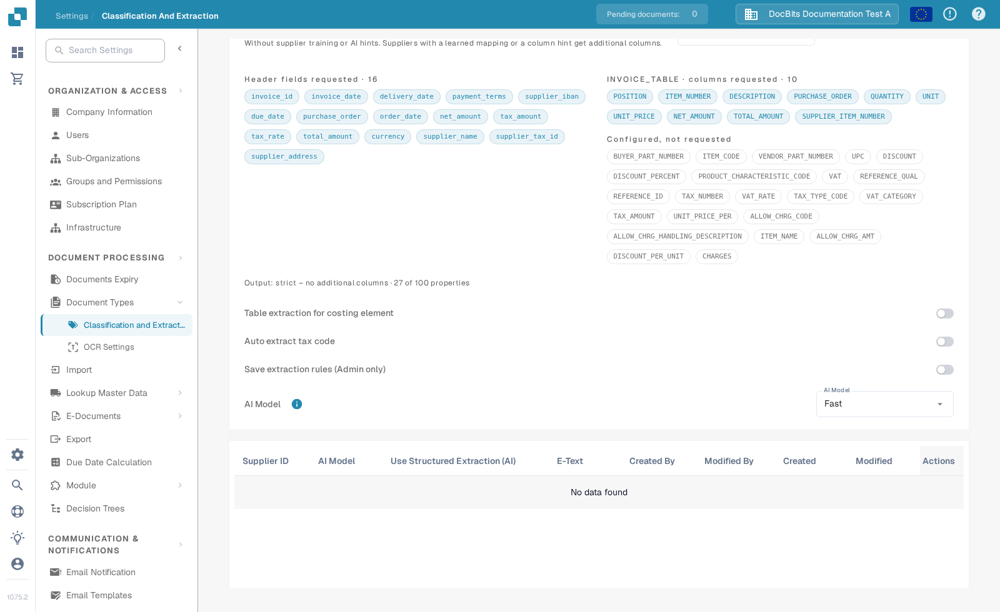

# Table extraction for costing element

Costing elements are charges or other amounts represented as invoice table lines. If this feature is enabled and the document has extracted lines, DocBits can classify those lines against the costing elements configured for the organization. A reviewer can correct a line's classification in the document table.

## Enable the setting

1. Open **Settings → Document Processing → Classification and Extraction**.
2. Stay on **General** and expand **Extraction**.
3. Find **Table extraction for costing element** below the fields requested for table extraction. An administrator can turn on this switch for the organization.

<figure><figcaption>
The switch is off in the synthetic Test A organization. It was not changed for this guide.
</figcaption></figure>


The switch alone does not create costing elements or invoice rows. Configure the elements and import any required data first. The linked [costing-element setup guide](../../../../infor-integration-and-configuration/importing-customer-master-data/m3/table-extraction-for-costing-element.md) explains the M3 example. Check [Classification and Extraction](README.md) for the other extraction controls.


## Review or correct a line

Open a document whose invoice table contains extracted lines and inspect the costing-element icon beside the relevant line. Select the icon to open the available classifications. Choose the correct configured costing element, or choose **Uncategorize** if the line is an ordinary item. Then review the resulting line and totals before saving the document.

If the icon or a classification is missing, first confirm that the document has extracted lines, the feature is enabled, and a costing element is configured for the organization. The synthetic Test A document used for this documentation check had no extracted invoice lines, so the classification menu could not be pictured or exercised. The steps above reflect the current document control; no classification was saved during this check.
