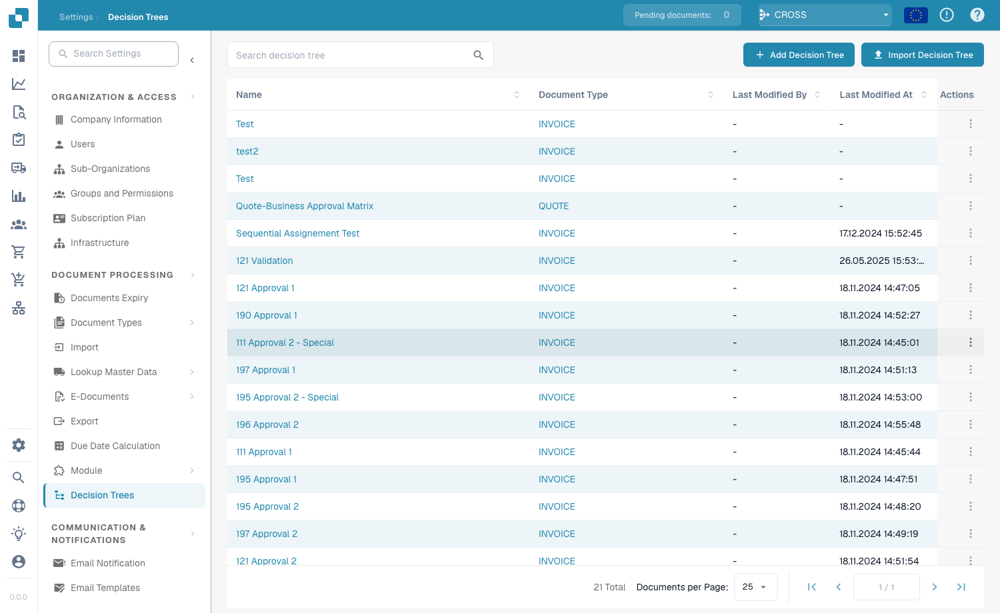

# Árvores de Decisão


Como criar uma Árvore de Decisão no DocBits (Condições, Políticas, Testes e Exportação)


## Visão geral

As Árvores de Decisão são uma funcionalidade poderosa que permite o encaminhamento automatizado e o processo de tomada de decisão com base em regras predefinidas. Esta funcionalidade é especialmente útil em ambientes complexos onde é necessário avaliar várias condições para determinar a ação correta a tomar, tais como atribuir preços, determinar quantidades ou encaminhar documentos.

#### Componentes principais

* **Lista de Árvores de Decisão**: Esta é a interface principal onde são listadas todas as árvores de decisão existentes. Cada árvore de decisão pode ser associada a um tipo de documento específico, como uma `INVOICE` ou `QUOTE`.
* **Editor de Árvores de Decisão**: Esta interface permite a criação e edição de árvores de decisão, onde pode definir regras, operadores e ações a executar quando determinadas condições são cumpridas.

## Interface da Árvore de Decisão

#### Lista de Árvores de Decisão

A lista de Árvores de Decisão apresenta todas as árvores de decisão configuradas. Abra-a a partir de **Settings → Document Processing → Decision Trees**.

<figure><figcaption>
A lista de Árvores de Decisão
</figcaption></figure>

Cada entrada apresenta:

| Coluna | Descrição |
|--------|-------------|
| **Name** | O nome da árvore de decisão. Clique no nome para abrir o Editor. |
| **Document Type** | O tipo de documento ao qual a árvore se aplica (por exemplo, `INVOICE`, `QUOTE`). |
| **Last Modified By** | O utilizador que editou a árvore pela última vez. |
| **Last Modified At** | Data e hora da última alteração. |
| **Actions** | Menu de três pontos para editar, copiar, exportar ou eliminar a árvore. |

#### Criar uma Árvore de Decisão

1. Clique em **+ Add Decision Tree** no canto superior direito.
2. Introduza um **Name** e selecione o **Document Type**.
3. Utilize o Editor de Árvores de Decisão (abaixo) para definir condições, políticas e resultados.

#### Importar uma Árvore de Decisão

Clique em **Import Decision Tree** para carregar um ficheiro de árvore de decisão exportado anteriormente (formato JSON). Isto é útil para copiar uma árvore entre organizações ou ambientes.

## Editor de Árvores de Decisão

O Editor de Árvores de Decisão permite-lhe configurar regras que regem a forma como as decisões são tomadas.

### **Componentes do Editor de Árvores de Decisão**

* **Regras**: Cada regra é composta por condições e ações.
* **Select Source**: Esta lista pendente permite-lhe especificar o campo de origem a avaliar.
* **Select Operator**: Define o operador lógico (por exemplo, `<=`, `>=`, `=`, `!=`) a aplicar ao campo de origem.
* **Result**: Define o resultado ou a ação que deve ser executada quando as condições são cumpridas.
* **Add New Row**: Permite-lhe adicionar regras adicionais à árvore de decisão.

### Exemplo de configuração de uma Árvore de Decisão

Esta árvore de decisão avalia o campo **Total Amount** e atribui-o a diferentes grupos com base em condições predefinidas. Cada regra compara o montante total com um valor específico e, com base na condição que é verdadeira, é devolvido o **Group** correspondente.

<figure><figcaption></figcaption></figure>

Esta árvore de decisão avalia duas condições principais para determinar qual o grupo a atribuir: **Total Amount** e **Warehouse Status**. A árvore utiliza limiares baseados no montante total para definir qual o grupo devolvido, com a distinção adicional de saber se o armazém é designado como "Warehouse Main", "Warehouse Sub" ou "Not Warehouse Main".

<figure><figcaption></figcaption></figure>

Cada regra é avaliada sequencialmente.

## Política da Árvore de Decisão

A Política da Árvore de Decisão define como as várias regras de uma árvore de decisão são processadas. Pode escolher entre várias políticas:

* [Política Única (Unique)](decision-trees/unique-policy.md)
* [Política Primeira (First)](decision-trees/first-policy.md)
* [Política de Prioridade (Priority)](decision-trees/priority-policy.md)
* [Política de Recolha (Collect — soma)](decision-trees/collect-sum-policy.md)
* [Política de Recolha (Collect — mín/máx/contagem)](decision-trees/collect-min-max-count-policy.md)
* [Política de Ordem das Regras (Rule Order)](decision-trees/rule-order-policy.md)
* [Política Qualquer (Any)](decision-trees/any-policy.md)
* [Política Primeira e Adjacente (First & Adjacent)](decision-trees/first-and-adjacent-policy.md)

## **Testar a Árvore de Decisão**

**Visão geral:**
O editor de árvores de decisão inclui uma funcionalidade de teste para validar a lógica das regras configuradas. Esta funcionalidade permite aos utilizadores testar a árvore de decisão fornecendo valores de entrada específicos para os campos selecionados.

**Passos para utilizar a funcionalidade de teste:**

1.  **Localizar o botão Test:**

    * No editor de árvores de decisão, encontre o botão **Test**.

    <figure><figcaption></figcaption></figure>
2.  **Abrir o pop-up de teste:**

    * Clique no botão **Test**.
    * Será apresentada uma janela de pop-up, com campos de entrada correspondentes aos critérios utilizados na árvore de decisão.

    <figure><figcaption></figcaption></figure>
3. **Fornecer valores de entrada:**
   *   Introduza valores nos campos de entrada para simular um cenário real.

       <figure><figcaption></figcaption></figure>
4.  **Avaliar os resultados:**

    * Após introduzir os dados, a árvore processa-os com base na política escolhida.
    * O sistema destaca a(s) regra(s) que corresponde(m) aos dados fornecidos.

    <figure><figcaption></figcaption></figure>
5. **Rever o feedback quando não há correspondência:**
   * Se nenhuma regra for destacada, o sistema apresentará feedback a explicar por que motivo nenhuma regra correspondeu.
   * Utilize este feedback para ajustar os dados de entrada ou rever a configuração da árvore quanto a potenciais problemas.

## Exportar e guardar

* **Save**: Guarda a configuração atual da árvore de decisão.
* **Export**: Permite-lhe exportar a configuração da árvore de decisão, que pode depois ser importada para outro ambiente ou utilizada para fins de cópia de segurança.

## Casos de utilização

* **Fluxos de trabalho de aprovação** — encaminhe faturas para diferentes aprovadores com base em limiares de montante (por exemplo, montantes superiores a 10 000 requerem aprovação do gestor).
* **Regras de validação** — valide automaticamente os valores dos campos e assinale os documentos que não cumprem os critérios configurados.
* **Atribuição sequencial** — atribua documentos a utilizadores por uma ordem específica com base em condições.
