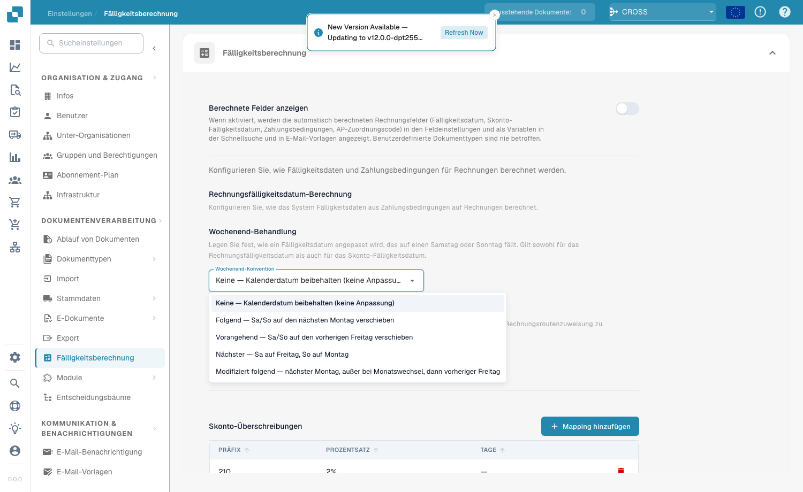
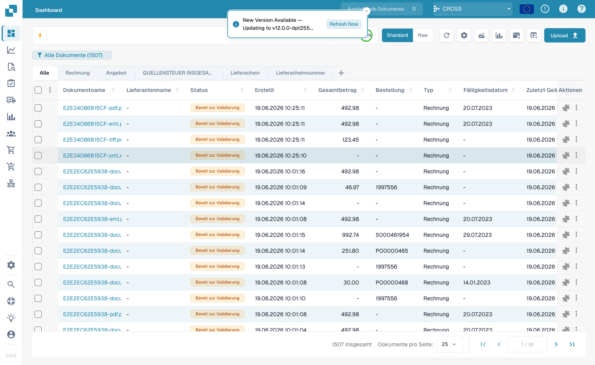
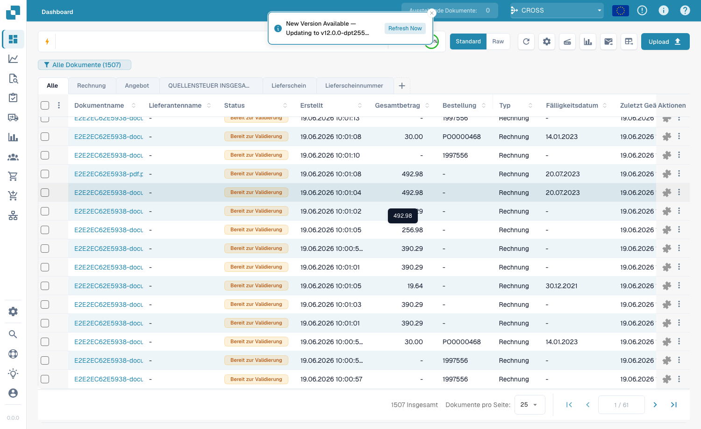

# Fälligkeitsberechnung

<figure><figcaption>
Einstellungen der Fälligkeitsberechnung
</figcaption></figure>

Die Seite **Fälligkeitsberechnung** (**Dokumentenverarbeitung → Fälligkeitsberechnung**) steuert, wie DocBits Fälligkeitsdaten von Rechnungen, Skonto-Fälligkeitsdaten und Zahlungsbedingungen aus den auf Rechnungen gefundenen Zahlungsbedingungs-Codes berechnet.

## Berechnete Felder anzeigen

Aktivieren Sie **Berechnete Felder anzeigen**, damit die automatisch berechneten Rechnungsfelder – Fälligkeitsdatum, Skonto-Fälligkeitsdatum, Zahlungsbedingungen und AP-Zuordnungscode – in den Feldeinstellungen sowie als Variablen in der Schnellsuche und in E-Mail-Vorlagen erscheinen. Benutzerdefinierte Dokumenttypen sind nie betroffen.

## Rechnungsfälligkeitsdatum-Berechnung

### Wochenend-Behandlung

<figure><figcaption>
Optionen der Wochenend-Konvention
</figcaption></figure>

Legen Sie fest, wie ein Fälligkeitsdatum angepasst wird, das auf einen Samstag oder Sonntag fällt. Dies gilt **sowohl** für das Rechnungsfälligkeitsdatum als auch für das Skonto-Fälligkeitsdatum.

| Konvention | Wirkung |
|------------|---------|
| **Keine** | Kalenderdatum beibehalten (keine Anpassung). |
| **Folgend** | Sa/So auf den nächsten Montag verschieben. |
| **Vorausgehend** | Sa/So auf den vorherigen Freitag verschieben. |
| **Nächste** | Samstag → Freitag, Sonntag → Montag. |
| **Modifiziert Folgend** | Nächster Montag, außer er fällt in den nächsten Monat – dann vorheriger Freitag. |

### AP-Zuordnungscode

Ordnen Sie Lieferanten-Zahlungsbedingungen AP-Zuordnungscodes für die automatisierte Rechnungsweiterleitung zu, indem Sie das **AP-Zuordnungscode-Feld** auswählen.

## Skonto-Überschreibungen

<figure><figcaption>
Skonto-Überschreibungen
</figcaption></figure>

Verwenden Sie **Skonto-Überschreibungen**, um ein bestimmtes Präfix einem Skonto-Prozentsatz und einer Anzahl von Tagen zuzuordnen. Klicken Sie auf **+ Mapping hinzufügen**, um eine Zeile mit **Präfix**, **Prozentsatz** und **Tagen** hinzuzufügen.

## Unterstützte Formate

<figure><figcaption>
Unterstützte Zahlungsbedingungs- und Skonto-Formate
</figcaption></figure>

DocBits erkennt die folgenden Zahlungsbedingungs- und Skonto-Codes.

**Unterstützte Zahlungsbedingungs-Formate**

| Format | Beispiel | Bedeutung |
|--------|----------|-----------|
| Infor M3 | `N90`, `N30` | Netto 90 / 30 Tage |
| Infor M3 | `NET` | Zahlbar bei Erhalt |
| Infor M3 | `M20` | 20. des Folgemonats |
| Infor M3 | `E15` | Monatsende + 15 Tage |
| Infor LN | `030`, `30` | Netto 30 Tage |
| Reversed | `14N`, `30N` | Netto 14 / 30 Tage |
| Text-Codes | `REC`, `DUE`, `COD` | Zahlbar bei Erhalt |

**Skonto-Format** – Skonto-Bedingungen kodieren Frühzahlerrabatte als 3-stellige Codes: die erste Ziffer ist der Skonto-Prozentsatz, die letzten beiden sind die Tage, innerhalb derer gezahlt werden muss.

| Code | Bedeutung |
|------|-----------|
| `210` | 2 % Skonto bei Zahlung innerhalb von 10 Tagen |
| `130` | 1 % Skonto bei Zahlung innerhalb von 30 Tagen |
| `545` | 5 % Skonto bei Zahlung innerhalb von 45 Tagen |
| `0` | Kein Skonto |
