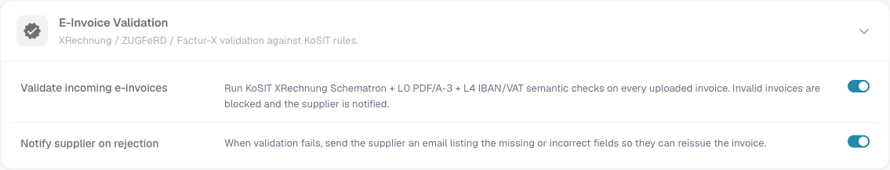
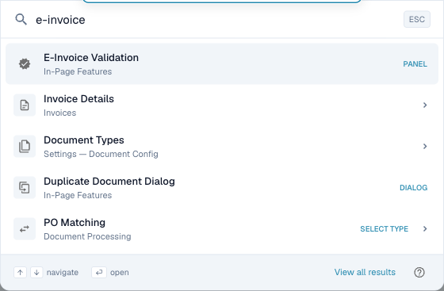

# E-Dokumente

DocBits validiert eingehende elektronische Rechnungen (E-Rechnungen) anhand der offiziellen Standards – **XRechnung**, **ZUGFeRD** und **Factur-X** – und leitet gefundene Probleme an die richtige Stelle weiter. Die Einstellungsgruppe **E-Dokumente** (unter **Dokumentenverarbeitung**) umfasst zwei Seiten:

* **[Validierungsregeln](validation-rules.md)** – legen Sie fest, welche E-Rechnungs-Versionen und -Profile Sie akzeptieren, und bestimmen Sie den Schweregrad jeder Validierungsregel für Ihre Organisation.
* **[Benachrichtigungsrouting](notification-routing.md)** – ordnen Sie Validierungs-Findings dem KI-Workforce-Agenten zu, der sie bearbeiten soll.

Gemeinsam legen Sie damit fest, **was auf einer eingehenden E-Rechnung als Problem gilt** und **wer sich darum kümmert**.

## E-Rechnungs-Validierung aktivieren oder deaktivieren

Die beiden E-Dokumente-Seiten greifen erst, wenn die **E-Rechnungs-Validierung für den Dokumenttyp eingeschaltet** ist. Der Schalter befindet sich am Dokumenttyp selbst, nicht im Menü E-Dokumente.

Gehen Sie zu **Einstellungen → Dokumenttypen → Rechnung → Erweiterte Einstellungen** und öffnen Sie den Abschnitt **E-Rechnungs-Validierung**.

<figure><figcaption>
E-Rechnungs-Validierung je Dokumenttyp ein- oder ausschalten, mit optionaler Lieferantenbenachrichtigung
</figcaption></figure>

* **Eingehende E-Rechnungen validieren** – der Hauptschalter. Ist er **aktiviert**, wird jede hochgeladene Rechnung anhand der KoSIT-XRechnung-Schematron-Regeln sowie der semantischen Prüfungen L0 (PDF/A-3) und L4 (IBAN/USt) geprüft, mit den Schweregraden, die Sie auf der Seite [Validierungsregeln](validation-rules.md) festgelegt haben. Ungültige Rechnungen werden blockiert. Ist er **deaktiviert**, überspringen Rechnungen die E-Rechnungs-Validierung vollständig, und die Seiten Validierungsregeln und Benachrichtigungsrouting haben keine Wirkung.
* **Lieferanten bei Ablehnung benachrichtigen** – erscheint, sobald die Validierung aktiviert ist. Ist er **aktiviert**, löst eine abgelehnte Rechnung eine E-Mail an den Lieferanten aus, die die fehlenden oder fehlerhaften Felder auflistet, damit er die Rechnung neu ausstellen kann. Wer welches Finding erhält und bearbeitet, wird auf der Seite [Benachrichtigungsrouting](notification-routing.md) konfiguriert.

> Die E-Rechnungs-Validierung wird **je Dokumenttyp** konfiguriert. Derzeit gilt sie für den Dokumenttyp **Rechnung**; aktivieren Sie sie für jeden Dokumenttyp, der validiert werden soll.

Sie können auch direkt hierher springen — mit der **globalen Schnellsuche**: Drücken Sie <kbd>Cmd</kbd> + <kbd>K</kbd> (<kbd>Strg</kbd> + <kbd>K</kbd> unter Windows und Linux) an beliebiger Stelle in DocBits und tippen Sie *e-invoice*.

<figure><figcaption>
Tippen Sie „e-invoice" in die Schnellsuche, um direkt zum Schalter zu springen.
</figcaption></figure>
