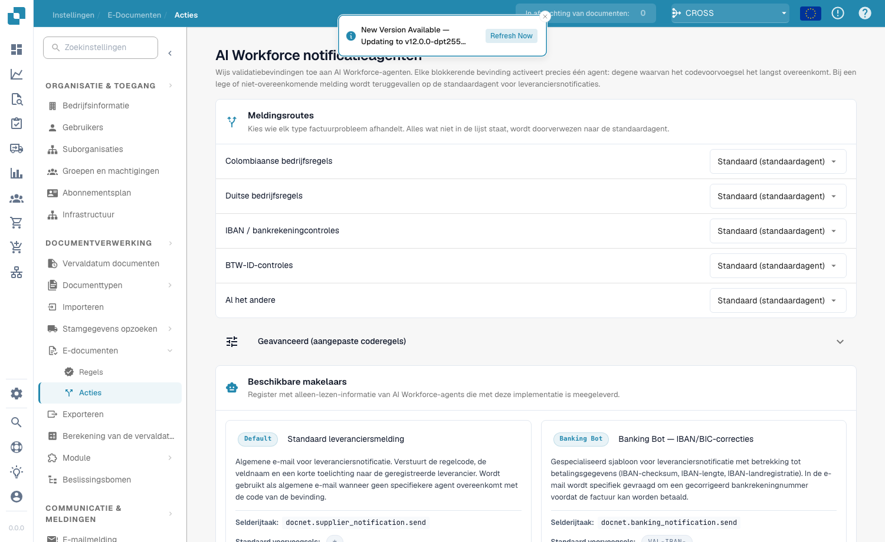
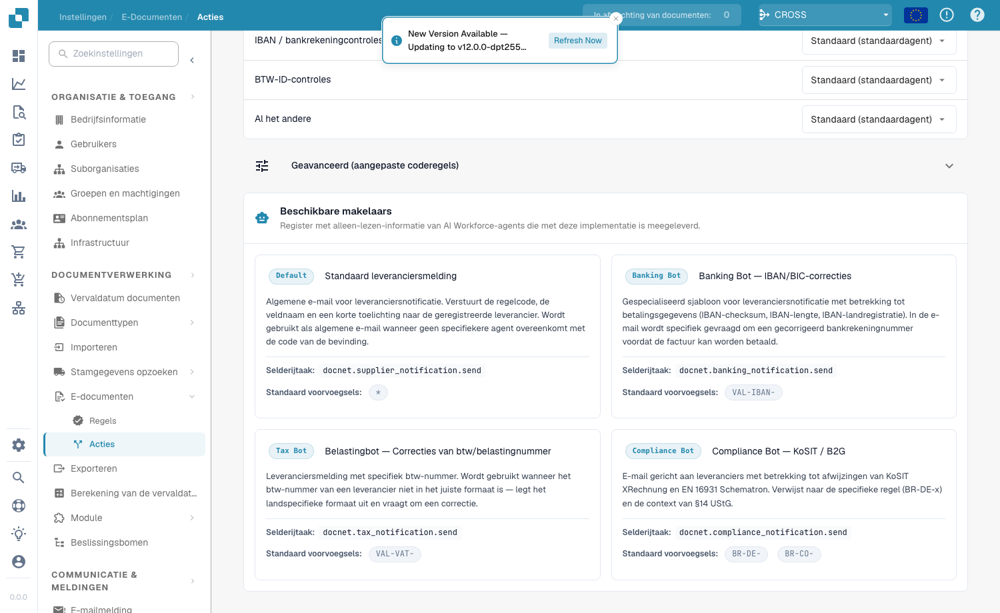

# Notificatierouting

<figure><figcaption>
Validatiebevindingen koppelen aan agents
</figcaption></figure>

De pagina **Notificatierouting** (**E-documenten → Acties**) koppelt validatiebevindingen aan **AI Workforce-agents**. Elke blokkerende bevinding activeert precies één agent — die waarvan het codeprefix het langst overeenkomt. Alles zonder match valt terug op de standaard leveranciersmelding-agent.

## Notificatieroutes

Kies wie elk type factuurprobleem afhandelt. Alles wat niet vermeld staat, gaat naar de standaardagent:

| Route | Bevindingen die het dekt |
|-------|--------------------------|
| **Colombiaanse bedrijfsregels** | Bevindingen van Colombia-specifieke bedrijfsregels. |
| **Duitse bedrijfsregels** | Bevindingen van Duitsland-specifieke bedrijfsregels. |
| **IBAN- / bankrekeningcontroles** | Bevindingen over betaalgegevens (IBAN-controlegetal, lengte, land). |
| **Btw-nummercontroles** | Bevindingen over het formaat van het btw-nummer. |
| **Al het overige** | De standaardterugval voor alles dat hierboven niet overeenkomt. |

Kies voor elke route de afhandelende agent in de vervolgkeuzelijst. **Geavanceerd (aangepaste coderegels)** maakt routering op een exacte bevindingscode mogelijk wanneer u fijnere controle nodig hebt.

## Beschikbare agents

<figure><figcaption>
Alleen-lezen register van AI Workforce-agents
</figcaption></figure>

Het gedeelte **Beschikbare agents** is een alleen-lezen register van de AI Workforce-agents die met uw implementatie worden geleverd, bijvoorbeeld:

| Agent | Doel |
|-------|------|
| **Standaard leveranciersmelding** | Generieke leveranciersmelding-e-mail; de vangnetagent wanneer geen specifiekere agent overeenkomt. |
| **Banking Bot** | Gespecialiseerd sjabloon voor betaalgegevensbevindingen (IBAN/BIC-correcties). |
| **Tax Bot** | Leveranciersmelding specifiek voor het btw-nummer. |
| **Compliance Bot** | Handelt compliancebevindingen af. |

Elke agent toont zijn Celery-taak en de bevindingscodeprefixen die hij standaard afhandelt.
