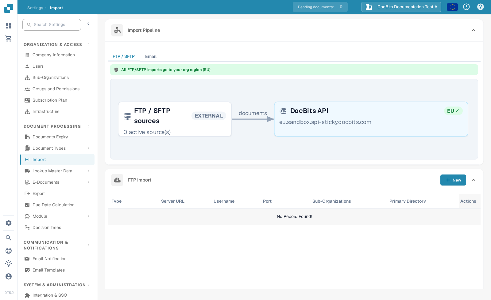
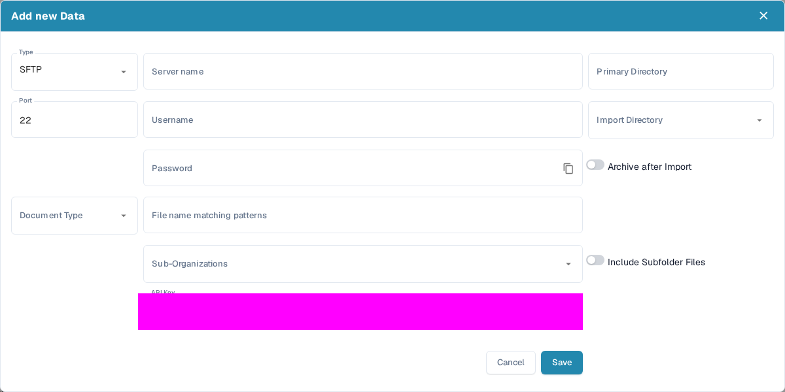
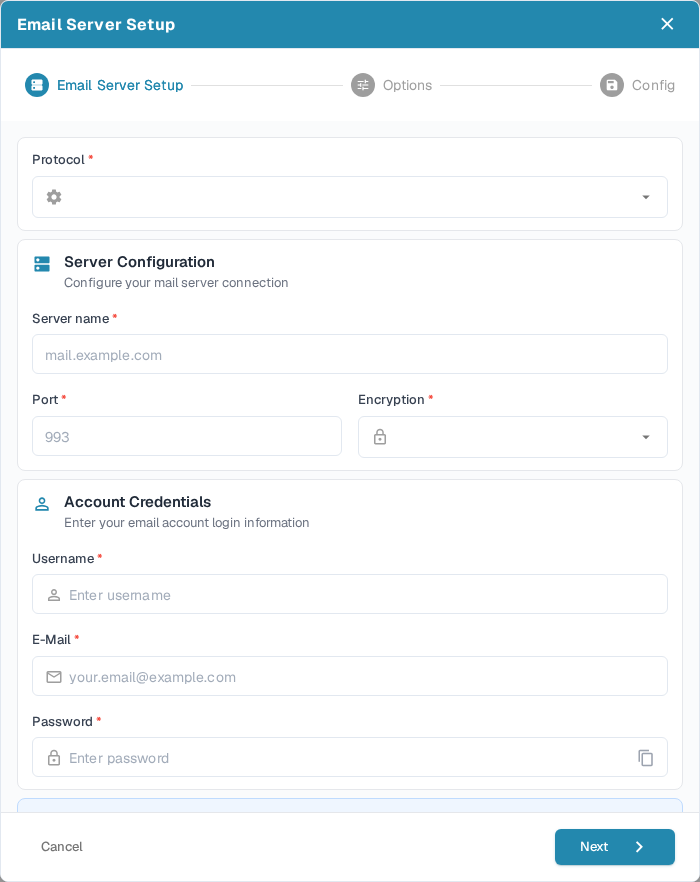

# Import

Use **Settings → Import** to see where automated documents enter DocBits and to configure FTP/SFTP or email sources. You need an administrator account to create a connection.

<figure><figcaption>
The current Import page in the English Sandbox UI.
</figcaption></figure>

## Understand the import pipeline

The **FTP / SFTP** tab shows the external sources, the number of active sources and the DocBits API region that receives their documents. Use it to check the destination before activating a connection. The **Email** pipeline tab currently says that its diagram is coming soon; configure email sources in **Email Import** below.

## Add an FTP or SFTP source

1. In **FTP Import**, select **New**.
2. Choose the **Type** (FTP, FTPS or SFTP), then enter the server name, port, username and password supplied by your server administrator. SFTP is selected by default and displays port 22.
3. Set **Primary Directory** and, if needed, an **Import Directory**. Use **File name matching patterns** to limit imported files. Select a **Document Type** or **Sub-Organizations** only when that routing is needed.
4. Enable **Archive after Import** to move successfully imported files to an archive directory, or **Include Subfolder Files** to search below the selected directory.
5. Select **Save**, then use the row's **Actions → Test Connection** before **Activate**. The connection must point to a server you control; this guide does not create one.

<figure><figcaption>
The New connection form. The automatically filled API key has been hidden in this example.
</figcaption></figure>

The row's **Actions** also offers **Connection Logs**, **Deactivate**, **Edit** and **Delete**. Check **Connection Logs** if the connection test or a later import fails. Deactivating pauses a source without deleting its settings.

## Add an email source

In **Email Import**, select **New**. The current form is a wizard. Choose the protocol first; the fields and later steps depend on that choice.

<figure><figcaption>
The first step of a new email connection, before any credentials are entered.
</figcaption></figure>

### IMAP or POP3

1. Select **IMAP** or **POP3**. Enter the mail server, port, encryption, username, email address and password. Obtain these values from your mail provider. For IMAP with SSL/TLS, port 993 is a common example; use your provider's actual settings.
2. Select **Next**. In **Options**, choose whether to merge attached documents, block duplicate filenames or send a confirmation email after import. The email subject and body appear when that notification is enabled.
3. Select **Next** again. In **Config**, choose a sub-organization if the mailbox should route to one, set an error-notification address and review the document routing and advanced settings. The API key is filled automatically; keep it private.
4. Select **Save**. To choose a source folder or move processed email to another folder, open the saved connection with **Actions → Edit**. These folder controls need an existing connection. Use **Test Connection**, then **Activate**.

### Microsoft 365 OAuth

1. In **New**, select **OAuth Office365**. Select document routing before authentication, then select **Authenticate**.
2. Follow the Microsoft sign-in flow using the code displayed by DocBits. Return to the wizard and select **Finish Authentication**. Never share the code or credentials in a screenshot or support ticket.
3. Review the import options after authentication, including an optional folder or shared mailbox. Select **Next**, complete **Config**, and **Save**. The **Import** action is available when editing an existing authenticated connection.

The wizard also offers **OAuth Office365 - Tenant** for an Azure tenant configuration. See [O365 Tenant](o365-tenant.md) for that setup.

## Monitor email imports

The email row's **Actions** includes **Connection Logs**, **Import Log**, **Activate/Deactivate**, **Edit** and **Delete**. **Test Connection** appears for IMAP and POP3. The separate **Import Log** button above the list opens the log across email connections. Start with the connection test and logs when an expected message does not become a document.

Supported attachment formats include `.pdf`, `.tif`/`.tiff`, `.eml`, `.dat`, `.xml`, `.edi` and `.purchaseorder`. DocBits can inspect file content when a forwarded message gives an attachment a generic content type; forwarded `.eml` and Outlook `winmail.dat` attachments can contain importable documents. Inline signature images are ignored. If an attachment fails, check the import log and the configured error-notification address.
