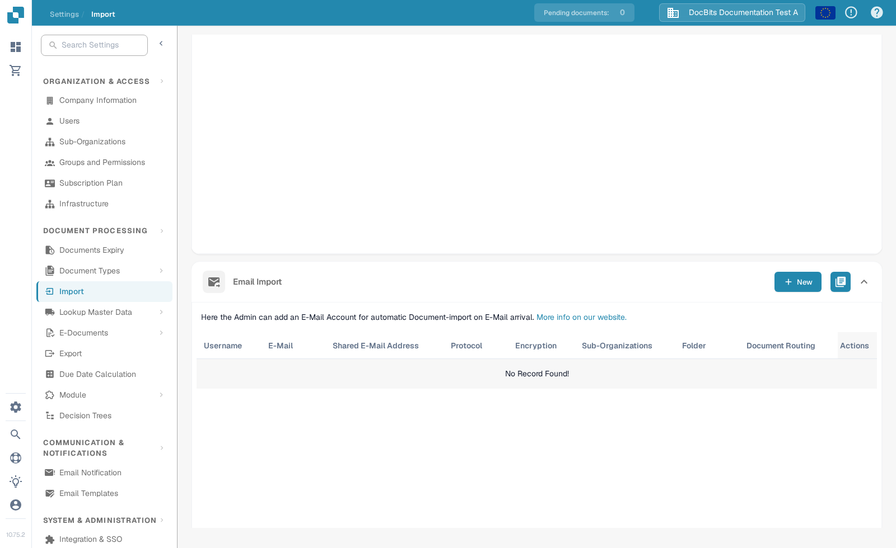
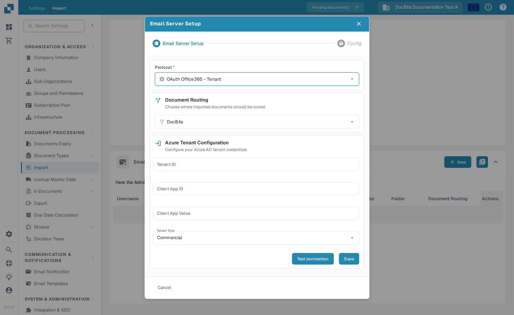

# Microsoft 365 tenant email import

Use this guide when an administrator wants DocBits to import documents from a Microsoft 365 mailbox through an app registered in the organisation's Microsoft Entra tenant. You need permission to configure both Microsoft Entra and DocBits. Keep the application secret private and follow your organisation's credential-rotation policy.

## 1. Register the application in Microsoft Entra

In the [Microsoft Entra admin center](https://entra.microsoft.com/), open **Applications → App registrations → New registration**. Give the app a name your team recognises. For an organisation-owned mailbox, choose accounts in **this organisational directory only** unless your identity administrator has a specific multitenant design. Record the **Directory (tenant) ID** and **Application (client) ID** from the Overview page. Microsoft's [app registration guide](https://learn.microsoft.com/en-us/graph/auth-register-app-v2) explains the current portal and these identifiers.

Under **Certificates & secrets**, create a client secret or use an approved credential type supported by your integration. Copy the **Value** immediately; it is shown only when created. Set an expiry and plan rotation before it expires. The DocBits form currently asks for **Client App Value**, so the following steps use the secret **Value**, not its secret ID. Do not put the value in a ticket, screenshot or public document.

The older guide told administrators to enable a public-client flow while also using a client secret. Remove that instruction: Microsoft's [client-type guide](https://learn.microsoft.com/en-us/entra/identity-platform/msal-client-applications) distinguishes public clients, which cannot keep a secret, from confidential clients. Have your identity administrator confirm the registration settings for this tenant integration.

## 2. Review Microsoft Graph permission and mailbox scope

Under **API permissions → Add a permission → Microsoft Graph**, add the **application** permission **Mail.ReadWrite** if your DocBits import configuration requires reading and moving messages. An administrator must grant consent. This permission can access mail across the tenant unless it is scoped; ask the Microsoft 365 administrator to review mailbox restriction using [Exchange application RBAC](https://learn.microsoft.com/en-us/exchange/permissions-exo/application-rbac). Add any further permission only when a chosen routing or sending feature requires it. Do not use a personal Microsoft account as a substitute for the tenant application.

## 3. Open the current DocBits setup

In your DocBits organisation, open **Settings → Import → Email Import → New**. The screenshot shows the current English Sandbox test organisation. The list has no email source yet; creating a source is a separate action.

Select **OAuth Office365 - Tenant** under **Protocol**. Choose **Document Routing** according to where imported documents should go. Enter the Entra **Tenant ID**, **Client App ID** and **Client App Value**. Select the right **Tenant Type**: **Commercial** or **GCC High**. Use **Test connection** before **Save**. A successful connection test verifies credentials and access at that moment; confirm actual document import separately with a test mailbox and test email.

## 4. Verify an import

After the connection succeeds and the source is saved, send a harmless test email with a sample attachment to the intended mailbox. Check the Email Import list and the import logs, then confirm the document appears in the selected destination. If you use a shared mailbox or move imported messages, review those options with your administrator. Record the mailbox, chosen route and secret-expiry owner in your internal runbook without storing the secret itself.

**Verification scope:** The two DocBits screenshots and menu path were checked in the English Sandbox test organisation. No Microsoft Entra app, credential, Graph permission or mailbox was configured for this update, and no connection or email-import test was run. The old Microsoft portal screenshots were removed; use the linked Microsoft documentation for its current interface.
