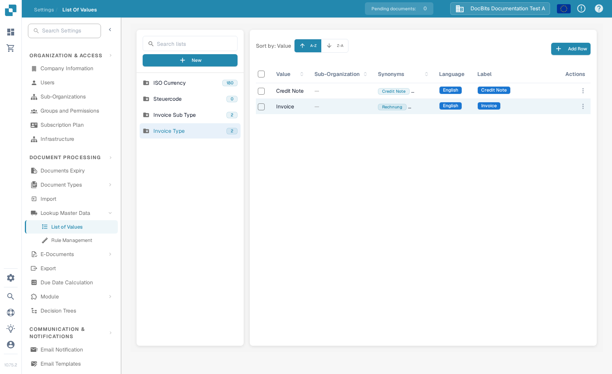
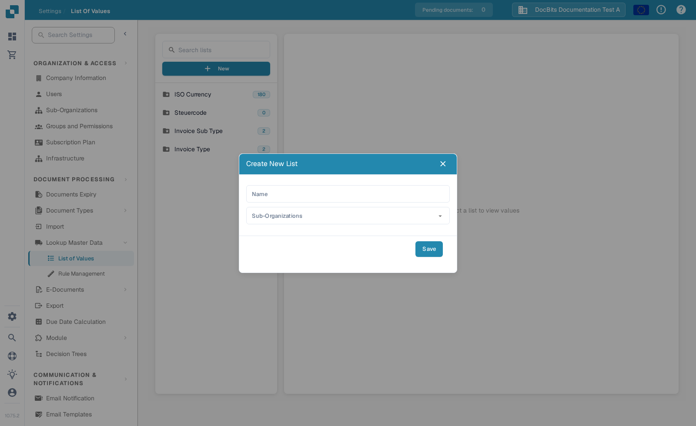
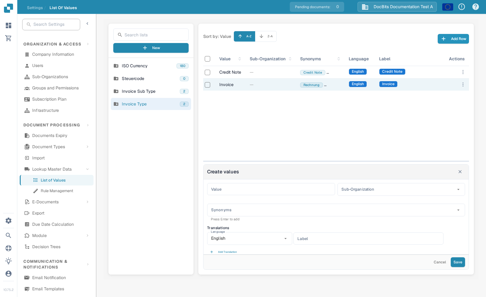

# List of Values

## What are lists of values?

A list of values supplies choices for a field, such as invoice types or currencies. Each entry has a stored **Value** and can also have a displayed **Label**, translations and synonyms. You can use these lists when configuring fields and field validation. See [Fields](../global-settings/document-types/fields/) for the next step.

## Open a list

1. Go to **Settings → Document Processing → Lookup Master Data → List of Values**.
2. Use **Search lists** to find a list, then select its name in the left panel. The number beside a name shows how many entries it contains.
3. Use **A–Z** or **Z–A** above the table to change the order. Select a row to inspect or edit it in the panel below the table.

The folder icon with a star marks a system list. System lists cannot be deleted.

<figure><figcaption>
Select a list in the left panel to see its entries.
</figcaption></figure>

## Create or delete a list

Select **New** above the list names. Enter a **Name**, optionally choose a **Sub-Organization**, then select **Save**. A list tied to a sub-organization applies there; leave it empty for the organization-wide list.

<figure><figcaption>
The New button opens the Create New List dialog.
</figcaption></figure>

To delete a list you created, open the three-dot menu beside its name and select **Delete**. Confirm the warning only if you want to remove the list. System lists have no delete menu.

## Add a value

1. Select the list, then select **Add Row** above the table.
2. Enter the **Value**. This is the underlying value that DocBits stores.
3. Optionally choose a **Sub-Organization** for this entry.
4. Optionally add **Synonyms**. Press **Enter** after each synonym so it becomes a chip. Synonyms help DocBits recognize alternative wording for the same value.
5. Under **Translations**, choose a language and enter a **Label**. The label is the text shown to users in that language. Select **Add Translation** to add another language and label.
6. Select **Save**. Use **Cancel** if you do not want to keep the entry.

<figure><figcaption>
Add Row opens the entry form below the table.
</figcaption></figure>

If there is no label for a user's language, DocBits displays the underlying value.

## Edit, duplicate or delete a value

Select an entry in the table to open its edit form below. Change the available fields and select **Save Changes**. You can also use the three-dot menu in its **Actions** column for **Edit** or **Duplicate**. The **Delete** action appears only for entries created by your organization; system entries cannot be deleted. To duplicate several entries, select their checkboxes and use the duplicate control above the table.

System entries can have restricted fields. The form indicates which fields are read-only.

## CSV import

The current List of Values screen does not show the former **Actions → Upload CSV** command. The earlier CSV instructions therefore do not apply to this screen. Add entries with **Add Row** until a supported import route is available again.
