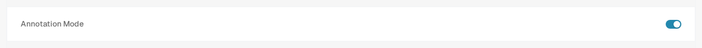
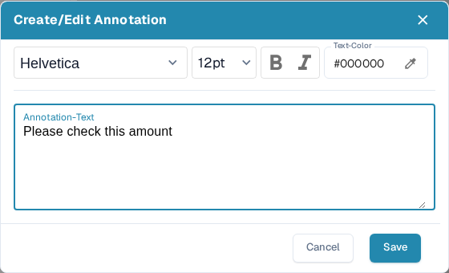
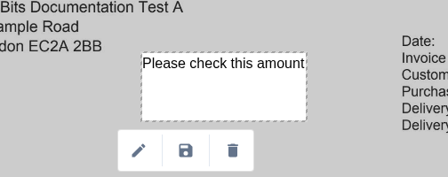
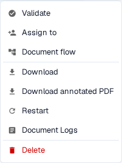

# Annotation Mode

Annotation Mode lets you place notes directly on a document during validation. You can edit, move, or delete a note before downloading an annotated PDF. Your administrator must enable the feature for the organization first.

## Turn on Annotation Mode

An administrator opens **Settings → Modules → Document Integration** and turns on **Annotation Mode**. If you cannot see the annotation button during validation, ask an administrator to check this setting and your access.

<figure><figcaption>
Enable Annotation Mode in Document Integration.
</figcaption></figure>

## Add a note during validation

1. Open the document on the [Validation Screen](../../../../end-user-and-partner-section/end-user-section/validation-screen/README.md).
2. Select the **speech bubble** in the toolbar on the right. Its tooltip says **Activate annotation-mode**. Select it again to leave Annotation Mode.
3. Drag across the part of the PDF where the note should appear. A small toolbar appears next to the selected area.
4. Select the **pen** to open **Create/Edit Annotation**. Enter the note in **Annotation-Text**. You can choose the font and size, use **Bold** or *Italic*, and set **Text-Color**. **Cancel** closes the dialog without applying the text; **Save** applies it to the selected annotation.
5. Use the **disk** button on the annotation toolbar to save your change. Use the **trash** button to remove the annotation if it is no longer needed.

<figure><figcaption>
Open Annotation Mode from the validation toolbar.
</figcaption></figure>

<figure><figcaption>
The toolbar appears after you select an area on the PDF.
</figcaption></figure>

<figure><figcaption>
Write and format the note in the annotation dialog.
</figcaption></figure>

<figure><figcaption>
Review the note before selecting Save.
</figcaption></figure>

## Manage an existing note

Select a note in Annotation Mode to show its toolbar. Use the **pen** to change the text or formatting, drag the selected note to move it, or use **trash** to delete it. The annotation appears on the PDF after it is saved. The speech-bubble button does not show a separate badge when a note exists.

<figure><figcaption>
A saved note remains visible on the document in Annotation Mode.
</figcaption></figure>

Annotations are also available during [document approval](../../global-settings/document-types/more-settings/approval/README.md). For output through Infor IDM, see [Exporting to IDM](../../../../infor-integration-and-configuration/exporting-to-infor/exporting-to-idm.md).

## Download the original or annotated PDF

On the **Dashboard**, open the document's three-dot action menu. Choose **Download** for the original PDF or **Download annotated PDF** for the version with saved notes. The annotated option appears after an annotation has been saved. The menu also offers **Validate** (open the validation screen), **Assign to** (choose a person), **Document flow** (view the [document flow](../../../../end-user-and-partner-section/end-user-section/dashboard/document-flow.md)), **Restart** (process the document again), **Document Logs** (view activity), and **Delete** (remove the document). Use those actions only when you intend to change or inspect the document.

<figure><figcaption>
Choose the PDF version you need from the document's action menu.
</figcaption></figure>
