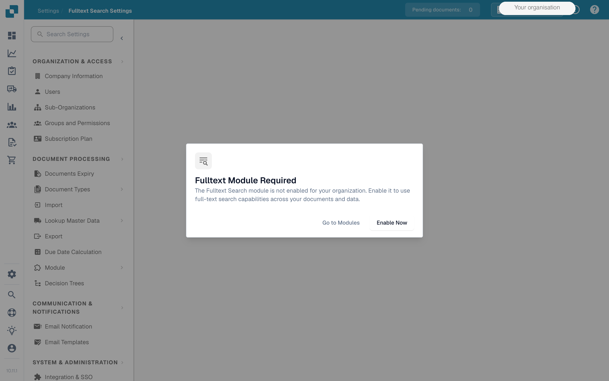
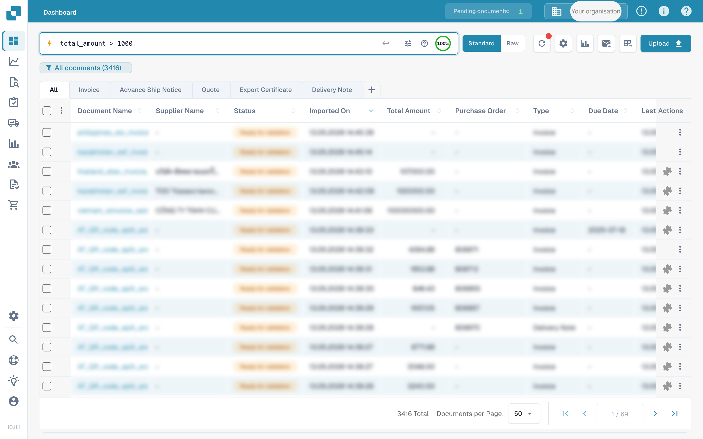
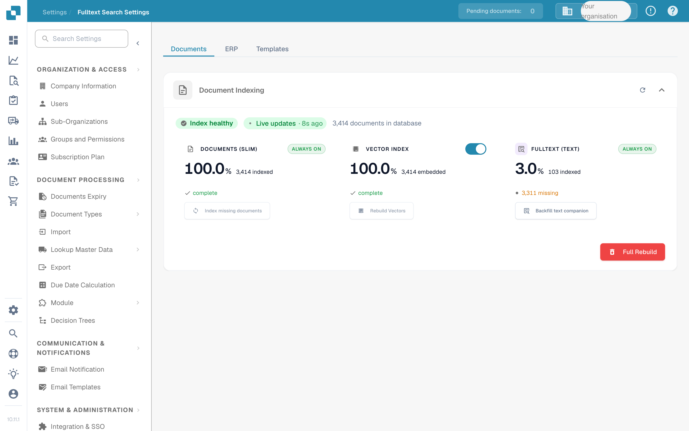
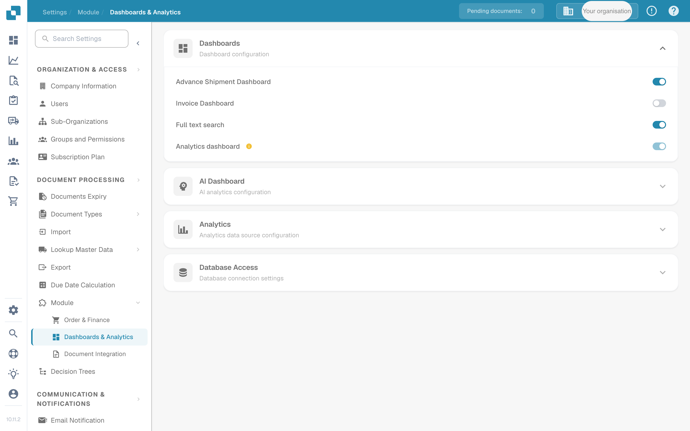

# Volltextsuche

Mit der Volltextsuche können Benutzer den tatsächlichen Inhalt von Dokumenten und jedes extrahierte Feld durchsuchen — nicht nur Dateinamen und IDs.

<figure><figcaption><p>Der Dialog „Fulltext Module Required“ erscheint auf Seiten, die das Modul voraussetzen.</p></figcaption></figure>

## Ohne das Modul

Wenn die Volltextsuche nicht aktiviert ist, kann die Suchleiste im Dashboard nur einen kleinen Satz strukturierter Felder abfragen. Freitext-Eingaben fallen auf den Abgleich mit folgenden Feldern zurück:

* `filename`
* Dokument-`ID`
* `invoice_id`
* `purchase_order`

Alles außerhalb dieser Felder wird ignoriert. Es gibt keine inhaltsbasierte Suche und keine Unterstützung für Bereiche, Operatoren oder Smart Filter.

## Mit aktiviertem Modul

Die Aktivierung der Volltextsuche schaltet die Suche über jedes extrahierte Feld eines Dokuments frei und ersetzt die Suchleiste im Dashboard durch eine erweiterte Abfragesprache. Abfragen können Feldfilter, Bereichsvergleiche, logische Operatoren, relative Datumsangaben und Smart-Filter-Kurzschreibweisen kombinieren.

<figure><figcaption><p>Die Suchleiste im Dashboard akzeptiert die erweiterte Abfragesprache. Geben Sie eine Abfrage ein und drücken Sie <kbd>Enter</kbd>, um die Dokumentliste zu filtern.</p></figcaption></figure>

### Feldbezogene Abfragen

Ein bestimmtes extrahiertes Feld lässt sich durch Voranstellen des Feldnamens mit Doppelpunkt abfragen. Feldnamen folgen der API-Konvention (Kleinbuchstaben, snake\_case) und gelten für jedes Feld, das Ihre Dokumenttypen erfassen — Lieferant, Rechnungsdaten, Positionen, benutzerdefinierte Felder.

```
supplier_name: Acme
invoice_id: INV-1234
status: ready_for_validation
```

### Bereichsabfragen

Vergleichsoperatoren funktionieren auf numerischen und Datumsfeldern. Sowohl offene Vergleiche als auch begrenzte Bereiche werden unterstützt.

```
total_amount > 5000
total_amount <= 10000
invoice_due_date between 2026-01-01 and 2026-04-30
```

### Logische Operatoren

Klauseln lassen sich mit `AND`, `OR` und `NOT` kombinieren; Klammern legen die Auswertungsreihenfolge fest. `IN`-Listen prüfen einen Feldwert gegen eine Menge möglicher Werte.

```
supplier_name: Acme AND total_amount > 1000
(status: ready_for_validation OR status: validated) AND invoice_date: this_month
NOT status: archived
status IN (ready_for_validation, exported)
```

### Relative Datumsangaben

Zeitausdrücke werden zum Abfragezeitpunkt ausgewertet und können überall dort verwendet werden, wo ein Datum erwartet wird.

```
imported_on: today()
invoice_date: last_week
imported_on: this_quarter
```

### Smart Filter

Kurzschreibweisen für häufige Abfragen. Sie funktionieren eigenständig oder als Teil eines größeren Ausdrucks.

```
overdue
@User
#INV-1234
$5k+
```

* `overdue` — Dokumente, deren Fälligkeitsdatum überschritten ist.
* `@User` — Filter nach Bearbeiter; ersetzen Sie `User` durch den Benutzernamen.
* `#INV-1234` — Schnellsuche per Dokumenten-ID.
* `$5k+` — Beträge größer als 5.000 in der Währung des Dokuments.

## Unterfunktionen

Zwei spezialisierte Suchmodi setzen auf dem Volltext-Modul auf. Beide setzen voraus, dass das Modul aktiviert ist, und können nicht eigenständig verwendet werden.

### Vektorsuche

Die Vektorsuche findet Dokumente, die der Abfrage semantisch ähnlich sind, statt nur lexikalisch übereinzustimmen. Das Dashboard behandelt jede Abfrage, die mit `vector:` beginnt, als Vektorsuche, lässt sie durch Dokument-Embeddings laufen und sortiert die Ergebnisse nach Ähnlichkeit.

```
vector: frozen food invoices
```

Die Vektor-Indizierung wird auf der Seite **Volltextsuche-Einstellungen** getrennt vom Volltext-Textindex gesteuert. Beim Deaktivieren werden keine neuen Dokumente mehr eingebettet, der Textindex bleibt jedoch erhalten.

### KI-Suche

Die KI-Suche akzeptiert natürlichsprachliche Abfragen und nutzt ein LLM, um daraus strukturierte Filter abzuleiten, die anschließend gegen den Volltext-Index laufen. Stellen Sie der Abfrage `ai:` voran.

```
ai: invoices from Ruiz over 1000 last quarter
```

KI-Suche und Vektorsuche sind nicht austauschbar: Die Vektorsuche findet ähnliche Inhalte, die KI-Suche übersetzt Sprache in Filter. Die KI-Suche hat keinen eigenen Schalter — sie nutzt den vorhandenen Volltext- und Vektor-Index.

<figure><figcaption><p>Volltextsuche-Einstellungen. Der Vektor-Index hat einen eigenen Schalter; der Volltext-Textindex läuft, sobald das Modul aktiviert ist.</p></figcaption></figure>

## Voraussetzungen

* Im Hintergrund läuft die OpenSearch-Infrastruktur, die den Index betreibt.
* Beim ersten Aktivieren werden alle vorhandenen Dokumente neu indiziert. Die Dauer skaliert mit der Anzahl der Dokumente in der Organisation.
* Nur Organisationsadministratoren können Module aktivieren oder deaktivieren.

## So aktivieren Sie das Modul

1. Öffnen Sie **Einstellungen → Dokumentenverarbeitung → Module**.
2. Aktivieren Sie unter der Gruppe **Dashboards** den Schalter **Full text search**.
3. Bestätigen Sie den Abonnement-Dialog, sofern er erscheint.
4. Warten Sie auf den Abschluss der ersten Neuindizierung, bevor Sie Volltext-Abfragen nutzen.

<figure><figcaption><p>Der Schalter <strong>Full text search</strong> befindet sich unter <strong>Module → Dashboards &#x26; Analytics</strong>.</p></figcaption></figure>


Die Preisgestaltung für das Volltext-Modul wird über Ihren DocBits-Vertriebskontakt abgewickelt. Der Abonnement-Hinweis erscheint beim ersten Aktivieren des Moduls.


## Siehe auch

* [Volltextsuche-Einstellungen](../../log-settings/fulltext-search-settings.md) — Indexverwaltung und der Schalter für den Vektor-Index.
* [Fulltext & Vector Search Funktionen](../../global-settings/document-types/script/scripting-in-docbits/fulltext-search-functions.md) — Scripting-API für `fulltext_search()` und `vector_search()`.
* [Modulübersicht](README.md) — vollständige Liste der optionalen DocBits-Module.
