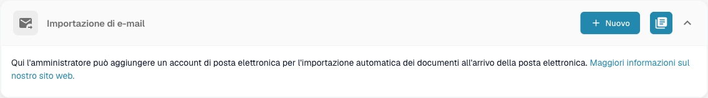
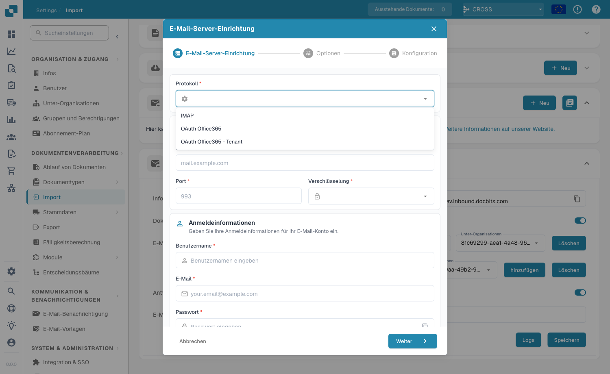
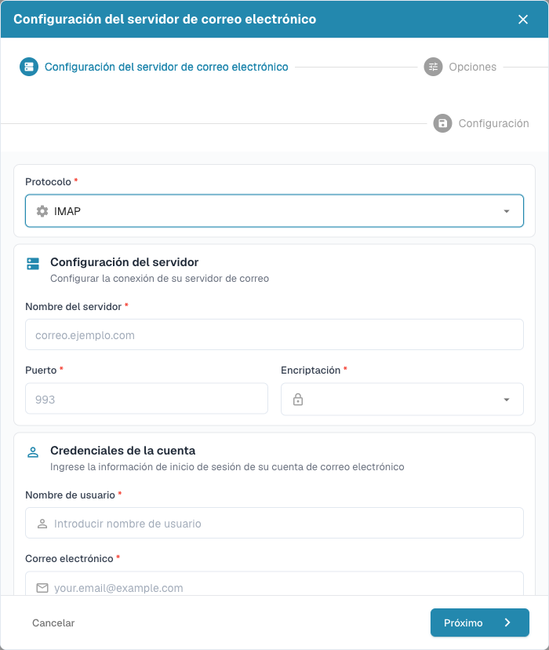
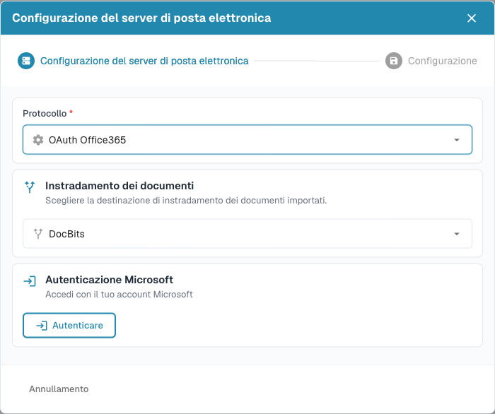
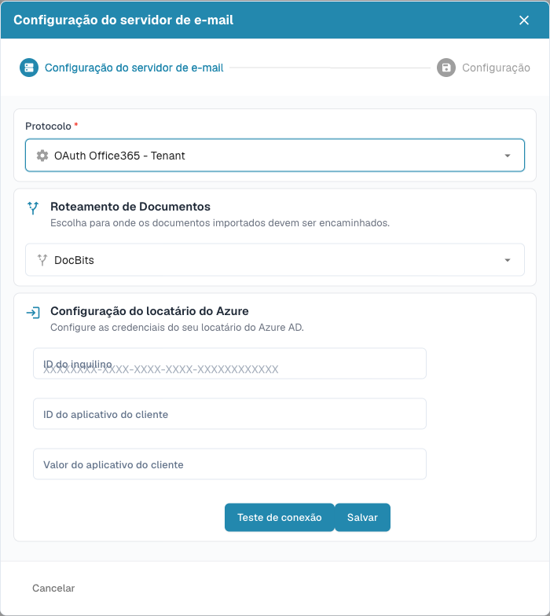
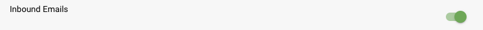
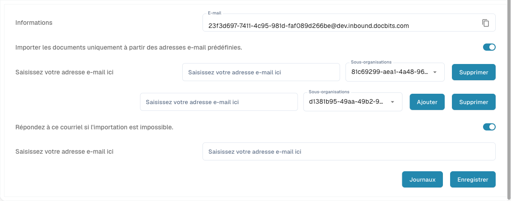

# Inkomende e-mails

### Overzicht

DocBits kan documenten rechtstreeks uit e-mail ophalen — geen handmatig uploaden nodig. Er zijn **twee manieren** om e-maildocumenten binnen te halen, beide onder **Instellingen → Documentverwerking → Importeren**:

| Methode | Hoe het werkt | Het meest geschikt voor |
|---------|---------------|--------------------------|
| **E-mailimportaccount** | DocBits maakt verbinding met een postbus die van u is (**IMAP**, **OAuth Office365** of **OAuth Office365 – Tenant**) en importeert de documenten die het vindt. | Een speciale postbus die uw documenten al ontvangt (bijv. `facturen@uwbedrijf.com`). |
| **Doorgestuurde e-mails (Inkomende e-mails)** | DocBits geeft u een uniek adres; elke geautoriseerde afzender kan documenten daarheen **doorsturen**. | Incidenteel doorsturen vanaf veel afzenders zonder postbusgegevens te delen. |

U kunt elke methode afzonderlijk of beide samen gebruiken.

### Methode 1 — Een postbus verbinden (E-mailimport)

Ga naar **Instellingen → Documentverwerking → Importeren** en open de sectie **E-mailimport**. Klik op **Nieuw** om een postbusverbinding toe te voegen.

<figure><figcaption>
Klik in de sectie E-mailimport op <strong>Nieuw</strong> om een postbus te verbinden.
</figcaption></figure>

De installatiewizard opent. Het eerste veld, **Protocol**, bepaalt hoe DocBits verbinding maakt — kies **IMAP**, **OAuth Office365** of **OAuth Office365 – Tenant**.

<figure><figcaption>
De lijst <strong>Protocol</strong> biedt de drie verbindingstypen.
</figcaption></figure>

#### IMAP

Voor een standaardpostbus kiest u **IMAP** en vult u de servergegevens en accountgegevens in:

* **Servernaam** en **Poort** (standaard `993`) van uw mailserver.
* **Versleuteling** — `SSL`, `TLS` of `None`.
* **Gebruikersnaam**, **e-mail** en **wachtwoord** van de postbus.

<figure><figcaption>
Het IMAP-formulier: de verbinding met de mailserver plus de inloggegevens van de postbus.
</figcaption></figure>

#### OAuth Office365

Voor één Microsoft 365-gebruikerspostbus kiest u **OAuth Office365**. In plaats van een wachtwoord autoriseert u DocBits via Microsoft: kies de bestemming voor **Documentroutering**, klik vervolgens op **Verifiëren** en voltooi de Microsoft-aanmelding.

<figure><figcaption>
OAuth Office365 maakt verbinding via de Microsoft-aanmelding — er wordt geen wachtwoord in DocBits opgeslagen.
</figcaption></figure>

#### OAuth Office365 – Tenant

Om op tenant-niveau (organisatie) verbinding te maken via een Azure-app-registratie, kiest u **OAuth Office365 – Tenant** en voert u de Azure-gegevens in: **Tenant-ID** (Tenant ID), **Client-app-ID** (Client App ID) en **Client-app-waarde** (clientgeheim). Gebruik **Verbinding testen** om te verifiëren en klik daarna op **Opslaan**.

<figure><figcaption>
OAuth Office365 – Tenant gebruikt een Azure-app-registratie (Tenant-ID, Client-app-ID, clientgeheim).
</figcaption></figure>


**Documentroutering** bepaalt waar de geïmporteerde documenten naartoe gaan — **DocBits** (het standaarddashboard) of **AI Workforce**. Na het verbinden kunt u in de volgende stappen van de wizard kiezen uit welke **map** wordt geïmporteerd, een optionele **gedeelde postbus**, en of verwerkte e-mails naar een andere map worden **verplaatst**.


### Methode 2 — E-mails doorsturen naar DocBits (Inkomende e-mails)

Voor deze methode moet eerst de module **Inkomende e-mails** zijn ingeschakeld. Ga naar **Instellingen → Documentverwerking → Module**, open de sectie **Documenttype**, zoek **Inkomende e-mails** en zet de schakelaar aan.

<figure><figcaption>
Schakel <strong>Inkomende e-mails</strong> in onder Instellingen → Documentverwerking → Module.
</figcaption></figure>

Zodra deze is ingeschakeld, verschijnt er een sectie **Inkomende e-mails** onder **Instellingen → Documentverwerking → Importeren**. Deze bevat alles wat nodig is om doorgestuurde documenten te ontvangen:

<figure><figcaption>
De sectie Inkomende e-mails: uw importadres, de lijst met vooraf gedefinieerde afzenders en het adres voor foutmeldingen.
</figcaption></figure>

* **Importadres** — een uniek, door het systeem gegenereerd adres in de vorm `org_id@environment.inbound.docbits.com`. Stuur of stuur documenten door naar dit adres en DocBits importeert ze automatisch. Gebruik het kopieerpictogram om het adres over te nemen.
* **Document alleen importeren vanuit vooraf gedefinieerde e-mailadressen** — wanneer ingeschakeld, worden alleen de hier vermelde afzenderadressen geaccepteerd; e-mails van anderen worden genegeerd. Voor elke afzender kunt u een **Suborganisatie** kiezen (laat leeg om aan de hoofdorganisatie toe te wijzen). Gebruik **Toevoegen** om meer afzenders toe te voegen en **Verwijderen** om er een te verwijderen.
* **Beantwoord deze e-mail als de import niet kan worden uitgevoerd** — wanneer ingeschakeld, voert u een adres in dat moet worden gewaarschuwd telkens als een importpoging mislukt, zodat problemen niet onopgemerkt blijven.

Klik op **Opslaan** om uw wijzigingen toe te passen.


**Welke bijlagen worden geïmporteerd?** DocBits importeert de ondersteunde documentbijlagen — zie [Importeren → E-mail importeren](../import/README.md#email-import) voor de volledige lijst met bestandstypen — en pakt doorgestuurde `.eml`-berichten en Outlook `winmail.dat`-bijlagen (TNEF) uit om de documenten erin te importeren. De herkenning is ook gebaseerd op de **werkelijke bestandsinhoud**, zodat bijlagen die een doorsturende mailserver van een generiek type (`application/octet-stream`) voorziet, toch correct worden geïmporteerd. Inline-afbeeldingen (handtekeninglogo's / ingesloten afbeeldingen) worden genegeerd.


### Welke methode wanneer

* **Gebruik een e-mailimportaccount** wanneer documenten al in een speciale postbus binnenkomen en u wilt dat DocBits ze zelf ophaalt — IMAP voor algemene mailservers, OAuth Office365 voor Microsoft 365.
* **Gebruik doorgestuurde e-mails** wanneer mensen documenten op aanvraag moeten doorsturen, of wanneer u de postbusgegevens niet met DocBits wilt delen.
* **Combineer beide** als sommige documenten in een vaste postbus aankomen terwijl andere incidenteel worden doorgestuurd.


Het beperken van afzenders (Methode 2) en het kiezen van de juiste bestemming voor **Documentroutering** (Methode 1) zijn de twee meest gebruikelijke manieren om een inkomende pijplijn schoon te houden — alleen de documenten die u verwacht, gestuurd naar waar u ze wilt hebben.

