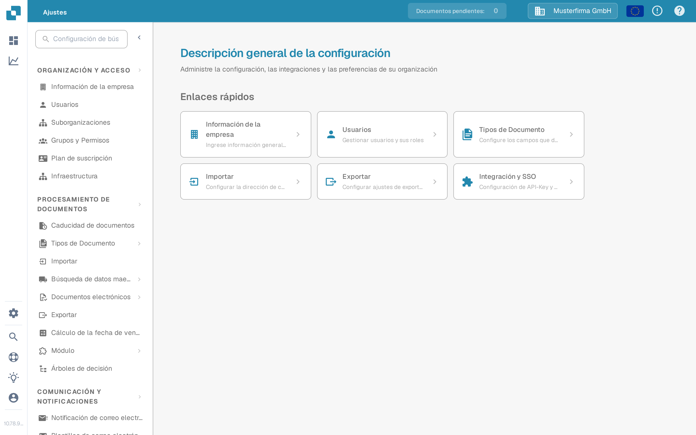

# Configuración Global

Utilice **Ajustes** para gestionar la organización y la forma en que se procesan los documentos. La aplicación actual agrupa los ajustes por finalidad en el menú izquierdo; ya no muestra una pantalla separada llamada «Configuración Global».

1. Seleccione el icono de engranaje para abrir **Ajustes**.
2. En **Organización y Acceso**, elija el área que necesita, por ejemplo **Información de la empresa** o **Usuarios**.
3. En **Procesamiento de documentos**, elija **Tipos de Documento** para configurar un tipo de documento concreto.

<figure><figcaption>Vista actual de la Sandbox (idioma de la interfaz: español) con datos de ejemplo inventados. Información de la empresa está seleccionada; no se modificó ningún valor.</figcaption></figure>

Empiece por la guía que corresponda a su tarea:

* [Información de la Empresa](company-information/README.md) para los datos y las preferencias de la empresa.
* [Grupos, Usuarios y Permisos](groups-users-and-permissions/README.md) para saber quién puede trabajar en la organización.
* [Plan de suscripción](subscription-plan/README.md) para la información del plan contratado.
* [Integración](integration/README.md) para las conexiones y las claves de API.
* [Tipos de Documentos](document-types/README.md) para la configuración específica de cada documento.
* [Notificación por Correo Electrónico](email-notification/README.md) y [Plantillas de correo electrónico](e-mail-templates.md) para los mensajes que envía DocBits.

Los ajustes pueden afectar a documentos en curso y a otros usuarios. Lea la guía correspondiente y compruebe los cambios en una organización de prueba antes de guardarlos en producción.
