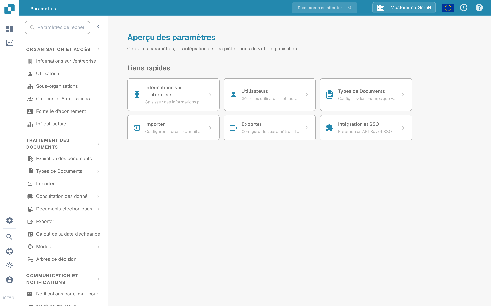

# Paramètres Globaux

Utilisez les **Paramètres** pour gérer l'organisation et la manière dont les documents sont traités. L'application actuelle regroupe les paramètres par usage dans le menu de gauche ; elle n'affiche plus d'écran séparé nommé « Paramètres Globaux ».

1. Sélectionnez l'icône en forme d'engrenage pour ouvrir les **Paramètres**.
2. Sous **Organisation et accès**, choisissez le domaine dont vous avez besoin, par exemple **Informations sur l'entreprise** ou **Utilisateurs**.
3. Sous **Traitement des documents**, choisissez **Types de Documents** pour configurer un type de document précis.

<figure><figcaption>Vue actuelle de la Sandbox (interface en français) avec des données d'exemple fictives. Informations sur l'entreprise est sélectionné ; aucune valeur n'a été modifiée.</figcaption></figure>

Commencez par le guide qui correspond à votre tâche :

* [Informations sur l'entreprise](company-information/README.md) pour les données et les préférences de l'entreprise.
* [Groupes, Utilisateurs et Autorisations](groups-users-and-permissions/README.md) pour savoir qui peut travailler dans l'organisation.
* [Plan d'abonnement](subscription-plan/README.md) pour les informations sur votre formule.
* [Intégration](integration/README.md) pour les connexions et les clés API.
* [Types de Documents](document-types/README.md) pour la configuration propre à chaque type de document.
* [Notification par e-mail](email-notification/README.md) et [Modèles d'e-mails](e-mail-templates.md) pour les messages envoyés par DocBits.

Les paramètres peuvent avoir un effet sur les documents en cours et sur d'autres utilisateurs. Consultez le guide correspondant et vérifiez vos modifications dans une organisation de test avant de les enregistrer en production.
