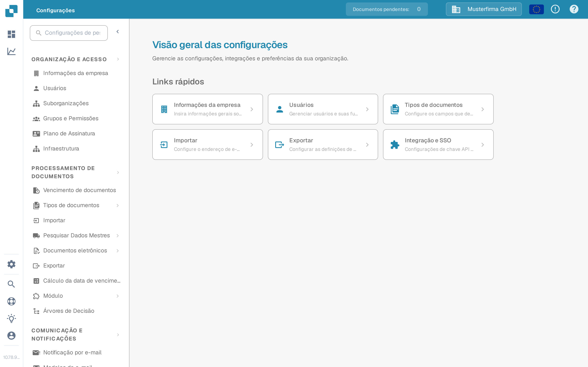

# Configurações Globais

Use as **Configurações** para gerenciar a organização e a forma como os documentos são processados. O aplicativo atual agrupa as configurações por finalidade no menu à esquerda; ele não mostra mais uma tela separada chamada “Configurações Globais”.

1. Selecione o ícone de engrenagem para abrir as **Configurações**.
2. Em **Organização e Acesso**, escolha a área de que precisa, como **Informações da empresa** ou **Usuários**.
3. Em **Processamento de Documentos**, escolha **Tipos de documentos** para configurar um tipo específico de documento.

<figure><figcaption>Vista atual da Sandbox (idioma da interface: português) com dados de exemplo inventados. Informações da empresa está selecionado; nenhum valor foi alterado.</figcaption></figure>

Comece pelo guia que corresponde à sua tarefa:

* [Informações da Empresa](company-information/README.md) para os dados e as preferências da empresa.
* [Grupos, Usuários e Permissões](groups-users-and-permissions/README.md) para saber quem pode trabalhar na organização.
* [Plano de subscrição](subscription-plan/README.md) para as informações do plano contratado.
* [Integração](integration/README.md) para as conexões e as chaves de API.
* [Tipos de documentos](document-types/README.md) para a configuração específica de cada tipo de documento.
* [Notificação por e-mail](email-notification/README.md) e [Modelos de e-mail](e-mail-templates.md) para as mensagens enviadas pelo DocBits.

As configurações podem afetar documentos em andamento e outros usuários. Leia o guia correspondente e verifique as alterações em uma organização de teste antes de salvá-las em produção.
