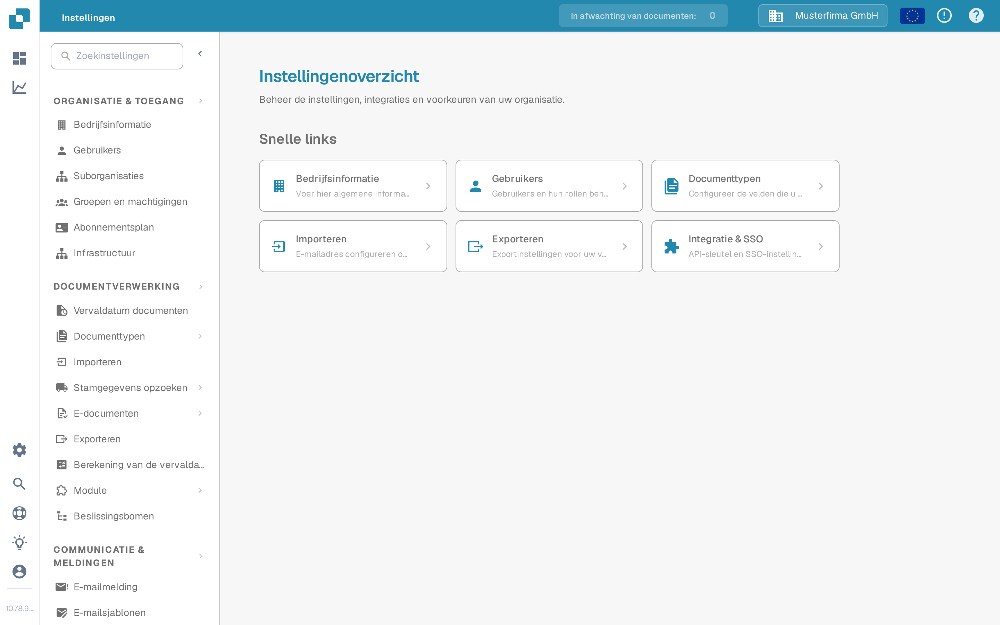

# Algemene instellingen

Gebruik **Instellingen** om de organisatie en de manier waarop documenten worden verwerkt te beheren. De huidige app groepeert de instellingen per doel in het linkermenu; er is geen apart scherm met de naam "Global Settings" meer.

1. Selecteer het tandwielpictogram om **Instellingen** te openen.
2. Kies onder **Organisatie & toegang** het onderdeel dat u nodig hebt, bijvoorbeeld **Bedrijfsinformatie** of **Gebruikers**.
3. Kies onder **Documentverwerking** de optie **Documenttypen** om een bepaald soort document te configureren.

<figure><figcaption>Huidige weergave van de Sandbox (interface in het Nederlands) met fictieve voorbeeldgegevens. Bedrijfsinformatie is geselecteerd; er zijn geen waarden gewijzigd.</figcaption></figure>

Begin met de gids die bij uw taak past:

* [Bedrijfsinformatie](company-information/README.md) voor bedrijfsgegevens en voorkeuren.
* [Groepen, gebruikers en machtigingen](groups-users-and-permissions/README.md) voor wie in de organisatie mag werken.
* [Abonnement](subscription-plan/README.md) voor informatie over uw abonnement.
* [Integratie](integration/README.md) voor verbindingen en API-sleutels.
* [Documenttypen](document-types/README.md) voor de configuratie per documenttype.
* [E-mailmelding](email-notification/README.md) en [E-mailsjablonen](e-mail-templates.md) voor berichten die DocBits verzendt.

Instellingen kunnen invloed hebben op lopende documenten en op andere gebruikers. Raadpleeg de betreffende gids en controleer uw wijzigingen in een testorganisatie voordat u ze in productie opslaat.
