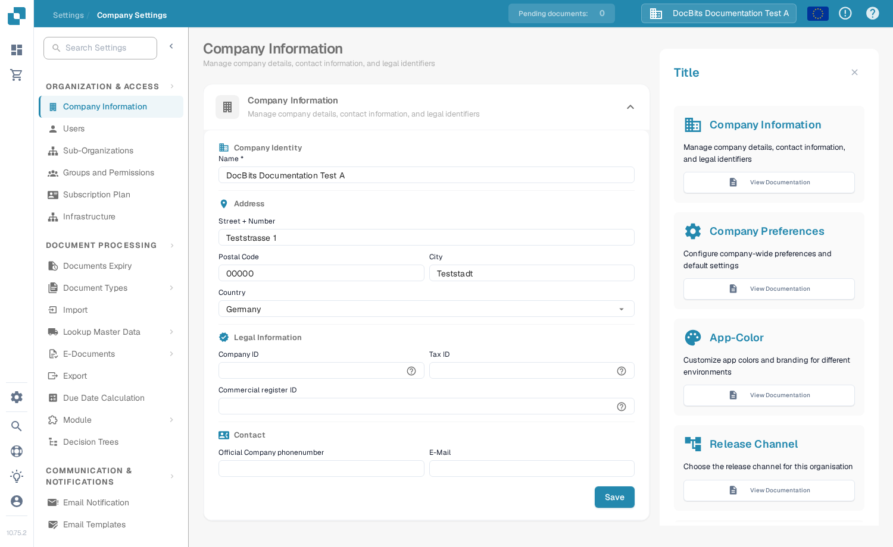

# Global Settings

Use **Settings** to manage the organisation and the way documents are processed. The current app groups settings by purpose in the left menu; it does not show a separate screen named “Global Settings”.

1. Select the gear icon to open **Settings**.
2. Under **Organization & Access**, choose the area you need, such as **Company Information** or **Users**.
3. Under **Document Processing**, choose **Document Types** to configure a particular kind of document.

<figure><figcaption>Current English Sandbox view for DocBits Documentation Test A. Company Information is selected; no values were changed.</figcaption></figure>

Start with the guide that matches your task:

* [Company Information](company-information/README.md) for company details and preferences.
* [Groups, Users and Permissions](groups-users-and-permissions/README.md) for who can work in the organisation.
* [Subscription Plan](subscription-plan/README.md) for plan information.
* [Integration](integration/README.md) for connections and API keys.
* [Document Types](document-types/README.md) for document-specific configuration.
* [Email Notification](email-notification/README.md) and [E-Mail templates](e-mail-templates.md) for messages sent by DocBits.

Settings can affect live documents and other users. Review the relevant guide and check changes in a test organisation before saving them in production.

