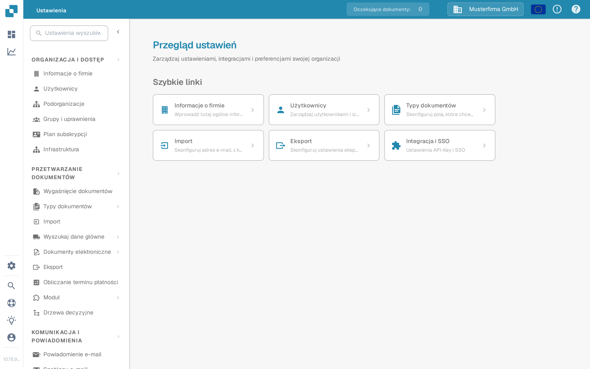

# Ustawienia globalne

Użyj **Ustawień**, aby zarządzać organizacją oraz sposobem przetwarzania dokumentów. Aktualna aplikacja grupuje ustawienia według przeznaczenia w menu po lewej stronie; nie wyświetla osobnego ekranu o nazwie „Ustawienia globalne”.

1. Wybierz ikonę koła zębatego, aby otworzyć **Ustawienia**.
2. W sekcji **Organizacja i dostęp** wybierz potrzebną dziedzinę, na przykład **Informacje o firmie** lub **Użytkownicy**.
3. W sekcji **Przetwarzanie dokumentów** wybierz **Typy dokumentów**, aby skonfigurować określony rodzaj dokumentu.

<figure><figcaption>Aktualny widok Sandbox w języku polskim z wymyślonymi danymi przykładowymi. Wybrana jest pozycja Informacje o firmie; żadna wartość nie została zmieniona.</figcaption></figure>

Zacznij od przewodnika, który odpowiada Twojemu zadaniu:

* [Informacje o firmie](company-information/README.md) — dane i preferencje firmy.
* [Grupy, użytkownicy i uprawnienia](groups-users-and-permissions/README.md) — kto może pracować w organizacji.
* [Plan subskrypcji](subscription-plan/README.md) — informacje o planie.
* [Integracja](integration/README.md) — połączenia i klucze API.
* [Typy dokumentów](document-types/README.md) — konfiguracja określonego rodzaju dokumentu.
* [Powiadomienia e-mail](email-notification/README.md) oraz [Szablony e-maili](e-mail-templates.md) — wiadomości wysyłane przez DocBits.

Ustawienia mogą wpływać na bieżące dokumenty i innych użytkowników. Przeczytaj odpowiedni przewodnik i sprawdź zmiany w organizacji testowej, zanim zapiszesz je w środowisku produkcyjnym.
