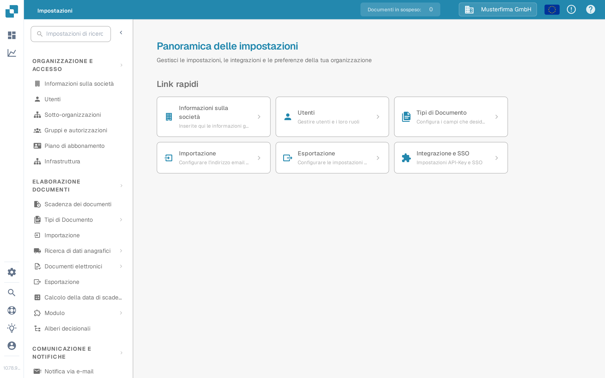

# Impostazioni Globali

Utilizza le **Impostazioni** per gestire l'organizzazione e il modo in cui vengono elaborati i documenti. L'app attuale raggruppa le impostazioni per scopo nel menu a sinistra; non mostra più una schermata separata chiamata «Impostazioni Globali».

1. Seleziona l'icona a ingranaggio per aprire le **Impostazioni**.
2. In **Organizzazione e accesso**, scegli l'area che ti serve, ad esempio **Informazioni sulla società** o **Utenti**.
3. In **Elaborazione documenti**, scegli **Tipi di Documento** per configurare un determinato tipo di documento.

<figure><figcaption>Vista attuale della Sandbox (lingua dell'interfaccia: italiano) con dati di esempio inventati. Informazioni sulla società è selezionata; non è stato modificato alcun valore.</figcaption></figure>

Inizia dalla guida che corrisponde alla tua attività:

* [Informazioni sulla società](company-information/README.md) per i dati e le preferenze dell'azienda.
* [Gruppi, Utenti e Autorizzazioni](groups-users-and-permissions/README.md) per sapere chi può lavorare nell'organizzazione.
* [Piano di abbonamento](subscription-plan/README.md) per le informazioni sul piano.
* [Integrazione](integration/README.md) per le connessioni e le chiavi API.
* [Tipi di Documento](document-types/README.md) per la configurazione specifica di ciascun tipo di documento.
* [Notifica via e-mail](email-notification/README.md) e [Modelli di e-mail](e-mail-templates.md) per i messaggi inviati da DocBits.

Le impostazioni possono influire sui documenti in corso e sugli altri utenti. Leggi la guida corrispondente e verifica le modifiche in un'organizzazione di prova prima di salvarle in produzione.
