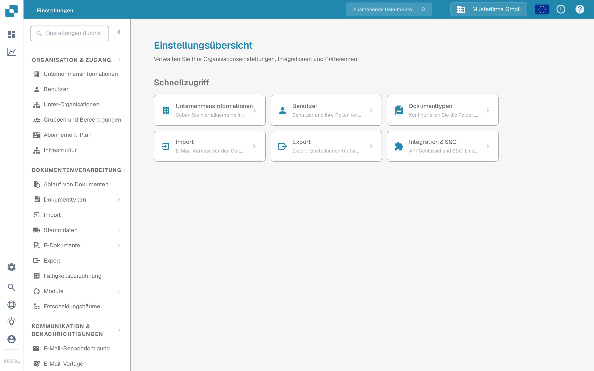

# Globale Einstellungen

Über die **Einstellungen** verwalten Sie die Organisation und die Art, wie Dokumente verarbeitet werden. Die aktuelle App gruppiert die Einstellungen im linken Menü nach Zweck; ein separater Bildschirm namens „Globale Einstellungen“ wird nicht mehr angezeigt.

1. Klicken Sie auf das Zahnrad-Symbol, um die **Einstellungen** zu öffnen.
2. Wählen Sie unter **Organisation & Zugang** den Bereich, den Sie benötigen, z. B. **Unternehmensinformationen** oder **Benutzer**.
3. Wählen Sie unter **Dokumentenverarbeitung** die Option **Dokumenttypen**, um eine bestimmte Art von Dokument zu konfigurieren.

<figure><figcaption>Aktuelle Sandbox-Ansicht (Oberflächensprache Deutsch) mit erfundenen Beispieldaten. Unternehmensinformationen ist ausgewählt; es wurden keine Werte geändert.</figcaption></figure>

Beginnen Sie mit der Anleitung, die zu Ihrer Aufgabe passt:

* [Firmeninformationen](company-information/README.md) für Firmendaten und Einstellungen.
* [Gruppen, Benutzer und Berechtigungen](groups-users-and-permissions/README.md) für den Zugang von Mitarbeitern zur Organisation.
* [Abonnement-Plan](subscription-plan/README.md) für Informationen zum gebuchten Plan.
* [Integration](integration/README.md) für Verbindungen und API-Schlüssel.
* [Dokumenttypen](document-types/README.md) für die dokumentspezifische Konfiguration.
* [E-Mail-Benachrichtigung](email-notification/README.md) und [E-Mail-Vorlagen](e-mail-templates.md) für Nachrichten, die DocBits versendet.

Einstellungen können sich auf laufende Dokumente und andere Benutzer auswirken. Lesen Sie die passende Anleitung und prüfen Sie Änderungen in einer Testorganisation, bevor Sie sie in der Produktivumgebung speichern.
