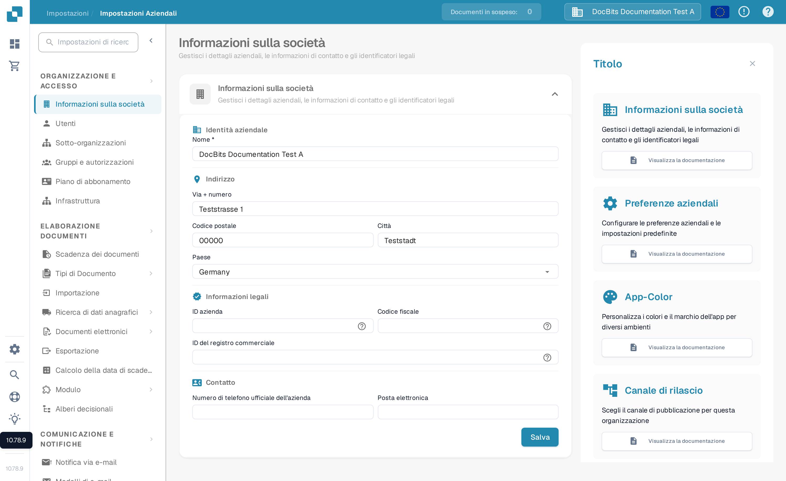
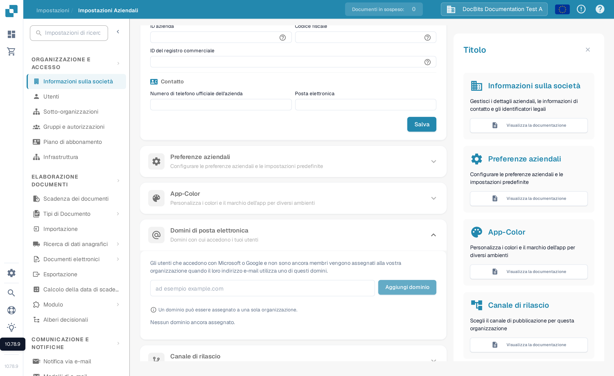

# Informazioni sulla Società

<figure><figcaption>
Informazioni sulla società: modifica il nome, l'indirizzo, gli identificatori legali e i recapiti dell'organizzazione, quindi seleziona Salva.
</figcaption></figure>

1. **Nome della Società**: Il nome legale della società come registrato.
2. **Via + Numero**: L'indirizzo fisico dell'ufficio principale o della sede della società.
3. **Codice postale**: Il codice ZIP o postale dell'indirizzo della società.
4. **Città**: La città in cui si trova la società.
5. **Stato**: Lo stato o la regione in cui è basata la società.
6. **Paese**: Il paese di operazione della società.
7. **ID Società**: Un identificatore univoco per la società, che potrebbe essere utilizzato internamente o per integrazioni con altri sistemi.
8. **ID Fiscale**: Il numero di identificazione fiscale della società, importante per le operazioni finanziarie e la segnalazione.
9. **ID Registro Commerciale**: Il numero di registrazione della società nel registro commerciale, che potrebbe essere importante per la documentazione legale e ufficiale.
10. **Numero di Telefono Ufficiale della Società**: Il numero di contatto principale per la società.
11. **Email Ufficiale della Società**: L'indirizzo email principale che verrà utilizzato per le comunicazioni ufficiali.

Le informazioni inserite qui possono essere cruciali per garantire che documenti come fatture, corrispondenza ufficiale e report siano correttamente formattati con i dettagli corretti della società. Aiuta anche a mantenere la coerenza nel modo in cui la società è rappresentata in varie comunicazioni esterne e documenti. Dopo aver inserito o aggiornato le informazioni, l'amministratore deve salvare le modifiche cliccando sul pulsante "Salva" per garantire che tutte le modifiche siano applicate a livello di sistema.

## Domini di posta elettronica

Gli amministratori dell'organizzazione possono aprire **Impostazioni → Informazioni sulla società → Domini di posta elettronica** per gestire i domini utilizzati per l'assegnazione automatica dell'organizzazione. Quando un utente accede con Microsoft o Google e non è ancora membro di un'organizzazione, DocBits può assegnarlo a questa organizzazione se il suo indirizzo e-mail utilizza uno dei domini elencati. Un dominio può appartenere a una sola organizzazione.

<figure><figcaption>
La sezione Domini di posta elettronica in italiano prima dell'aggiunta di un dominio. Inserisci il dominio dell'azienda, quindi seleziona Aggiungi dominio.
</figcaption></figure>

Inserisci solo il dominio, ad esempio `example.com`, nel campo e seleziona **Aggiungi dominio** oppure premi Invio. Il primo dominio diventa il dominio primario. Se sono elencati altri domini, usa **Imposta come primario** su un'altra riga per modificarlo, oppure l'icona del cestino per rimuovere un dominio. Gli errori, come un dominio non valido, un provider di posta elettronica personale o un dominio già assegnato a un'altra organizzazione, vengono visualizzati sotto il campo. **Nessun dominio ancora assegnato** significa che questa organizzazione non ha alcuna regola di dominio.

Prima di aggiungere un dominio, verifica quale organizzazione deve ricevere i nuovi accessi. Per gestire le appartenenze esistenti, continua con [Utenti](../groups-users-and-permissions/users/README.md).

Inoltre, la sezione fornisce una panoramica del piano di abbonamento, mostrando quanti giorni mancano, le date di inizio e fine, e un contatore di utilizzo dell'abbonamento che tiene traccia del consumo di token di servizio rispetto a quanto è allocato nel piano. Questo può aiutare gli amministratori a monitorare e pianificare il rinnovo o l'aggiornamento dell'abbonamento in base alle tendenze di utilizzo.
