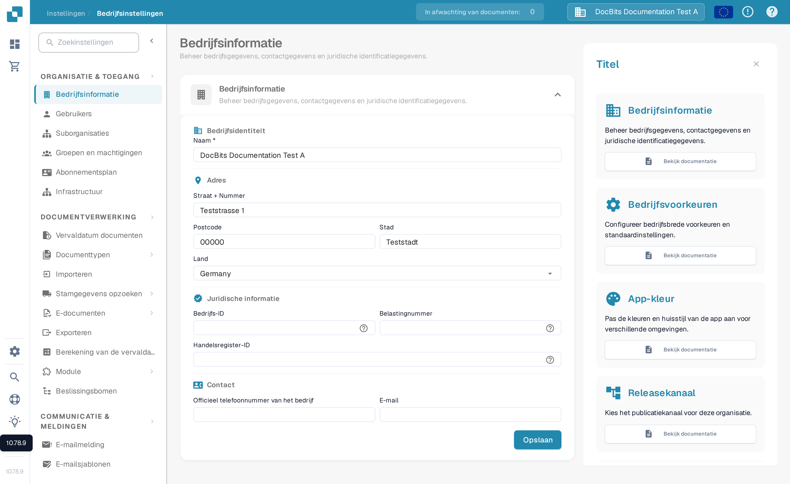
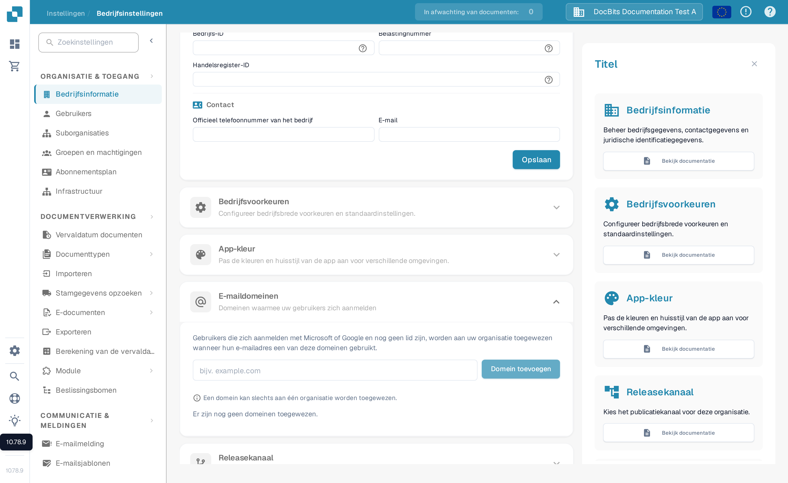

# Bedrijfsinformatie

<figure><figcaption>
Bedrijfsinformatie: werk de naam, het adres, de juridische identificatiegegevens en de contactgegevens van de organisatie bij en selecteer vervolgens Opslaan.
</figcaption></figure>

1. **Bedrijfsnaam**: De juridische naam van het bedrijf zoals geregistreerd.
2. **Straat + Nummer**: Het fysieke adres van het hoofdkantoor of de hoofdvestiging van het bedrijf.
3. **Postcode**: De ZIP- of postcode voor het adres van het bedrijf.
4. **Stad**: De stad waarin het bedrijf is gevestigd.
5. **Staat**: De staat of regio waar het bedrijf is gevestigd.
6. **Land**: Het land waar het bedrijf actief is.
7. **Bedrijfs-ID**: Een unieke identificatie voor het bedrijf, die intern of voor integraties met andere systemen kan worden gebruikt.
8. **BTW-ID**: Het belastingidentificatienummer voor het bedrijf, belangrijk voor financiële operaties en rapportage.
9. **Handelsregister-ID**: Het registratienummer van het bedrijf in het handelsregister, wat belangrijk kan zijn voor juridische en officiële documentatie.
10. **Officieel Bedrijfstelefoonnummer**: Het primaire contactnummer voor het bedrijf.
11. **Officiële Bedrijfse-mail**: Het belangrijkste e-mailadres dat zal worden gebruikt voor officiële communicatie.

De hier ingevoerde informatie kan cruciaal zijn voor het waarborgen dat documenten zoals facturen, officiële correspondentie en rapporten correct zijn opgemaakt met de juiste bedrijfsgegevens. Het helpt ook bij het handhaven van consistentie in de manier waarop het bedrijf wordt weergegeven in verschillende externe communicatie en documenten. Na het invoeren of bijwerken van de informatie moet de beheerder de wijzigingen opslaan door op de knop "Opslaan" te klikken om ervoor te zorgen dat alle aanpassingen systeemwijd worden toegepast.

## E-maildomeinen

Organisatiebeheerders kunnen **Instellingen → Bedrijfsinformatie → E-maildomeinen** openen om de domeinen te beheren die worden gebruikt voor de automatische toewijzing van organisaties. Wanneer iemand zich aanmeldt met Microsoft of Google en nog geen lid is van een organisatie, kan DocBits die persoon aan deze organisatie toewijzen als zijn of haar e-mailadres een van de vermelde domeinen gebruikt. Een domein kan slechts aan één organisatie worden toegewezen.

<figure><figcaption>
De Nederlandse sectie E-maildomeinen voordat een domein wordt toegevoegd. Voer een bedrijfsdomein in en selecteer vervolgens Domein toevoegen.
</figcaption></figure>

Voer alleen het domein in, zoals `example.com`, in het invoerveld en selecteer **Domein toevoegen** of druk op Enter. Het eerste domein wordt het primaire domein. Als er meer domeinen worden vermeld, gebruik dan **Maak primair** op een andere rij om dit te wijzigen, of het prullenbak-icoon om een domein te verwijderen. Fouten zoals een ongeldig domein, een persoonlijke e-mailprovider of een domein dat ergens anders al is toegewezen, verschijnen onder het invoerveld. **Er zijn nog geen domeinen toegewezen** betekent dat deze organisatie geen domeinregel heeft.

Controleer voordat u een domein toevoegt welke organisatie nieuwe aanmeldingen moet ontvangen. Ga door naar [Gebruikers](../groups-users-and-permissions/users/README.md) om bestaande lidmaatschappen te beheren.

Daarnaast biedt de sectie een overzicht van het abonnementsplan, met informatie over hoeveel dagen er nog over zijn, start- en einddata, en een abonnementsgebruikmeter die het verbruik van servicetokens bijhoudt ten opzichte van wat in het plan is toegewezen. Dit kan beheerders helpen bij het monitoren en plannen van de verlengingen of upgrades van het abonnement op basis van de gebruikstrends.
