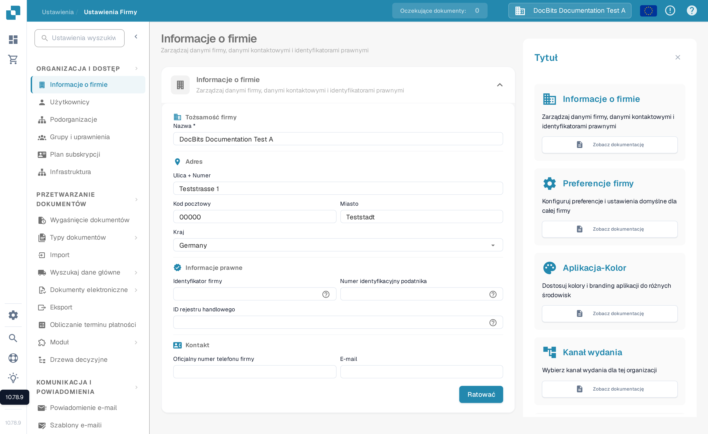
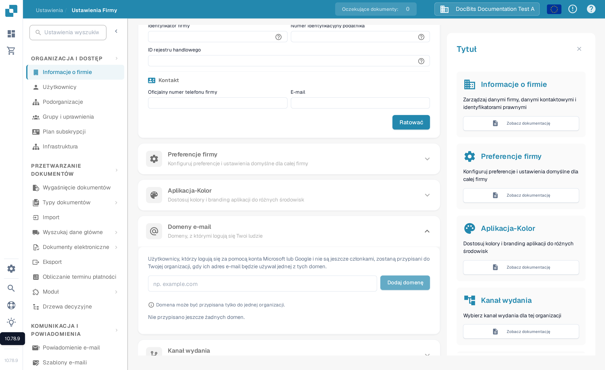

# Informacje o firmie

<figure><figcaption>
Informacje o firmie: uzupełnij nazwę, adres, identyfikatory prawne i dane kontaktowe organizacji, a następnie wybierz Zapisz.
</figcaption></figure>

1. **Nazwa firmy**: Oficjalna nazwa firmy zarejestrowana.
2. **Ulica + Numer**: Fizyczny adres głównego biura lub siedziby firmy.
3. **Kod pocztowy**: Kod pocztowy dla adresu firmy.
4. **Miasto**: Miasto, w którym znajduje się firma.
5. **Stan**: Stan lub region, w którym firma ma siedzibę.
6. **Kraj**: Kraj, w którym firma działa.
7. **ID firmy**: Unikalny identyfikator firmy, który może być używany wewnętrznie lub do integracji z innymi systemami.
8. **ID podatkowe**: Numer identyfikacji podatkowej firmy, ważny dla operacji finansowych i raportowania.
9. **ID rejestracji handlowej**: Numer rejestracyjny firmy w rejestrze handlowym, ważny dla dokumentacji prawnej i urzędowej.
10. **Oficjalny numer telefonu firmy**: Główny numer kontaktowy firmy.
11. **Oficjalny adres e-mail firmy**: Główny adres e-mail, który będzie używany do oficjalnej korespondencji.

Wprowadzone tutaj informacje mogą być kluczowe dla zapewnienia, że dokumenty takie jak faktury, oficjalna korespondencja i raporty są poprawnie sformatowane z prawidłowymi danymi firmy. Pomaga to również w utrzymaniu spójności w reprezentowaniu firmy w różnych komunikatach zewnętrznych i dokumentach. Po wprowadzeniu lub aktualizacji informacji administrator musi zapisać zmiany, klikając przycisk "Zapisz", aby wszystkie modyfikacje zostały zastosowane w całym systemie.

## Domeny e-mail

Administratorzy organizacji mogą otworzyć **Ustawienia → Informacje o firmie → Domeny e-mail**, aby zarządzać domenami używanymi do automatycznego przypisywania organizacji. Gdy ktoś loguje się kontem Microsoft lub Google i nie jest jeszcze członkiem żadnej organizacji, DocBits może przypisać go do tej organizacji, jeśli jego adres e-mail korzysta z jednej z wymienionych domen. Domena może być przypisana tylko do jednej organizacji.

<figure><figcaption>
Polska sekcja Domeny e-mail przed dodaniem domeny. Wpisz domenę firmową, a następnie wybierz Dodaj domenę.
</figcaption></figure>

Wprowadź w polu tylko domenę, na przykład `example.com`, i wybierz **Dodaj domenę** lub naciśnij Enter. Pierwsza domena staje się domeną główną. Jeśli wymieniono więcej domen, użyj **Ustaw jako główną** w innym wierszu, aby ją zmienić, albo ikony kosza, aby usunąć domenę. Błędy, takie jak nieprawidłowa domena, osobisty provider e-mail lub domena już przypisana gdzie indziej, wyświetlają się pod polem wprowadzania. **Nie przypisano jeszcze żadnych domen** oznacza, że ta organizacja nie ma reguły domenowej.

Zanim dodasz domenę, sprawdź, która organizacja ma otrzymywać nowe logowania. Aby zarządzać istniejącymi członkostwami, przejdź do strony [Użytkownicy](../groups-users-and-permissions/users/README.md).

Dodatkowo, sekcja zapewnia widok planu subskrypcji, pokazując ile dni pozostało, daty rozpoczęcia i zakończenia oraz licznik zużycia subskrypcji, który śledzi zużycie tokenów usługowych w porównaniu do tego, co jest przydzielone w planie. To może pomóc administratorom monitorować i planować odnowienia subskrypcji lub aktualizacje na podstawie trendów zużycia.
