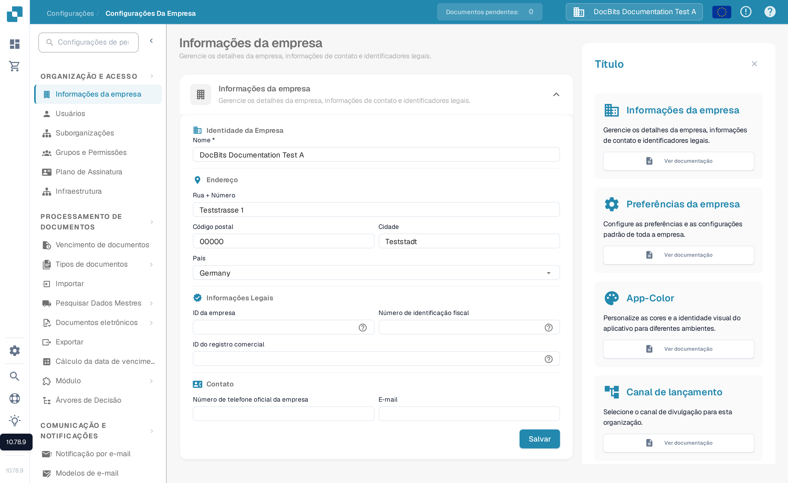
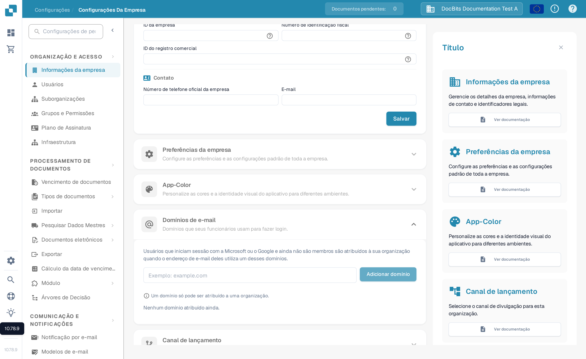

# Informações da Empresa

<figure><figcaption>
Informações da Empresa: preencha o nome, o endereço, os identificadores legais e os dados de contato da organização e selecione Salvar.
</figcaption></figure>

1. **Nome da Empresa**: O nome legal da empresa conforme registrado.
2. **Rua + Número**: O endereço físico da sede principal da empresa.
3. **Código Postal**: O CEP ou código postal do endereço da empresa.
4. **Cidade**: A cidade onde a empresa está localizada.
5. **Estado**: O estado ou região onde a empresa está sediada.
6. **País**: O país de operação da empresa.
7. **ID da Empresa**: Um identificador único para a empresa, que pode ser usado internamente ou para integrações com outros sistemas.
8. **ID Fiscal**: O número de identificação fiscal da empresa, importante para operações financeiras e relatórios.
9. **ID do Registro Comercial**: O número de registro da empresa no registro comercial, que pode ser importante para documentação legal e oficial.
10. **Número de Telefone Oficial da Empresa**: O número de contato principal da empresa.
11. **E-mail Oficial da Empresa**: O endereço de e-mail principal que será usado para comunicações oficiais.

As informações inseridas aqui podem ser cruciais para garantir que documentos como faturas, correspondências oficiais e relatórios sejam formatados corretamente com os detalhes corretos da empresa. Também ajuda a manter a consistência na forma como a empresa é representada em várias comunicações externas e documentos. Após inserir ou atualizar as informações, o administrador precisa salvar as alterações clicando no botão "Salvar" para garantir que todas as modificações sejam aplicadas em todo o sistema.

## Domínios de e-mail

Os administradores da organização podem abrir **Configurações → Informações da Empresa → Domínios de e-mail** para gerenciar os domínios usados na atribuição automática de organização. Quando alguém entra com a conta Microsoft ou Google e ainda não é membro de nenhuma organização, o DocBits pode atribuí-la a esta organização se o endereço de e-mail dela usar um dos domínios listados. Um domínio só pode pertencer a uma organização.

<figure><figcaption>
A seção portuguesa Domínios de e-mail antes de adicionar um domínio. Digite o domínio da empresa e selecione Adicionar domínio.
</figcaption></figure>

Digite no campo apenas o domínio, por exemplo `example.com`, e selecione **Adicionar domínio** ou pressione Enter. O primeiro domínio passa a ser o domínio principal. Se houver mais domínios listados, use **Definir como principal** em outra linha para alterá-lo, ou o ícone de lixeira para remover um domínio. Erros como domínio inválido, provedor de e-mail pessoal ou domínio já atribuído a outra organização aparecem abaixo do campo. **Nenhum domínio atribuído ainda** significa que esta organização não tem regra de domínio.

Antes de adicionar um domínio, verifique qual organização deve receber os novos acessos. Para gerenciar associações existentes, continue em [Usuários](../groups-users-and-permissions/users/README.md).

Além disso, a seção fornece uma visão do plano de assinatura, mostrando quantos dias restam, datas de início e término, e um medidor de uso da assinatura que acompanha o consumo de tokens de serviço em relação ao que está alocado no plano. Isso pode ajudar os administradores a monitorar e planejar as renovações ou atualizações da assinatura com base nas tendências de uso.
