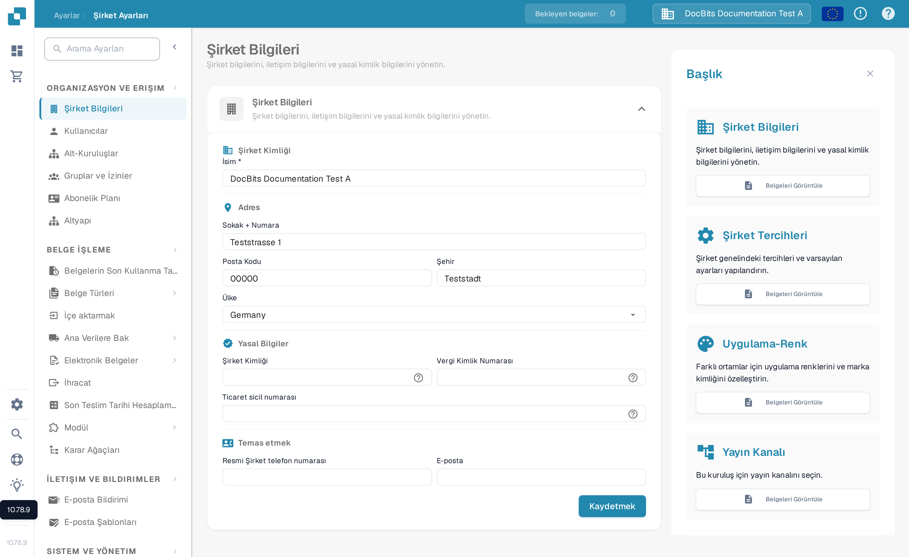
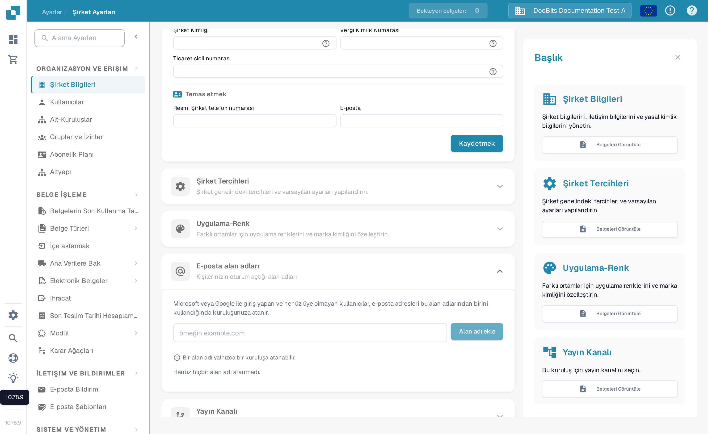

# Şirket Bilgileri

<figure><figcaption>
Şirket Bilgileri: kuruluş adını, adresi, yasal kimlik numaralarını ve iletişim bilgilerini düzenleyin, ardından Kaydet'e seçin.
</figcaption></figure>

Şirket Bilgileri sayfası şirket profilinizi, tercihlerinizi ve abonelik ayrıntılarınızı yönetmenizi sağlar. Aşağıdaki bölümlere ayrılmıştır:

## Şirket Bilgileri

Bu bölüm, dört alana gruplanmış temel şirket verilerinizi içerir:

### Şirket Kimliği

* **Ad** *(zorunlu)*: Şirketinizin yasal adı.

### Adres

* **Sokak + Numara**: Şirketinizin sokak adresi.
* **Posta Kodu**: ZIP veya posta kodu.
* **Şehir**: Şehir adı.
* **Ülke**: Ülkenizi açılır listeden seçin.

### Yasal Bilgiler

* **Şirket Kimliği**: Entegrasyonlar ve iç referans için kullanılan, şirketinize özel benzersiz tanımlayıcı.
* **Vergi Kimlik Numarası**: Finansal raporlama için vergi kimlik numaranız.
* **Ticaret Sicil Numarası**: Yasal belgeler için ticaret sicil kayıt numaranız.

### İletişim

* **Resmi Şirket Telefon Numarası**: Şirketiniz için birincil telefon numarası.
* **E-posta**: Resmi iletişimlerde kullanılan ana e-posta adresi.

Herhangi bir alanı girdikten veya güncelledikten sonra değişiklikleri uygulamak için **Kaydet**'e tıklayın. Yasal kimlik numaralarının yanındaki **?** simgeleri ek alan açıklamaları gösterir. Formu açmak veya kapatmak için bölüm başlığını seçin.

## E-posta alan adları

Kuruluş yöneticileri, otomatik kuruluş atamasında kullanılan alan adlarını yönetmek için **Ayarlar → Şirket Bilgileri → E-posta alan adları** bölümünü açabilir. Bir kişi Microsoft veya Google ile oturum açtığında henüz hiçbir kuruluşun üyesi değilse, e-posta adresi bu kuruluşun listelenen alan adlarından birini kullanıyorsa DocBits onu bu kuruluşu atayabilir. Bir alan adı yalnızca tek bir kuruluşa ait olabilir.

<figure><figcaption>
Bir alan adı eklenmeden önce Türkçe E-posta alan adları bölümü. Bir şirket alan adı girin, ardından Alan adı ekle'yi seçin.
</figcaption></figure>

Giriş alanına yalnızca alan adını, örneğin `example.com` gibi yazın ve **Alan adı ekle**'yi seçin veya Enter'a basın. İlk alan adı birincil alan adı olur. Listede daha fazla alan adı varsa başka bir satırdaki **Birincil yap** ile birincil alan adını değiştirin veya bir alan adını kaldırmak için çöp kutusu simgesini kullanın. Geçersiz alan adı, kişisel e-posta sağlayıcısı veya başka bir yere atanmış alan adı gibi hatalar giriş alanının altında görünür. **Henüz hiçbir alan adı atanmadı** mesajı, bu kuruluşta alan adı kuralı olmadığı anlamına gelir.

Bir alan adı eklemeden önce yeni oturum açmaların hangi kuruluşu alması gerektiğini kontrol edin. Mevcut üyelikleri yönetmek için [Kullanıcılar](../groups-users-and-permissions/users/README.md) sayfasına devam edin.

## Şirket Tercihleri

Kuruluş genelinde varsayılan ayarları yapılandırın:

* **Tarih Biçimi**: Tarihlerin DocBits genelinde nasıl görüntüleneceğini seçin (ör. `%m/%d/%Y`, `%d.%m.%Y`).
* **Tutar Biçimi**: Tutarlar için sayı biçimini seçin (ör. `1.000,00` için Deutsch, `1,000.00` için English).
* **Yeni Sürüm Bilgi Penceresi**: Kullanıcıların yeni bir DocBits sürümü yayınlandığında bildirim görüp görmeyeceğini açın veya kapatın.

Değişikliklerden sonra **Kaydet**'e tıklayın.

## Uygulama-Renk

DocBits arayüzünün ana rengini özelleştirin. Bu, farklı ortamları (ör. dev ve production) görsel olarak ayırt etmeye yarar.

* **Renk**: Bir onaltılık renk kodu girin (ör. `#2388AE`) veya renk seçiciyi kullanın.
* Uygulamak için **Kaydet**'e, varsayılan rengi geri yüklemek için **Sıfırla**'ya tıklayın.

## Abonelik Planı

Etkin abonelik planlarınızı ve ayrıntılarını görüntüleyin:

* **Plan Adı**: Her etkin planın adı (ör. DocBits, DocFlow Users, DocSearch).
* **Kalan Gün**: Planın süresinin dolmasına kalan gün sayısı.
* **Başlangıç / Bitiş Tarihi**: Abonelik dönemi.
* **Kullanıcı Sayısı**: Kuruluşunuzdaki toplam kullanıcı sayısı.
* **Alt Kuruluş Sayısı**: Yapılandırılmış alt kuruluş sayısı.
* **Tedarikçi Sayısı**: Kayıtlı tedarikçi sayısı.

## Abonelik Kullanımı

Aylık jeton ve iş akışı tüketiminizi izleyin:

| Sütun | Açıklama |
|--------|-------------|
| **Tür** | Kullanım türü (Belge veya İş Akışı). |
| **Başlangıç / Bitiş** | Faturalandırma dönemi tarihleri. |
| **Kullanılan Jeton** | Dönemde tüketilen jeton sayısı. |
| **Kalan Jeton** | Dönemde hâlâ kullanılabilir jetonlar. |

Belirli tarih aralıklarına göre filtrelemek için **Seç** düğmesini kullanın.
