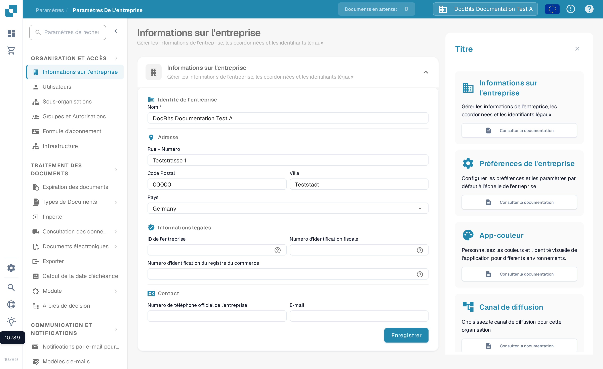
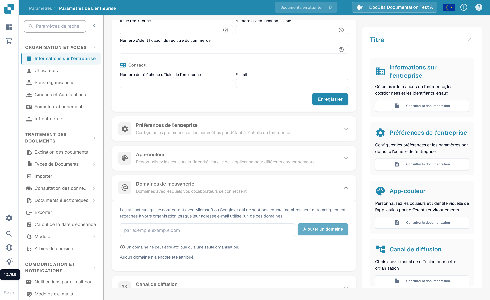

# Informations sur l'entreprise

<figure><figcaption>
Informations sur l'entreprise : modifiez le nom, l'adresse, les identifiants légaux et les coordonnées de l'organisation, puis sélectionnez Enregistrer.
</figcaption></figure>

1. **Nom de l'entreprise** : Le nom légal de l'entreprise tel qu'enregistré.
2. **Rue + Numéro** : L'adresse physique du siège social de l'entreprise.
3. **Code postal** : Le code ZIP ou postal de l'adresse de l'entreprise.
4. **Ville** : La ville où se trouve l'entreprise.
5. **État** : L'état ou la région où est basée l'entreprise.
6. **Pays** : Le pays d'opération de l'entreprise.
7. **Identifiant de l'entreprise** : Un identifiant unique pour l'entreprise, qui pourrait être utilisé en interne ou pour des intégrations avec d'autres systèmes.
8. **Identifiant fiscal** : Le numéro d'identification fiscale de l'entreprise, important pour les opérations financières et les rapports.
9. **Identifiant du registre commercial** : Le numéro d'enregistrement de l'entreprise au registre du commerce, qui pourrait être important pour la documentation légale et officielle.
10. **Numéro de téléphone officiel de l'entreprise** : Le numéro de contact principal de l'entreprise.
11. **Email officiel de l'entreprise** : L'adresse e-mail principale qui sera utilisée pour les communications officielles.

Les informations saisies ici peuvent être cruciales pour garantir que des documents tels que les factures, la correspondance officielle et les rapports soient correctement formatés avec les détails de l'entreprise corrects. Cela aide également à maintenir la cohérence dans la représentation de l'entreprise dans diverses communications externes et documents. Après avoir saisi ou mis à jour les informations, l'administrateur doit enregistrer les modifications en cliquant sur le bouton "Enregistrer" pour garantir que toutes les modifications sont appliquées à l'ensemble du système.

## Domaines de messagerie

Les administrateurs de l'organisation peuvent ouvrir **Paramètres → Informations sur l'entreprise → Domaines de messagerie** pour gérer les domaines utilisés pour l'attribution automatique des organisations. Lorsqu'un utilisateur se connecte avec Microsoft ou Google et qu'il n'est pas encore membre d'une organisation, DocBits peut le rattacher à cette organisation si son adresse e-mail utilise l'un des domaines listés. Un domaine ne peut appartenir qu'à une seule organisation.

<figure><figcaption>
La section Domaines de messagerie en français avant l'ajout d'un domaine. Saisissez le domaine de l'entreprise, puis sélectionnez Ajouter un domaine.
</figcaption></figure>

Saisissez uniquement le domaine, par exemple `example.com`, dans le champ, puis sélectionnez **Ajouter un domaine** ou appuyez sur Entrée. Le premier domaine devient le domaine principal. Si d'autres domaines sont listés, utilisez **Définir comme principal** sur une autre ligne pour le modifier, ou l'icône corbeille pour supprimer un domaine. Les erreurs, comme un domaine invalide, un fournisseur de messagerie personnel ou un domaine déjà attribué ailleurs, s'affichent sous le champ. **Aucun domaine n'a encore été attribué** signifie que cette organisation n'a aucune règle de domaine.

Avant d'ajouter un domaine, vérifiez quelle organisation doit recevoir les nouvelles connexions. Pour gérer les appartenances existantes, continuez avec [Utilisateurs](../groups-users-and-permissions/users/README.md).

De plus, la section fournit une vue du plan d'abonnement, montrant combien de jours il reste, les dates de début et de fin, et un compteur d'utilisation d'abonnement qui suit la consommation de jetons de service par rapport à ce qui est alloué dans le plan. Cela peut aider les administrateurs à surveiller et à planifier les renouvellements d'abonnement ou les mises à niveau en fonction des tendances d'utilisation.
