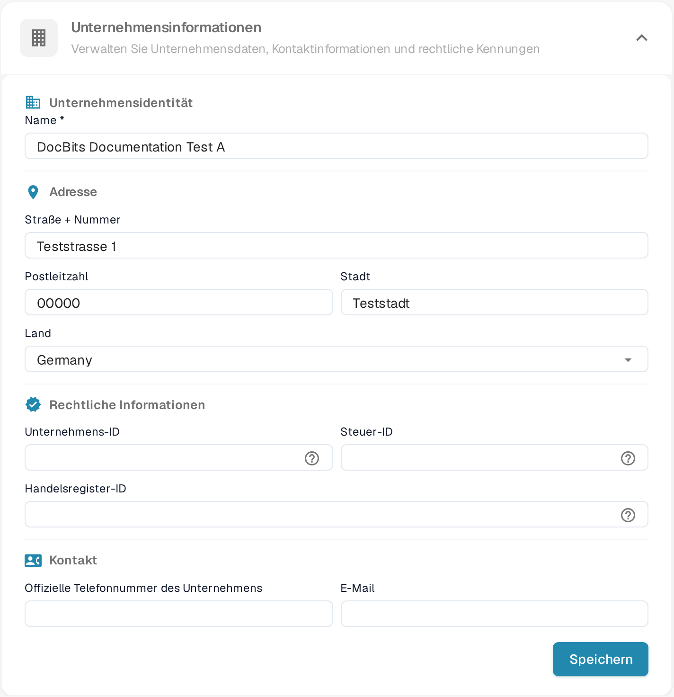
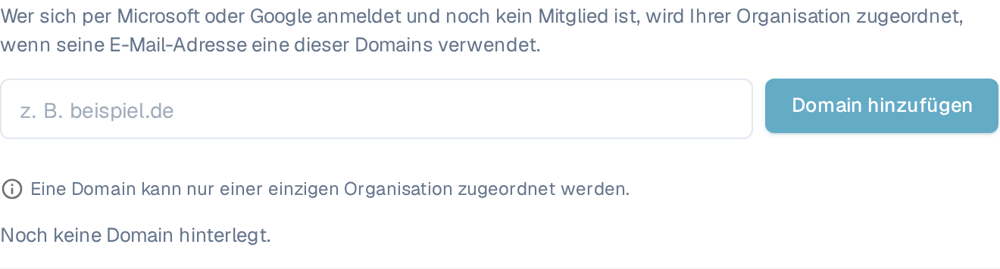

# Firmeninformationen

<figure><figcaption>
Unternehmensinformationen: Name, Adresse, rechtliche Kennungen und Kontaktdaten bearbeiten, anschließend auf **Speichern** wählen.
</figcaption></figure>

Auf der Seite „Unternehmensinformationen“ verwalten Sie das Firmenprofil und die zentralen Einstellungen Ihrer Organisation. Die Seite ist in aufklappbare Abschnitte gegliedert:

## Unternehmensinformationen

Dieser Abschnitt enthält Ihre zentralen Firmendaten, gegliedert in vier Bereiche:

### Unternehmensidentität

* **Name** *(erforderlich)*: Der rechtliche Name Ihres Unternehmens.

### Adresse

* **Straße + Nummer**: Die Straßenanschrift Ihres Unternehmens.
* **Postleitzahl**: Postleitzahl oder ZIP-Code.
* **Stadt**: Name der Stadt.
* **Land**: Wählen Sie Ihr Land aus der Dropdown-Liste.

### Rechtliche Informationen

* **Unternehmens-ID**: Ein eindeutiger Identifikator für Ihr Unternehmen, verwendet für Integrationen und interne Referenzen.
* **Steuer-ID**: Ihre Steuernummer für die Finanzberichterstattung.
* **Handelsregister-ID**: Ihre Handelsregisternummer für rechtliche Dokumentationen.

### Kontakt

* **Offizielle Telefonnummer des Unternehmens**: Die primäre Telefonnummer Ihres Unternehmens.
* **E-Mail**: Die Haupt-E-Mail-Adresse für offizielle Kommunikationen.

Nach dem Eingeben oder Aktualisieren von Feldern klicken Sie auf **Speichern**, um Ihre Änderungen anzuwenden. Die **?**-Symbole neben den rechtlichen Kennungen zeigen zusätzliche Feldhinweise an. Wählen Sie die Abschnittsüberschrift, um das Formular auf- oder zuzuklappen.

## E-Mail-Domains

Organisations-Administratoren können über **Einstellungen → Unternehmensinformationen → E-Mail-Domains** die Domains für die automatische Organisationszuordnung verwalten. Wenn sich jemand mit Microsoft oder Google anmeldet und noch kein Mitglied einer Organisation ist, kann DocBits diese Person Ihrer Organisation zuordnen, sofern ihre E-Mail-Adresse eine der hier hinterlegten Domains verwendet. Eine Domain kann nur einer einzigen Organisation zugeordnet werden.

<figure><figcaption>
Der Abschnitt „E-Mail-Domains“, bevor eine Domain ergänzt wird. Geben Sie eine Firmendomain ein und wählen Sie **Domain hinzufügen**.
</figcaption></figure>

Geben Sie in das Eingabefeld nur die Domain ein, zum Beispiel `example.com`, und wählen Sie **Domain hinzufügen** oder drücken Sie die Enter-Taste. Die erste Domain wird zur primären Domain. Wenn weitere Domains gelistet sind, nutzen Sie **Als primär festlegen** in einer anderen Zeile, um sie zu ändern, oder das Papierkorb-Symbol, um eine Domain zu entfernen. Fehler wie eine ungültige Domain, ein privater E-Mail-Anbieter oder eine bereits anderweitig zugeordnete Domain erscheinen unter dem Eingabefeld. **Noch keine Domain hinterlegt** bedeutet, dass diese Organisation keine Domain-Regel hat.

Bevor Sie eine Domain hinzufügen, prüfen Sie, welche Organisation neue Anmeldungen erhalten soll. Um bestehende Mitgliedschaften zu verwalten, fahren Sie fort mit [Benutzer](../groups-users-and-permissions/users/README.md).

## Unternehmenspräferenzen

Konfigurieren Sie unternehmensweite Standardeinstellungen:

* **Datum Muster**: Wählen Sie, wie Daten in DocBits angezeigt werden (z. B. `%d.%m.%Y`).
* **Betragsformatierung**: Wählen Sie das Zahlenformat für Beträge (z. B. **Deutsch** für `1.000,00`, **English** für `1,000.00`).

Klicken Sie nach den Änderungen auf **Speichern**.

## App-Farbe

Passen Sie die Primärfarbe und das Branding der DocBits-Oberfläche an. Das ist nützlich, um verschiedene Umgebungen wie Test, Sandbox und Produktion optisch zu unterscheiden.

* **Farbe**: Geben Sie einen Hex-Farbcode ein (z. B. `#2388AE`) oder nutzen Sie die Farbauswahl.
* Klicken Sie zum Anwenden auf **Speichern** oder auf **Zurücksetzen**, um die Standardfarbe wiederherzustellen.

## Release-Kanal

Administratoren wählen hier, wie diese Organisation DocBits-Releases erhält. Der aktuelle Stand wird mit Versionsnummer angezeigt:

* **Vesta**: Nur Hotfixes, maximale Stabilität.
* **Nova**: Neue Features nach jedem Release (Standard).

## Abonnement-Plan

Sehen Sie die Details Ihrer Abos ein: die Anzahl der Benutzer, der Unterorganisationen und der Lieferanten. Der Unterabschnitt **Funktions-Abonnements** listet pro App (z. B. DocFlow, AI Search) das Abonnement, den Status sowie Start, Ende und verbleibende Tage.

## Nutzung des Abonnements

Beobachten Sie Ihre Token- und Workflow-Nutzung. Mit **Wählen Sie** filtern Sie nach bestimmten Zeiträumen. Die Tabelle zeigt pro Zeitraum die Spalten **Typ** (Document oder Workflow), **Von**, **Bis**, **Tokens Gebraucht** und **Verbleibende Token**.
