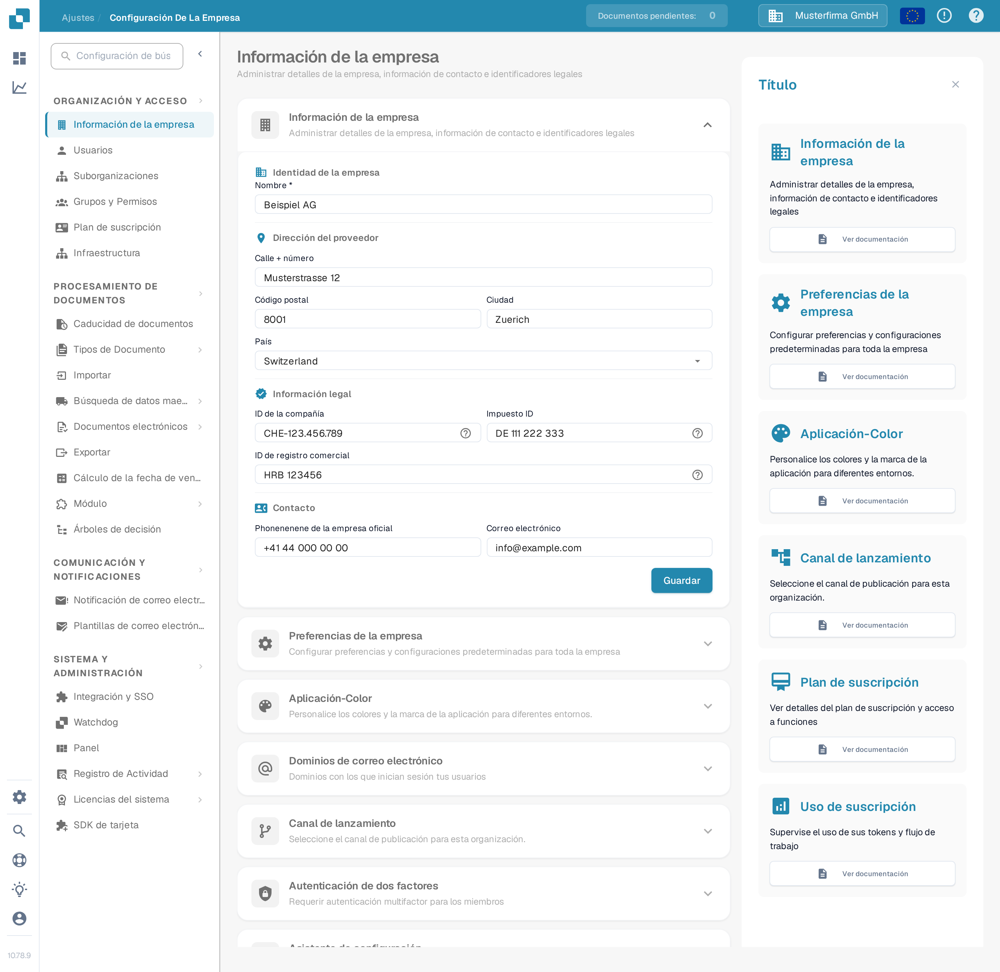
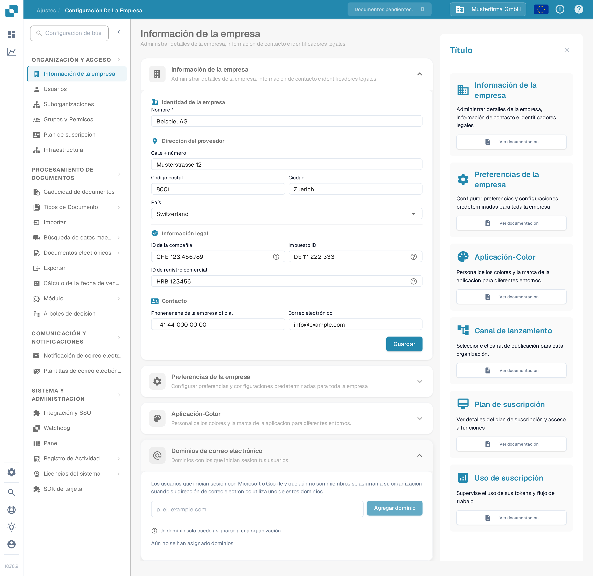

# Información de la Empresa

<figure><figcaption>
Información de la empresa: edita el nombre de la organización, la dirección, los identificadores legales y los datos de contacto y, a continuación, selecciona Guardar.
</figcaption></figure>

La página Información de la Empresa te permite gestionar el perfil de tu empresa, sus preferencias y los datos de la suscripción. Se organiza en las siguientes secciones:

## Información de la Empresa

Esta sección contiene los datos esenciales de tu empresa, agrupados en cuatro áreas:

### Identidad de la empresa

* **Nombre** *(obligatorio)*: El nombre legal de tu empresa.

### Dirección

* **Calle + número**: La dirección postal de tu empresa.
* **Código postal**: El código postal o ZIP.
* **Ciudad**: El nombre de la ciudad.
* **País**: Selecciona tu país en la lista desplegable.

### Información legal

* **ID de la empresa**: Un identificador único de tu empresa, utilizado para integraciones y referencias internas.
* **Impuesto ID**: Tu número de identificación fiscal para la información financiera.
* **ID de registro comercial**: Tu número de registro mercantil para la documentación legal.

### Contacto

* **Teléfono de la empresa oficial**: El número de teléfono principal de tu empresa.
* **Correo electrónico**: La dirección de correo electrónico principal para comunicaciones oficiales.

Tras introducir o actualizar cualquier campo, haz clic en **Guardar** para aplicar los cambios. Los iconos **?** junto a los identificadores legales muestran orientación adicional sobre el campo. Selecciona el título de la sección para desplegar o plegar el formulario.

## Dominios de correo electrónico

Los administradores de la organización pueden abrir **Ajustes → Información de la empresa → Dominios de correo electrónico** para gestionar los dominios utilizados en la asignación automática de organizaciones. Cuando alguien inicia sesión con Microsoft o Google y aún no es miembro de ninguna organización, DocBits puede asignarlo a esta organización si su dirección de correo electrónico utiliza uno de los dominios listados. Un dominio solo puede pertenecer a una organización.

<figure><figcaption>
La sección «Dominios de correo electrónico» en español antes de añadir un dominio. Introduce un dominio de la empresa y selecciona **Agregar dominio**.
</figcaption></figure>

Introduce solo el dominio, por ejemplo `example.com`, en el campo y selecciona **Agregar dominio** o pulsa Intro. El primer dominio se convierte en el dominio principal. Si se listan más dominios, usa **Establecer como principal** en otra fila para cambiarlo, o el icono de papelera para eliminar un dominio. Los errores, como un dominio no válido, un proveedor de correo personal o un dominio ya asignado a otra organización, aparecen bajo el campo de entrada. **Aún no se han asignado dominios** significa que esta organización no tiene ninguna regla de dominios.

Antes de añadir un dominio, comprueba qué organización debe recibir los nuevos inicios de sesión. Para gestionar las membresías existentes, continúa con [Usuarios](../groups-users-and-permissions/users/README.md).

## Preferencias de la empresa

Configura la configuración predeterminada de toda la empresa:

* **Patrón de fecha**: Elige cómo se muestran las fechas en DocBits (por ejemplo, `%d/%m/%Y`, `%d.%m.%Y`).
* **Formato de importes**: Selecciona el formato numérico para los importes (por ejemplo, Deutsch para `1.000,00`, English para `1,000.00`).
* **Diálogo de información de nueva versión**: Activa o desactiva si los usuarios ven una notificación cuando se publica una nueva versión de DocBits.

Haz clic en **Guardar** tras realizar los cambios.

## Color de la aplicación

Personaliza el color principal de la interfaz de DocBits. Resulta útil para distinguir visualmente distintos entornos (por ejemplo, desarrollo y producción).

* **Color**: Introduce un código de color hexadecimal (por ejemplo, `#2388AE`) o usa el selector de color.
* Haz clic en **Guardar** para aplicar el color o en **Restablecer** para restaurar el color predeterminado.

## Plan de suscripción

Consulta tus planes de suscripción activos y sus detalles:

* **Nombre del plan**: El nombre de cada plan activo (por ejemplo, DocBits, DocFlow Users, DocSearch).
* **Días restantes**: Los días que quedan hasta que caduque el plan.
* **Fecha de inicio / fecha de fin**: El periodo de suscripción.
* **Número de usuarios**: El número total de usuarios de tu organización.
* **Número de suborganizaciones**: El número de suborganizaciones configuradas.
* **Número de proveedores**: El número de proveedores registrados.

## Uso de la suscripción

Supervisa el consumo mensual de tokens y de flujos de trabajo:

| Columna | Descripción |
|--------|-------------|
| **Tipo** | El tipo de uso (documento o flujo de trabajo). |
| **Desde / Hasta** | Las fechas del periodo de facturación. |
| **Tokens utilizados** | Número de tokens consumidos en el periodo actual. |
| **Tokens restantes** | Tokens aún disponibles en el periodo actual. |

Usa el botón **Seleccionar** para filtrar por intervalos de fechas concretos.
