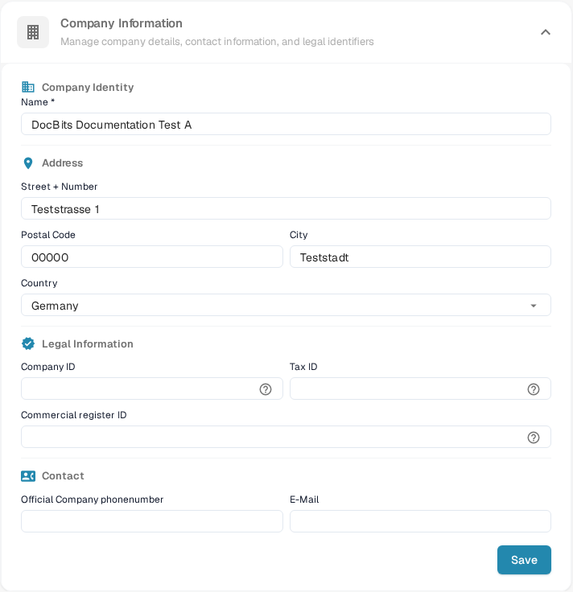
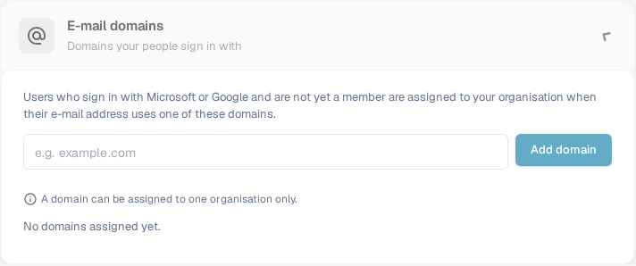

# Company Information

<figure><figcaption>
Company Information: edit the organization name, address, legal identifiers and contact details, then select Save.
</figcaption></figure>

The Company Information page lets you manage your company profile, preferences, and subscription details. It is organized into the following sections:

## Company Information

This section contains your core company data, grouped into four areas:

### Company Identity

* **Name** *(required)*: The legal name of your company.

### Address

* **Street + Number**: Your company's street address.
* **Postal Code**: ZIP or postal code.
* **City**: City name.
* **Country**: Select your country from the dropdown.

### Legal Information

* **Company ID**: A unique identifier for your company, used for integrations and internal reference.
* **Tax ID**: Your tax identification number for financial reporting.
* **Commercial Register ID**: Your commercial register number for legal documentation.

### Contact

* **Official Company Phone Number**: The primary phone number for your company.
* **E-Mail**: The main email address used for official communications.

After entering or updating any fields, click **Save** to apply your changes. The **?** icons beside the legal identifiers show extra field guidance. Select the section heading to expand or collapse the form.

## E-mail domains

Organization admins can open **Settings → Company Information → E-mail domains** to manage the domains used for automatic organization assignment. When someone signs in with Microsoft or Google and is not yet a member of an organization, DocBits can assign them to this organization if their e-mail address uses one of its listed domains. A domain can belong to only one organization.

<figure><figcaption>
The English E-mail domains section before a domain is added. Enter a company domain, then select Add domain.
</figcaption></figure>

Enter the domain only, such as `example.com`, in the input and select **Add domain** or press Enter. The first domain becomes the primary domain. If more domains are listed, use **Make primary** on another row to change it, or the trash icon to remove a domain. Errors such as an invalid domain, a personal e-mail provider or a domain already assigned elsewhere appear under the input. **No domains assigned yet** means this organization has no domain rule.

Before adding a domain, check which organization should receive new sign-ins. To manage existing memberships, continue with [Users](../groups-users-and-permissions/users/README.md).

## Company Preferences

Configure company-wide default settings:

* **Date Pattern**: Choose how dates are displayed throughout DocBits (e.g., `%m/%d/%Y`, `%d.%m.%Y`).
* **Amount Formatting**: Select the number format for amounts (e.g., Deutsch for `1.000,00`, English for `1,000.00`).
* **New Version Info Dialog**: Toggle whether users see a notification when a new DocBits version is released.

Click **Save** after making changes.

## App-Color

Customize the primary color of the DocBits interface. This is useful for visually distinguishing different environments (e.g., dev vs. production).

* **Color**: Enter a hex color code (e.g., `#2388AE`) or use the color picker.
* Click **Save** to apply, or **Reset** to restore the default color.

## Subscription Plan

View your active subscription plans and their details:

* **Plan Name**: The name of each active plan (e.g., DocBits, DocFlow Users, DocSearch).
* **Days Left**: How many days remain until the plan expires.
* **Start Date / End Date**: The subscription period.
* **Users Count**: Total number of users in your organization.
* **Sub Organizations Count**: Number of sub-organizations configured.
* **Suppliers Count**: Number of suppliers registered.

## Subscription Usage

Monitor your monthly token and workflow consumption:

| Column | Description |
|--------|-------------|
| **Type** | The usage type (Document or Workflow). |
| **From / To** | The billing period dates. |
| **Tokens Used** | Number of tokens consumed in the current period. |
| **Remaining Tokens** | Tokens still available in the current period. |

Use the **Select** button to filter by specific date ranges.
