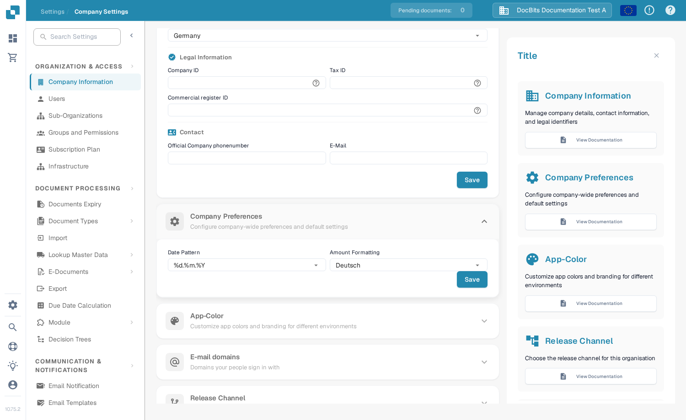
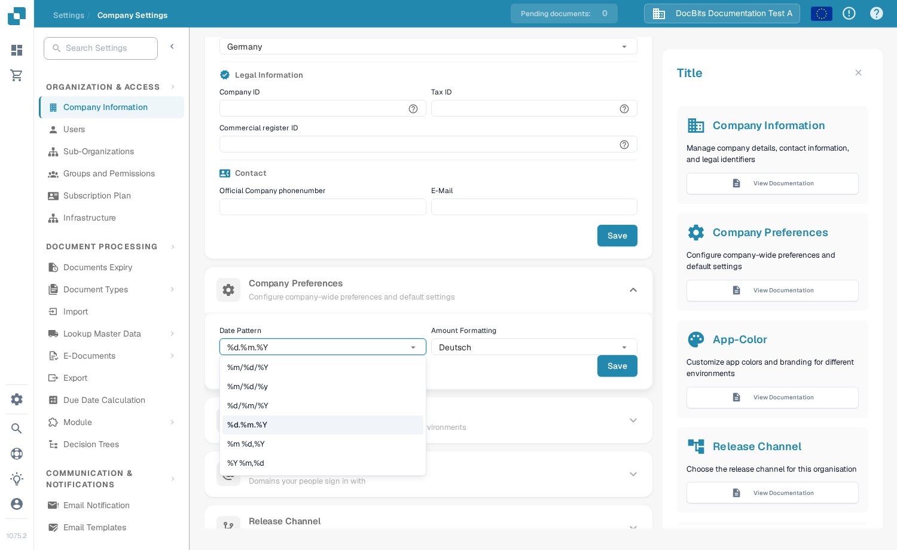
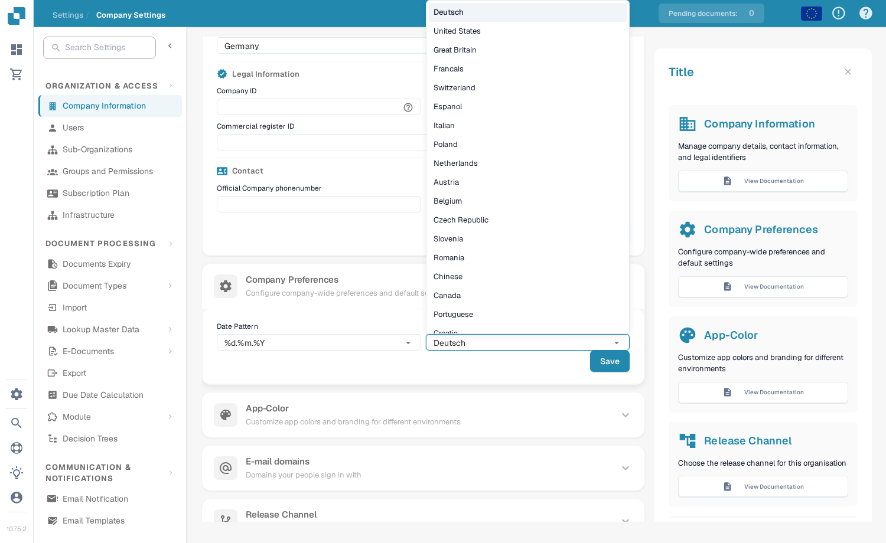

# Company Preferences

Company Preferences controls how dates and amounts are displayed for your organisation. You can find it under **Settings → Company Information**. Expand **Company Preferences** to see the two settings.

<figure><figcaption>
The two company preferences and their Save button.
</figcaption></figure>

## Choose a date pattern

Open **Date Pattern** and select the order and separator you want for displayed dates. For example, `%d.%m.%Y` displays day, month and four-digit year with dots; `%m/%d/%Y` puts the month first and uses slashes. The list in DocBits shows all available patterns.

<figure><figcaption>
Select a date pattern that suits your organisation.
</figcaption></figure>

## Choose amount formatting

Open **Amount Formatting** and select the regional format your organisation uses. The list includes **Deutsch**, **United States**, **Great Britain**, **Francais**, and other options.

<figure><figcaption>
Select a regional amount format.
</figcaption></figure>

Click **Save** inside **Company Preferences** after making a change. This is separate from the Save button in **Company Information** above it.
