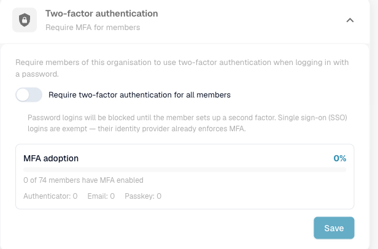
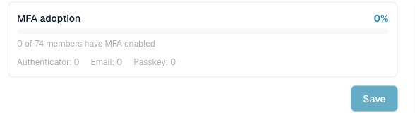

# Twee-factor-authenticatie (Admin)

## Overzicht

Als organisatiebeheerder kunt u **elk lid verplichten om twee-factor-authenticatie (2FA) te gebruiken** wanneer ze met een wachtwoord inloggen. Wanneer de verplichting is ingeschakeld, wordt een lid dat nog geen tweede factor heeft ingesteld door de registratie geleid voordat het de aanmelding kan voltooien.

Single sign-on (SSO)-aanmeldingen — Google, Microsoft, SAML — zijn **vrijgesteld**: hun identiteitsprovider dwingt al zijn eigen MFA af, dus de verplichting geldt alleen voor wachtwoordaanmeldingen.

Deze instelling bevindt zich in **Instellingen → Global Settings → Bedrijfsinformatie → Twee-factor-authenticatie** en is alleen beschikbaar voor organisatiebeheerders.

## MFA verplicht stellen voor uw organisatie

1. Ga naar **Instellingen → Global Settings → Bedrijfsinformatie**.
2. Open de sectie **Twee-factor-authenticatie**.
3. Schakel **Twee-factor-authenticatie vereisen voor alle leden** in en klik op **Opslaan**.

<figure><figcaption>
Schakel de verplichting voor alle leden in en volg de acceptatie hieronder.
</figcaption></figure>

Na het opslaan wordt de wijziging binnen een minuut van kracht. Vanaf dan:

* Een lid **met** een tweede factor wordt daar na het wachtwoord om gevraagd, zoals gebruikelijk.
* Een lid **zonder** een tweede factor moet er een registreren voordat het een sessie ontvangt.
* SSO-/social-aanmeldingen worden niet beïnvloed.


Door dit in te schakelen worden wachtwoordaanmeldingen geblokkeerd voor leden die geen tweede factor hebben, totdat ze de registratie voltooien. Communiceer de wijziging naar uw team en overweeg om deze buiten piekuren in te schakelen.


## MFA-acceptatierapport

Onder de schakelaar toont het paneel **MFA-acceptatie** hoe breed 2FA in uw organisatie wordt gebruikt voordat u het afdwingt:

* het algehele **acceptatiepercentage** en een voortgangsbalk,
* hoeveel van uw leden 2FA hebben ingeschakeld (bijv. *0 van 74 leden*),
* een uitsplitsing per factor — **Authenticator**, **E-mail**, en **Passkey**.

<figure><figcaption>
Het MFA-acceptatierapport: algeheel percentage, geregistreerde leden, en een uitsplitsing per factor.
</figcaption></figure>

Gebruik het om de gereedheid in te schatten: verhoog eerst de acceptatie en schakel daarna de verplichting in, zodat er minder leden bij de registratiestap worden geblokkeerd.

## Wat leden zien

Een lid dat zich moet registreren, wordt bij de volgende aanmelding naar de 2FA-instellingen gestuurd en kiest een methode (authenticator-app, e-mailcode, of passkey). De stappen voor de eindgebruiker worden beschreven in [Twee-factor-authenticatie (2FA)](../../../../overview-and-basics/two-factor-authentication.md).

## Gerelateerde beveiligingsmaatregelen

De organisatiebrede MFA-verplichting vormt een aanvulling op de ingebouwde beveiligingen die altijd van kracht zijn zodra een gebruiker 2FA heeft ingeschakeld: eenmalige inlogcodes, een TOTP-replaybeveiliging, pogingslimieten per uitdaging en per account (een account wordt tijdelijk vergrendeld na te veel mislukte pogingen), en automatische intrekking van vertrouwde apparaten wanneer een lid zijn wachtwoord wijzigt.
