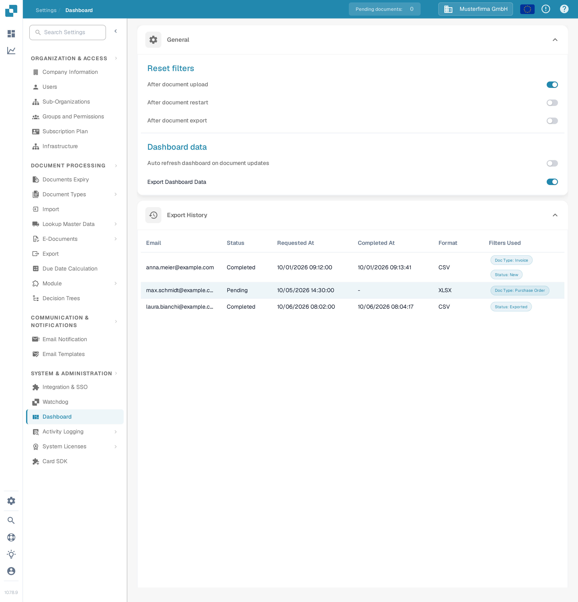
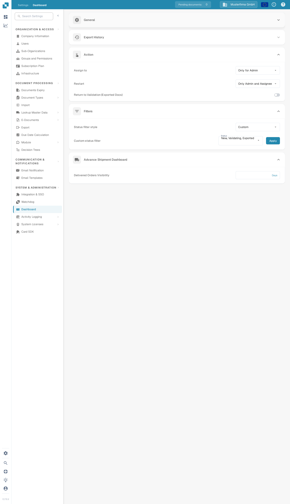

# Dashboard settings

Administrators use **Settings → Dashboard** to choose how the document dashboard refreshes, which actions users can perform, and which document statuses appear in its filters.

## General and export history

Under **Reset filters**, choose whether the dashboard clears its current filters after a document is uploaded, restarted, or exported. **Auto refresh dashboard on document updates** controls whether the list refreshes when documents change. Turn on **Export Dashboard Data** to make the dashboard's data export available.

**Export History** lists export requests and their email address, status, request and completion times, format, and filters. An empty table means this organization has no export record to show.

<figure><figcaption>
General dashboard behavior and export history in the synthetic Sandbox organization.
</figcaption></figure>

## Actions and status filters

Under **Action**, choose who can **Assign to** and **Restart** documents. **Return to Validation (Exported Docs)** is a separate switch. Choose these permissions to match the employees who handle documents in your organization.

Under **Filters**, **Status filter style** offers **All**, **Static**, and **Custom**. Choose **Custom** to select the document statuses you want to display, then select **Apply**. The custom status selector is shown only after Custom is chosen. See [Custom status filters](page-1.md) for the exact steps.

Under **Advance Shipment Dashboard**, **Delivered Orders Visibility** sets how many days delivered orders remain visible.

<figure><figcaption>
Action permissions, filters, and delivered-order visibility farther down the same settings page.
</figcaption></figure>
