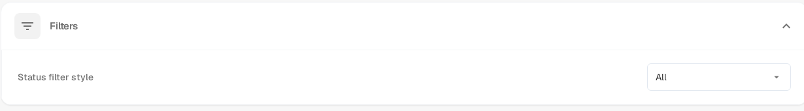
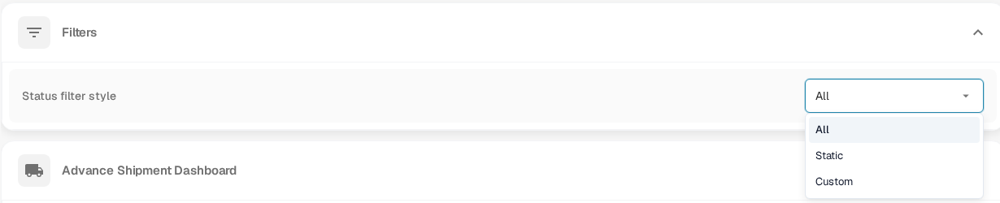

# Customizing Dashboard Status Filters

An administrator can choose which **status options** are available in the dashboard filter. This setting does not filter the document list by itself. To search for documents or combine filters, see [Filtering Documents](../../../../overview/dashboard/filtering-documents.md).

## Choose a status filter style

1. Open **Settings → Dashboard** as an organization administrator.
2. Expand **Filters** and find **Status filter style**.
3. Open the dropdown and choose one of the three styles:

   - **All** shows the full status list.
   - **Static** shows the predefined shorter list.
   - **Custom** lets you choose the statuses your organization needs.

<figure><figcaption>The status filter setting in Dashboard settings.</figcaption></figure>

<figure><figcaption>The three available filter styles.</figcaption></figure>

Choosing **All** or **Static** saves that style immediately. With **Custom**, a **Custom status filter** selector appears: choose one or more statuses and select **Apply**. If you apply an empty custom selection, the setting returns to **All**.

To use the resulting status filter on actual documents, return to the [dashboard filtering guide](../../../../overview/dashboard/filtering-documents.md). There you can also find how to clear applied filters.
