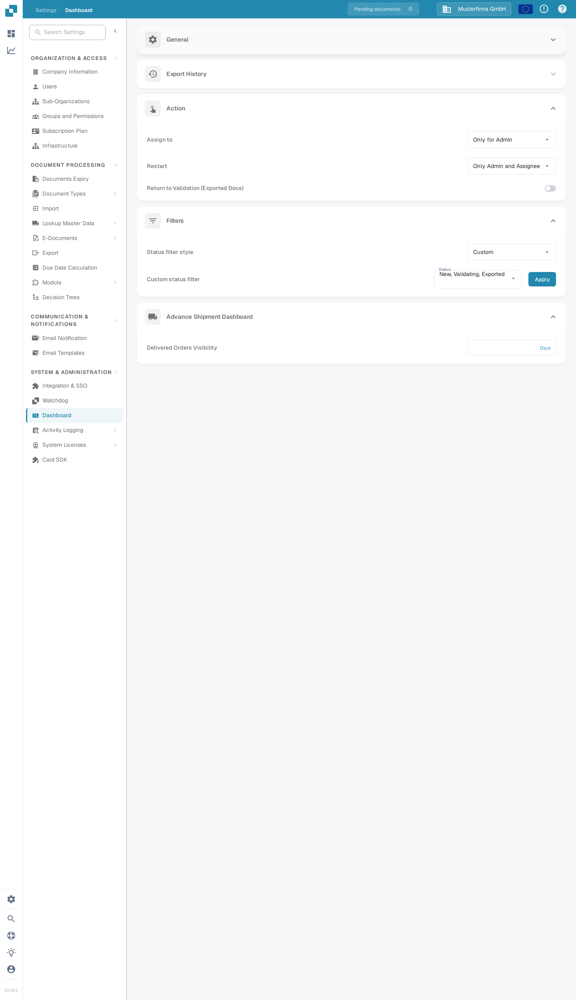

# Custom status filters

Use a custom status filter when your team wants the Dashboard to focus on particular stages of document processing.

1. Open **Settings → Dashboard** and scroll to **Filters**.
2. Open **Status filter style** and choose **Custom**. The **Custom status filter** row appears below it.
3. Open **Status** and select the document statuses your team needs.
4. Select **Apply** to save that selection. Return to the Dashboard to use the chosen status filter.

<figure><figcaption>
Choose the statuses in the second row, then select Apply.
</figcaption></figure>

To stop using a custom selection, return to **Status filter style** and choose **All**. This example was captured in a synthetic Sandbox organization, and its original All setting was restored after the screenshot.

See [Dashboard settings](README.md) for reset filters, export history, action permissions, and delivered-order visibility.
