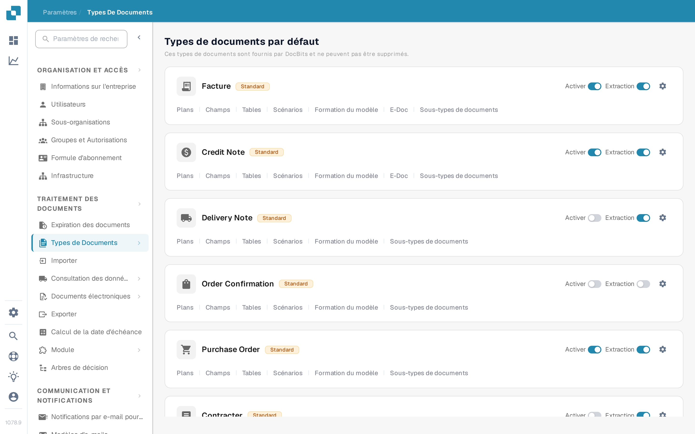

# Activation

Les administrateurs choisissent les types de documents disponibles pour leur organisation. Ce réglage se modifie sur la page **Types de documents**, sans supprimer le type ni sa configuration.

1. Ouvrez **Paramètres → Types de documents**.
2. Trouvez le type de document, par exemple **Facture**, dans **Types de documents par défaut** ou **Types de documents personnalisés**.
3. Utilisez l'interrupteur **Activer** sur la carte de ce type. Un interrupteur coloré signifie que le type est actif ; un interrupteur gris signifie qu'il est inactif. Attendez le message de confirmation avant de quitter la page. Cet interrupteur n'a pas de bouton Enregistrer séparé.

<figure><figcaption>
Chaque type de document dispose de son propre interrupteur Activer à droite de sa carte.
</figcaption></figure>

L'interrupteur **Extraction** placé à côté d'**Activer** est un réglage différent. Il sélectionne le mode d'extraction (Flex ou Fix) ; il n'active ni ne désactive le type de document. L'icône d'engrenage ouvre d'autres paramètres pour ce type. Les liens sous le nom du type ouvrent ses plans, ses champs, ses tables, ses scénarios et les autres zones de configuration disponibles.

DocBits fournit les types de documents par défaut, qui ne peuvent pas être supprimés. Vous pouvez aussi créer et gérer des types personnalisés. Voir [Ajout/Modification de Types de Documents](adding-editing-document-types.md) pour les étapes de configuration suivantes et [Colonnes de Tableau](table-columns.md) pour configurer les éléments de ligne extraits.
