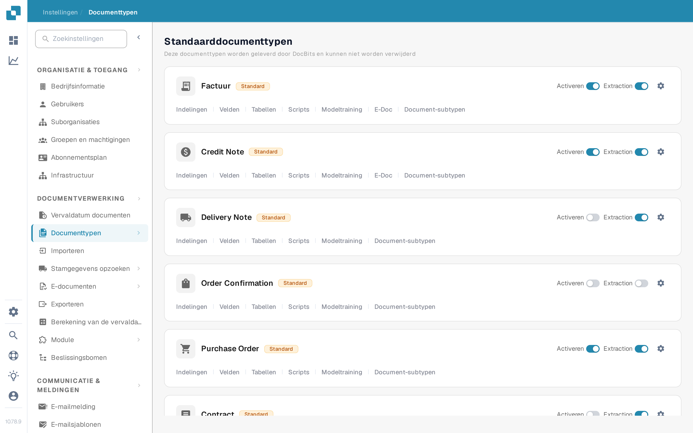

# Activeer of deactiveer een documenttype

Beheerders kunnen kiezen welke documenttypes beschikbaar zijn voor hun organisatie. U wijzigt dit op de pagina **Documenttypen** zonder het type of de bijbehorende configuratie te verwijderen.

1. Open **Instellingen → Documenttypen**.
2. Zoek het documenttype, bijvoorbeeld **Factuur**, onder **Standaarddocumenttypen** of **Aangepaste documenttypen**.
3. Gebruik de schakelaar **Activeren** op de kaart van dat type. Een gekleurde schakelaar betekent dat het type actief is; een grijze schakelaar betekent dat het inactief is. Wacht op het bevestigingsbericht voordat u de pagina verlaat. Voor deze schakelaar is geen aparte knop Om te slaan.

<figure><figcaption>
Elk documenttype heeft zijn eigen schakelaar Activeren aan de rechterkant van de kaart.
</figcaption></figure>

De schakelaar **Extraction** naast **Activeren** is een andere instelling. Deze kiest de extractiemodus (Flex of Fix); hiermee activeert of deactiveert u het documenttype niet. Het tandwiel-icoon opent meer instellingen voor dat type. De koppelingen onder de typenaam openen de indelingen, velden, tabellen, scripts en andere beschikbare configuratiegebieden.

DocBits levert de standaarddocumenttypen; deze kunnen niet worden verwijderd. U kunt ook aangepaste typen maken en beheren. Zie [Documenttypen toevoegen/bewerken](adding-editing-document-types.md) voor de volgende installatiestappen en [Tabelkolommen](table-columns/README.md) om de opgehaalde tabelregels te configureren.
