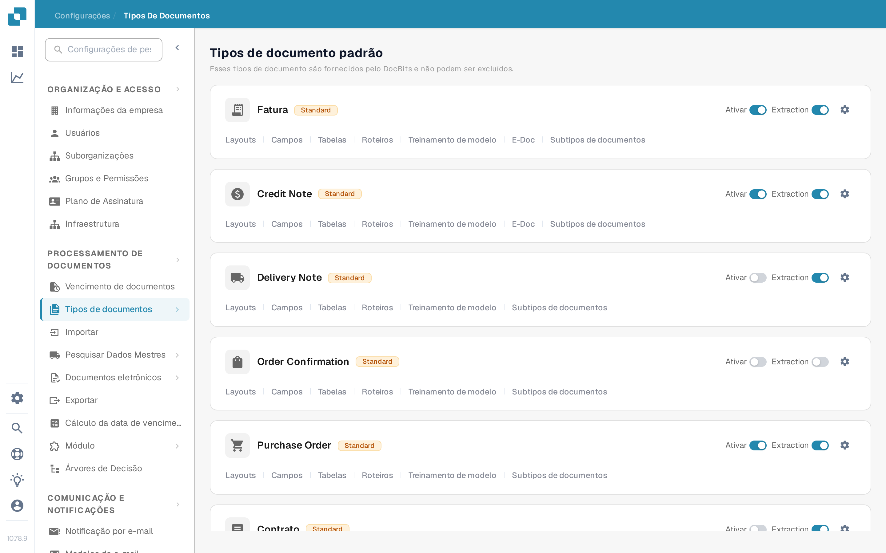

# Ativar ou desativar um tipo de documento

Os administradores escolhem quais os tipos de documento disponíveis para a sua organização. Pode alterá-lo na página **Tipos de documentos** sem eliminar o tipo nem a sua configuração.

1. Abra **Configurações → Tipos de documentos**.
2. Encontre o tipo de documento, por exemplo **Fatura**, em **Tipos de documento padrão** ou **Tipos de documentos personalizados**.
3. Use o interruptor com a etiqueta **Ativar** no cartão desse tipo. Um interruptor colorido significa que o tipo está ativo; um interruptor cinzento significa que está inativo. Aguarde a mensagem de confirmação antes de sair da página. Este interruptor não tem um botão Guardar separado.

<figure><figcaption>
Cada tipo de documento tem o seu próprio interruptor Ativar no lado direito do seu cartão.
</figcaption></figure>

O interruptor **Extraction** junto ao interruptor **Ativar** é uma definição diferente. Seleciona o modo de extração (Flex ou Fix); não ativa nem desativa o tipo de documento. O ícone de engrenagem abre mais definições desse tipo. As ligações sob o nome do tipo abrem os layouts, campos, tabelas, roteiros e outras áreas de configuração disponíveis.

O DocBits fornece os tipos de documento padrão, que não podem ser eliminados. Também pode criar e gerir tipos personalizados. Consulte [Adicionando/Editando Tipos de Documentos](adding-editing-document-types.md) para os passos seguintes da configuração e [Colunas da Tabela](table-columns/README.md) para configurar os itens de linha extraídos.
