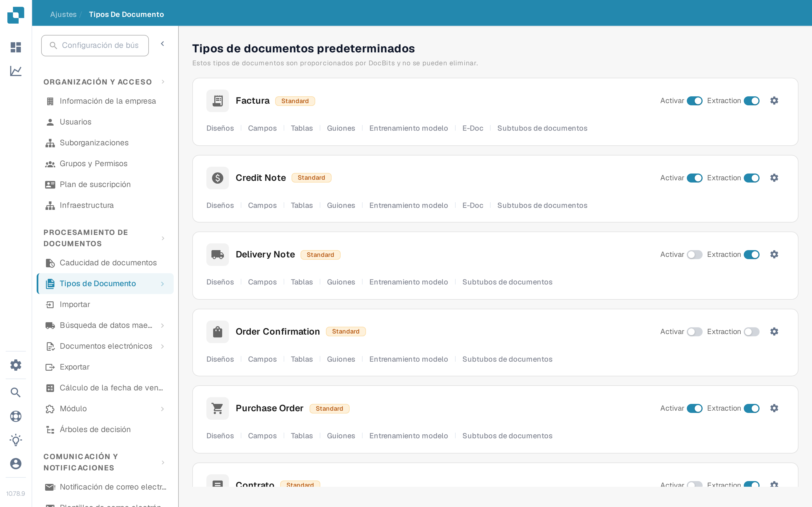

# Activar o desactivar un tipo de documento

Los administradores pueden elegir qué tipos de documentos están disponibles para su organización. Puede cambiar esto en la página **Tipos de Documento** sin eliminar el tipo ni su configuración.

1. Abra **Ajustes → Tipos de Documento**.
2. Busque el tipo de documento, por ejemplo **Factura**, en **Tipos de documentos predeterminados** o **Tipos de documentos personalizados**.
3. Use el interruptor **Activar** en la tarjeta de ese tipo. Un interruptor de color significa que el tipo está activo; un interruptor gris significa que está inactivo. Espere el mensaje de confirmación antes de salir de la página. Este interruptor no tiene un botón de guardar aparte.

<figure><figcaption>
Cada tipo de documento tiene su propio interruptor Activar en el lado derecho de su tarjeta.
</figcaption></figure>

El interruptor **Extraction** que aparece junto a **Activar** es un ajuste distinto. Selecciona el modo de extracción (Flex o Fix); no activa ni desactiva el tipo de documento. El icono de engranaje abre más ajustes de ese tipo. Los enlaces bajo el nombre del tipo abren sus diseños, campos, tablas, scripts y demás áreas de configuración disponibles.

DocBits proporciona los tipos de documento predeterminados, que no se pueden eliminar. También puede crear y gestionar tipos personalizados. Consulte [Agregar y editar tipos de documentos](adding-editing-document-types.md) para los siguientes pasos de la configuración y [Columnas de tabla](table-columns/README.md) para configurar los elementos de línea extraídos.
