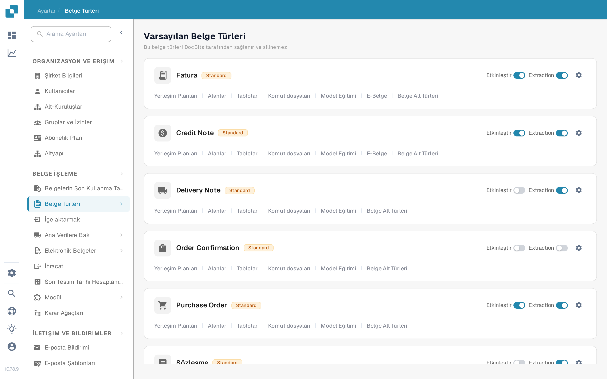

# Bir belge türünü etkinleştirme veya devre dışı bırakma

Yöneticiler, belge türlerinin hangilerinin kendi kuruluşları için kullanılabilir olduğunu seçebilir. Bu ayarı, türü veya yapılandırmasını silmeden **Belge Türleri** sayfasında değiştirebilirsiniz.

1. **Ayarlar → Belge Türleri** sayfasını açın.
2. Belge türünü, örneğin **Fatura**, **Varsayılan Belge Türleri** veya **Özel Belge Türleri** altında bulun.
3. Bu türün kartındaki **Etkinleştir** etiketli anahtarı kullanın. Renkli bir anahtar türün etkin olduğunu; gri bir anahtar etkin olmadığını gösterir. Sayfadan ayrılmadan önce onay mesajını bekleyin. Bu anahtar için ayrı bir Kaydet düğmesi yoktur.

<figure><figcaption>
Her belge türünün kartının sağ tarafında kendi Etkinleştir anahtarı bulunur.
</figcaption></figure>

**Etkinleştir** anahtarının yanındaki **Extraction** anahtarı farklı bir ayardır. Veri çıkarma modunu (Flex veya Fix) seçer; belge türünü etkinleştirip devre dışı bırakmaz. Dişli simgesi o türün diğer ayarlarını açar. Türün adının altındaki bağlantılar yerleşim planlarını, alanları, tabloları, komut dosyalarını ve diğer kullanılabilir yapılandırma alanlarını açar.

DocBits, silinemeyen varsayılan belge türlerini sağlar. Özel türleri de oluşturabilir ve yönetebilirsiniz. Sonraki kurulum adımları için [Adding/Editing Document Types](adding-editing-document-types.md) sayfasına, çıkarılan satır kalemlerini yapılandırmak için [Tablo Sütunları](../../../../admin-section/settings/global-settings/document-types/table-columns.md) sayfasına bakın.
