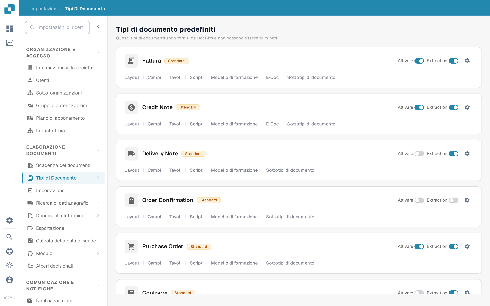

# Attivare o disattivare un tipo di documento

Gli amministratori possono scegliere quali tipi di documento sono disponibili per la loro organizzazione. È possibile modificare questa impostazione nella pagina **Tipi di Documento** senza eliminare il tipo né la sua configurazione.

1. Aprire **Impostazioni → Tipi di Documento**.
2. Individuare il tipo di documento, ad esempio **Fattura**, in **Tipi di documento predefiniti** o **Tipi di documenti personalizzati**.
3. Usare l'interruttore **Attivare** sulla scheda del tipo. Un interruttore colorato significa che il tipo è attivo; un interruttore grigio significa che è inattivo. Attendere il messaggio di conferma prima di lasciare la pagina. Per questo interruttore non esiste un pulsante di salvataggio separato.

<figure><figcaption>
Ogni tipo di documento ha un proprio interruttore Attivare sul lato destro della sua scheda.
</figcaption></figure>

L'interruttore **Extraction** accanto ad **Attivare** è un'impostazione diversa. Seleziona la modalità di estrazione (Flex o Fix); non attiva né disattiva il tipo di documento. L'icona dell'ingranaggio apre altre impostazioni per quel tipo. I collegamenti sotto il nome del tipo aprono i layout, i campi, le tabelle, gli script e le altre aree di configurazione disponibili.

DocBits fornisce i tipi di documento predefiniti, che non possono essere eliminati. È anche possibile creare e gestire tipi personalizzati. Vedere [Aggiunta e modifica dei tipi di documento](adding-editing-document-types.md) per i passaggi successivi della configurazione e [Colonne della tabella](table-columns/README.md) per configurare gli elementi di riga estratti.
