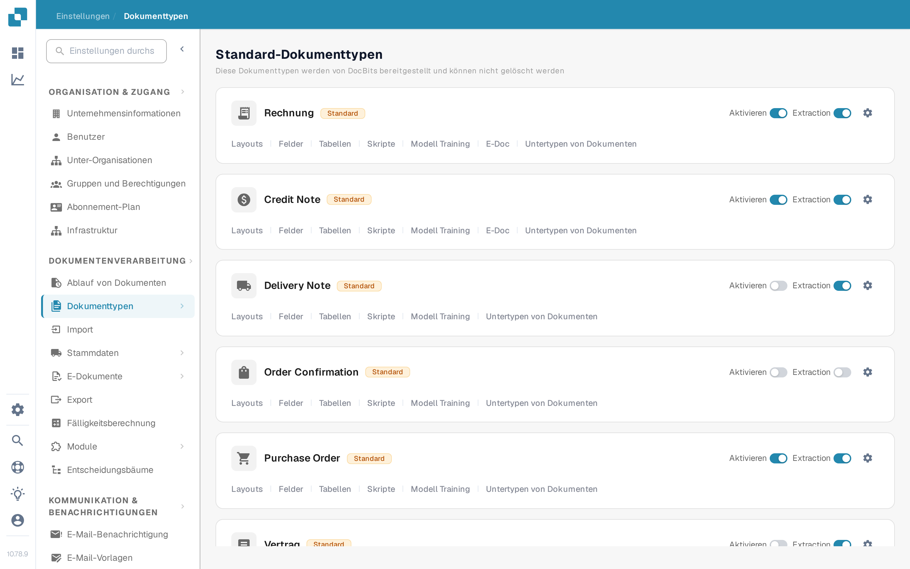

# Dokumenttyp aktivieren oder deaktivieren

Administratoren können festlegen, welche Dokumenttypen in ihrer Organisation verfügbar sind. Sie ändern dies auf der Seite **Dokumenttypen**, ohne den Typ oder seine Konfiguration zu löschen.

1. Öffnen Sie **Einstellungen → Dokumenttypen**.
2. Suchen Sie den Dokumenttyp, zum Beispiel **Rechnung**, unter **Standard-Dokumenttypen** oder **Benutzerdefinierte Dokumenttypen**.
3. Nutzen Sie den Schalter **Aktivieren** auf der Karte des Typs. Ein farbiger Schalter bedeutet, dass der Typ aktiv ist; ein grauer Schalter bedeutet, dass er inaktiv ist. Warten Sie die Bestätigungsmeldung ab, bevor Sie die Seite verlassen. Für diesen Schalter gibt es keine separate Speichern-Schaltfläche.

<figure><figcaption>
Jeder Dokumenttyp hat einen eigenen Schalter Aktivieren rechts auf seiner Karte.
</figcaption></figure>

Der Schalter **Extraction** neben **Aktivieren** ist eine andere Einstellung. Er wählt den Extraktionsmodus (Flex oder Fix); er aktiviert oder deaktiviert den Dokumenttyp nicht. Das Zahnrad-Symbol öffnet weitere Einstellungen für diesen Typ. Die Links unter dem Typnamen öffnen seine Layouts, Felder, Tabellen, Skripte und die übrigen verfügbaren Konfigurationsbereiche.

DocBits stellt die Standard-Dokumenttypen bereit, die nicht gelöscht werden können. Sie können auch eigene Typen anlegen und verwalten. Siehe [Dokumenttypen hinzufügen und bearbeiten](adding-editing-document-types.md) für die nächsten Einrichtungsschritte und [Tabellenspalten](table-columns/README.md) zum Konfigurieren der extrahierten Positionen.
