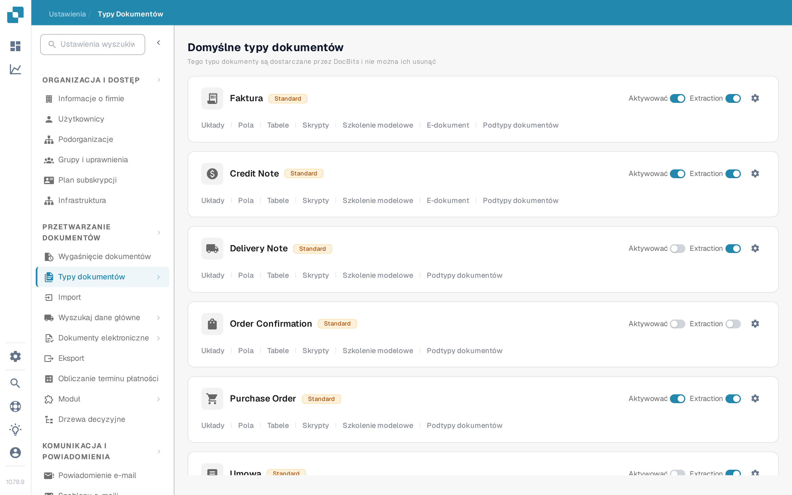

# Aktywacja lub dezaktywacja typu dokumentu

Administratorzy wybierają, które typy dokumentów są dostępne dla ich organizacji. Można to zmienić na stronie **Typy Dokumentów** bez usuwania typu ani jego konfiguracji.

1. Otwórz **Ustawienia → Typy Dokumentów**.
2. Znajdź typ dokumentu, na przykład **Faktura**, w sekcji **Domyślne typy dokumentów** lub **Niestandardowe typy dokumentów**.
3. Użyj przełącznika o etykiecie **Aktywować** na karcie danego typu. Kolorowy przełącznik oznacza, że typ jest aktywny; szary przełącznik oznacza, że jest nieaktywny. Przed opuszczeniem strony odczekaj na komunikat potwierdzający. Ten przełącznik nie ma osobnego przycisku Zapisz.

<figure><figcaption>
Każdy typ dokumentu ma własny przełącznik Aktywować po prawej stronie swojej karty.
</figcaption></figure>

Przełącznik **Extraction** znajdujący się obok przełącznika **Aktywować** to inne ustawienie. Wybiera on tryb ekstrakcji (Flex lub Fix); nie aktywuje ani nie dezaktywuje typu dokumentu. Ikona zębatki otwiera pozostałe ustawienia danego typu. Linki pod nazwą typu otwierają jego układy, pola, tabele, skrypty i inne dostępne obszary konfiguracji.

DocBits udostępnia domyślne typy dokumentów, których nie można usunąć. Możesz także tworzyć i zarządzać typami niestandardowymi. Zobacz [Dodawanie i Edytowanie Typów Dokumentów](adding-editing-document-types.md), aby poznać kolejne kroki konfiguracji, oraz [Kolumny Tabeli](table-columns/README.md), aby skonfigurować wyodrębniane pozycje.
