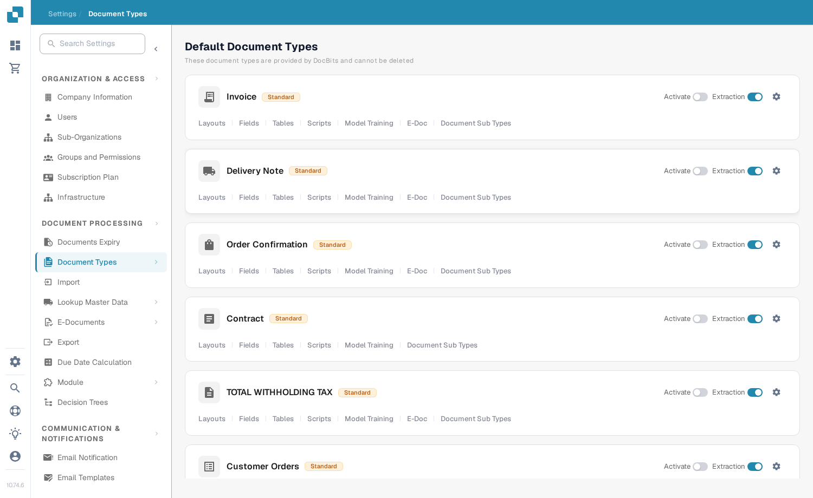

# Activate or deactivate a document type

Administrators can choose which document types are available to their organization. You can change this on the **Document Types** page without deleting the type or its configuration.

1. Open **Settings → Document Types**.
2. Find the document type, for example **Invoice**, under **Default Document Types** or **Custom Document Types**.
3. Use the switch labelled **Activate** on that type's card. A colored switch means the type is active; a gray switch means it is inactive. Wait for the confirmation message before leaving the page. There is no separate Save button for this switch.

<figure><figcaption>
Each document type has its own Activate switch on the right side of its card.
</figcaption></figure>

The **Extraction** switch beside **Activate** is a different setting. It selects the extraction mode (Flex or Fix); it does not activate or deactivate the document type. The gear icon opens more settings for that type. The links below the type name open its layouts, fields, tables, scripts, and other available configuration areas.

DocBits provides the default document types, which cannot be deleted. You can also create and manage custom types. See [Adding and Editing Document Types](adding-editing-document-types.md) for the next setup steps and [Table Columns](table-columns/README.md) to configure extracted line items.
