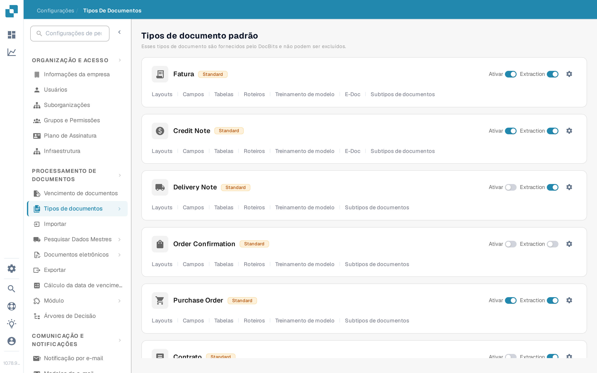
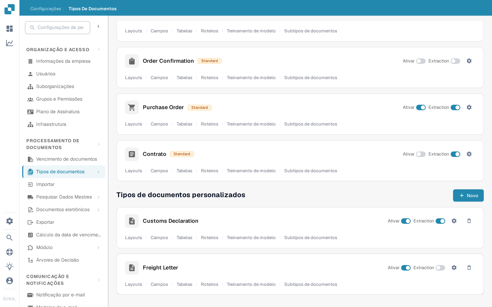

# Adicionar e editar tipos de documentos

Administradores podem criar um tipo de documento personalizado ou alterar as configurações de um existente. Abra **Configurações → Processamento de Documentos → Tipos de documentos**. A página separa os **Tipos de documento padrão** integrados dos **Tipos de documentos personalizados**.

<figure><figcaption>
Use o cartão de um tipo de documento para abrir a configuração que deseja alterar.
</figcaption></figure>

## Criar um tipo de documento personalizado

1. Role até **Tipos de documentos personalizados** e selecione **+ Novo**. Os tipos padrão fornecidos pelo DocBits não podem ser excluídos; crie um tipo personalizado para uma nova categoria.
2. Em **Criar**, insira um **Nome** claro e uma **Descrição**. Selecione **Mesa disponível** se este tipo de documento precisar de tabelas de itens de linha. Escolha **Auto** para treinamento de modelo com documentos de exemplo ou **Expressão regular** para reconhecimento baseado em padrões.
3. Selecione **Próximo** para criar o tipo de documento e continuar a configuração. **O Próximo salva o novo tipo neste momento**; não é apenas uma pré-visualização. Evite inserir um nome de teste em uma organização de produção.
4. Para **Auto**, carregue pelo menos **10 documentos de exemplo** antes de continuar. Para **Expressão regular**, crie pelo menos **dois padrões**. Esses requisitos vêm do fluxo de criação atual. Consulte [Treinamento de modelo](model-training/README.md) para obter detalhes do treinamento.
5. Em **Campos e grupos**, crie os grupos necessários e pelo menos um campo. Se **Mesa disponível** foi selecionada, continue para **Tabelas e colunas** e configure a tabela. Selecione **Concluir** quando a configuração necessária estiver concluída.

<figure><figcaption>
O botão Novo inicia o assistente de tipo de documento personalizado.
</figcaption></figure>

<figure><figcaption>
Escolha o tipo e o método de reconhecimento antes de selecionar Próximo.
</figcaption></figure>

## Editar um tipo de documento existente

Encontre o cartão do tipo em **Tipos de documento padrão** ou **Tipos de documentos personalizados**. Os controles de cada cartão têm funções diferentes:

| Controle | O que faz |
| --- | --- |
| **Ativar** | Ativa ou desativa o processamento deste tipo de documento. Verifique o estado atual antes de alterá-lo. |
| **Extraction** | Alterna entre os modos de extração **Flex** e **Fix**; não ativa nem desativa o tipo de documento. Passe o cursor sobre a chave para ver o modo atual. |
| **Configurações** (engrenagem) | Abre **Mais Configurações** para esse tipo de documento. |
| **Layouts** | Abre o layout de validação. Consulte [Navegando no Construtor de Layout](layout-manager/navigating-the-layout-manager.md). |
| **Campos** | Abre a configuração de campos. Consulte [Adicionando e Editando Campos](fields/adding-and-editing-fields.md). |
| **Tabelas** | Abre as colunas de tabela deste tipo de documento. |
| **Roteiros** | Abre os scripts de processamento quando esse recurso está disponível. |
| **Treinamento de modelo** | Abre os dados de treinamento e as opções do modelo. |
| **E-Doc** | Abre as configurações de documentos eletrônicos quando disponíveis. Consulte [e-docs](edi/README.md). |
| **Subtipos de documentos** | Abre as configurações de subtipos; consulte [Tipos de Documentos Secundários](document-sub-types.md). |

Os links exibidos em um cartão dependem dos recursos habilitados da organização e do tipo de documento. Abra a seção relevante, faça a alteração desejada nela e verifique um documento de exemplo na visualização de validação antes de usar o tipo atualizado no processamento normal.
